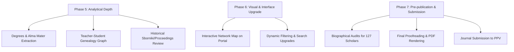

# HANDOFF: IndologyScholars Article (v0.4)

**Last Updated:** 2026-05-23  
**Session:** Implementation of Hypotheses H7–H10, conclusion updates, and sociological synthesis of Russian Indology.  
**Status:** Main manuscript `article/ppv_draft.md` is updated to v0.4, fully checked, and exported to HTML and DOCX formats. All changes are committed and pushed to GitHub.

---

## 📋 Current Article Status

**File:** `article/ppv_draft.md`  
**Version:** v0.4 (post-hypotheses H7–H10 integration + conclusion updates)  
**Size:** ~157 KB (including all appendices and code listings)  
**Target Journal:** ППВ (Письменные памятники Востока); fallback: Восток (Oriens)  

### Recent Corrections & Additions (Session 2026-05-23)

1. **Integrated New Subsections for H7–H10:**
   - **H7 (Institutional Fractional Counting):** Section 6 updated with `### 6.1. Метод подсчета: простое и фракционное институциональное участие`. Quantified that fractional counting causes negligible change in rankings due to >99% single-author rate (ИВ РАН: 160 vs 158.00; СПбГУ: 38 vs 38.00; НИУ ВШЭ: 18 vs 16.00).
   - **H8 (Era Shift on Zograf Readings):** Section 8 updated with `### 8.4. Влияние смены оргкомитета на тематический дрейф и приток новых участников (Зографские чтения)`. Compares Vasilkov era ($\le 2024$) with Albedil-Ivanov era ($2025–2026$). Documented a statistically significant chronological shift in L2 periods ($p = 0.0459$), with classic themes dropping (36.2% to 26.3%) and chronologically unspecified ones rising (8.2% to 16.7%).
   - **H9 (Geographic Gravity & Regional Survival):** Section 6 updated with `### 6.2. Географическое притяжение и когортная выживаемость региональных исследователей`. Highlighted SPb's паритетность (43.8% SPb vs 42.6% Moscow) vs Moscow's inward orientation (only 9.0% SPb at Roerich). Documented that regional retention is significantly lower than metropolitan (36.1% vs ~59%, $p = 0.0191$).
   - **H10 (Talk Serialization / Salami Slicing):** Section 4 updated with `### 4.5. Сериализация докладов и «salami slicing»`. No significant difference in serialization rate between core and periphery (2.2% vs 4.0%, $p = 0.1649$). However, a weak but significant correlation exists between total presentations and absolute serialized papers ($\rho = 0.223$, $p = 0.0007$), suggesting serialization is an individual long-term style.

2. **Updated Conclusion (Section 10):**
   - The conclusion list has been expanded to **11 points** to fully summarize the findings of H7–H10.
   - Added a detailed sociological synthesis paragraph wrapping up the findings into a cohesive description of the clannish, fragmented, and competitive structure of the Indology landscape.

3. **Compiled Draft Deliverables:**
   - Generated [ppv_draft.html](file:///c:/Users/user/Documents/GitHub/IndologyScholars/article/ppv_draft.html) and [ppv_draft.docx](file:///c:/Users/user/Documents/GitHub/IndologyScholars/article/ppv_draft.docx) directly from the markdown draft using pandoc.

4. **Pipeline Rebuild:**
   - Ran `build_and_populate_db.py`, `generate_analytics.py`, `generate_site_data.py`, `generate_scholars_pages.py`, `validate_publication.py`, and `generate_publication_pages.py`. All databases, static HTML profiles, and analytics files are up-to-date and pushed.

---

## 🗺️ Roadmap for Future Phases

The next phases of the IndologyScholars project are organized into three key tracks:

### Track A: Analytical Depth & Genealogy (Data Expansion)
1. **Degrees & Alma Mater Extraction (High Priority):**
   - **Goal:** Differentiate the "Leningrad school" and "Moscow school" hierarchies by extracting PhD (канд. наук) and DSc (докт. наук) degrees, alongside undergraduate university (SPbGU vs ISAA MGU).
   - **Method:** Target the core 37 overlap scholars first, query RINC (eLIBRARY) and RSL (Russian State Library) dissertation databases, and integrate this metadata into `person` table.
2. **Teacher-Student Lineage Networks (High Priority):**
   - **Goal:** Formalize teaching lineages (e.g., Paribok → Desnitskaya/Kuzina; Vasilkov → ...; Lysenko → Kuzina) to draw an explicit pedigree graph.
   - **Method:** Identify advisor/advisee relationships from dissertation abstracts and direct scholar profiles, then render a directed genealogy graph.
3. **Historical Sborniki (Proceedings) Analysis (Medium Priority):**
   - **Goal:** Trace the correspondence between conference talks and published articles in the official sborniki (Zograf and Roerich proceedings). Check if the same gatekeeping patterns repeat in printed collections.

### Track B: Web Interface & Portal Upgrades (UX)
1. **Interactive Network Visualization (Medium Priority):**
   - **Goal:** Embed an interactive, client-side network visualization (using Sigma.js or Vis.js) on the portal (`index.html`) so users can explore the clusters and bridging nodes directly.
2. **Enhanced Cross-Filtering:**
   - Add filter controls for dominant themes and historical periods on the main scholar directory.

### Track C: Pre-publication & Formatting (Submission)
1. **Resolve 127 Missing Birth Years (High Priority):**
   - **Goal:** Research the remaining 127 birth years manually using academic directories, memorial pages, and RINC profiles (avoiding OpenAlex proxy which proved systematically incorrect for Soviet-era generations).
2. **Final Article Formatting (High Priority):**
   - Re-verify all references, footnotes, and citation tables in [ppv_draft.md](file:///c:/Users/user/Documents/GitHub/IndologyScholars/article/ppv_draft.md) to match the target journal's (ППВ) exact rules.
   - Prepare the final print-ready PDF using a custom LaTeX template or pandoc.

---

## 📁 Updated File Structure Reference

| Path | Purpose | Status |
|------|---------|--------|
| `article/ppv_draft.md` | Main manuscript (v0.4, 10 sections + 3 appendices) | ✅ Current |
| `article/ppv_draft.html` | Compiled HTML manuscript | ✅ Generated & Tracked |
| `article/ppv_draft.docx` | Compiled MS Word manuscript | ✅ Generated & Tracked |
| `article/work_ppv_hypotheses.py` | Python script to compute H7-H10 statistical tests | ✅ Current |
| `article/hypothesis_output/` | Directory containing all CSV results of H7-H10 | ✅ Updated & Committed |

---

**END OF HANDOFF**
