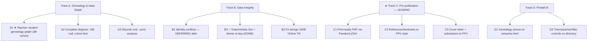

# HANDOFF: IndologyScholars

> Historical session handoff retained for audit context. It is not the current
> data or development guide. See [docs/development-en.md](docs/development-en.md)
> or [docs/development.md](docs/development.md) for maintained instructions and
> current publication-state figures.

**Last Updated:** 2026-05-24
**Status:** Repo clean, everything committed. Pipeline healthy. Manuscript at **v0.7**.
**Target journal:** ППВ (Письменные памятники Востока); fallback: Восток (Oriens).
**Main goal (author-selected):** ⟶ **Track C — get v0.7 submission-ready.** Data-depth (Track A, genealogy) runs after/in parallel; identity conflicts are deferred debt.

---

## 📊 Current State of Truth

| Metric | Value |
|---|---|
| Unique scholars (deduplicated) | **220** (0 missing birth years) |
| Unique talks / author participations | **895 / 899** |
| Cross-conference core cohort | **38** |
| Zograf-only / Roerich-only | 129 / 53 |
| Timeline | 2004–2026 (Zograf 2004–2026, Roerich 2007–2025) |
| Scholars with recorded degree | **31 / 220** (cohort not yet fully covered) |
| Manuscript | `article/ppv_draft.md` v0.7 — 10 sections + appendices А/Б/В/**Г** |
| Manuscript builds | HTML + DOCX (no print-ready **PDF** yet) |
| Network viz | Vis.js live on `index.html` + `networks.html` (266 nodes, 4704 edges) |

**Appendix Г (statistical proof) headline results:**
- **H1 — positive win.** Degree-preserving permutation null: observed cross-series overlap 39 vs expected ~104 (z≈−18.3, p<0.0001). "Two largely separate communities" is now *proven*, not hedged.
- **H2 — retraction.** Kaplan-Meier survival: log-rank p≈0.97. The old claim that Roerich debutants "выступают дольше" is **not** supported; §4.3 softened.
- **H3.** Bootstrap CIs all include 0 → "descriptive only" hedge confirmed.
- **H4.** City-only affiliation a venue-format artifact (CMH OR≈157), not precarization.

---

## ✅ Done This Session (2026-05-24, review pass)

1. **Reviewed the whole project**; reconciled doc drift (this file was stuck at v0.4 while README/CHANGELOG were at v0.7 / v1.8.0).
2. **Deterministic-ID debt closed.** `presentation_id` was already deterministic (`stable_presentation_id()`, commit `235a5d7`); the live theme-code join in `generate_site_data.py` / `generate_publication_pages.py` already uses the **natural key `(year, series, title)`**. Only the vestigial `presentation_id` column in the frozen theme CSVs was stale. Re-keyed it: `theme_codes_final.csv`, `theme_codes_final_v2.csv`, `article/supplementary_theme_codes.csv` now all show **895/895** id overlap with `conferences.db` (was 0/895). Utility: `scratch/rekey_theme_codes.py` (re-runnable after any rebuild).
   - **Rule going forward:** the canonical join key for any external CSV is `(year, series, title)`, never `presentation_id`.

---

## 🗺️ Roadmap (Future Development)

### Track A — Genealogy & Data Depth  *(priority data track; follows / parallels submission)*

1. **A1 ★ Teacher–student genealogy graph (TOP PRIORITY).**
   - **Goal:** Formalize advisor→advisee lineages for the 38-cohort (e.g. Paribok → …, Vasilkov → …, Lysenko → Kuzina) into a directed pedigree graph.
   - **Method:** Mine dissertation abstracts / автореферат scientific-advisor fields, ISTINA, RSL; author verifies each edge. Store as a new lineage table (`advisor_person_id → advisee_person_id`, with degree/year/source_url).
   - **Render:** add a **"Genealogy" preset** to the existing Vis.js `networks.html` (directed edges) — ties to Track D1.
2. **A2 Complete degrees.** 189/220 still null; even the 38-cohort is incomplete (only 31 total). Prioritize cohort, then most-prolific scholars; resolve the ~12 earlier not-found (Лелюхин, Смирнитская, Гордийчук, Мехакян, Кузина, Уланский, Юдицкая, plus likely-aspirants). Columns (`degree`/`degree_year`/`degree_source_url`) already wired into `person` + profile pages.
3. **A3 Sborniki (proceedings) vs oral talks.** Compare announced talks against published proceedings articles — test whether gatekeeping repeats in print. New data-collection effort.

### Track B — Data Integrity

1. **B1 — DEFERRED (known debt, see below).** 3 identity conflicts need the author's expert call; do not block submission.
2. **B2 ✓ DONE** — deterministic IDs confirmed + theme CSVs re-keyed (see above).
3. **B3 Benign FK** — venue `V008` "Online" has `organization_id='unspecified'` with no matching row. Add an "Online / unspecified" organization in `build_and_populate_db.py`.

---

## ⚠️ Known Debt (deferred, do not block Track C)

- **D1. Three unresolved identity conflicts** — author to resolve later, then re-run the pipeline:
  - **Минаева** — `BIOGRAPHICAL_DATA` has "Мария Дмитриевна" vs program "Маргарита Денисовна" (same person? two people?).
  - **Мехакян** — possible duplicate: "Арег Гайкович" (А. Г.) vs "А. А. Мехакян".
  - **Уланский** — patronymic Андреевич (DB) vs Александрович (program).
- **D2. Degrees coverage** — only 31/220 filled; the 38-cohort itself is incomplete (Track A2).
- **D3. Benign FK** — `V008` "Online" → `organization_id='unspecified'` (Track B3).

### Track C — Pre-publication & Submission

1. **C1 Print-ready PDF.** Only HTML/DOCX exist. Build PDF via Pandoc + LaTeX template matching ППВ layout.
2. **C2 References & footnotes** to ППВ style; finalize bibliography and citation tables.
3. **C3 Submission package** — cover letter, suggested reviewers, final send to ППВ (fallback Восток/Oriens).

### Track D — Portal / UX (mostly complete)

1. **D1 Genealogy preset** on `networks.html` (consumes A1 data).
2. **D2 Theme/period filter controls** on the main scholar directory.

---

## 📁 Key Files

| Path | Purpose |
|------|---------|
| `article/ppv_draft.md` | Main manuscript (v0.7, 10 §§ + appendices А/Б/В/Г) |
| `article/ppv_draft.{html,docx}` | Compiled builds (PDF still TODO — C1) |
| `article/work_appendix_g.py` | Appendix Г statistical tests (null model, KM, bootstrap, CMH) |
| `article/work_ppv_hypotheses.py` | H7–H10 tests |
| `article/hypothesis_output/` | All CSV results |
| `analytics_output/theme_codes_final_v2.csv` | **Live** LLM theme codes, natural-keyed (year/series/title) |
| `scratch/rekey_theme_codes.py` | Re-key vestigial presentation_id column after rebuilds |
| `networks.html` / `generate_network_json.py` | Vis.js network viz + its JSON compiler |

---

**END OF HANDOFF**
