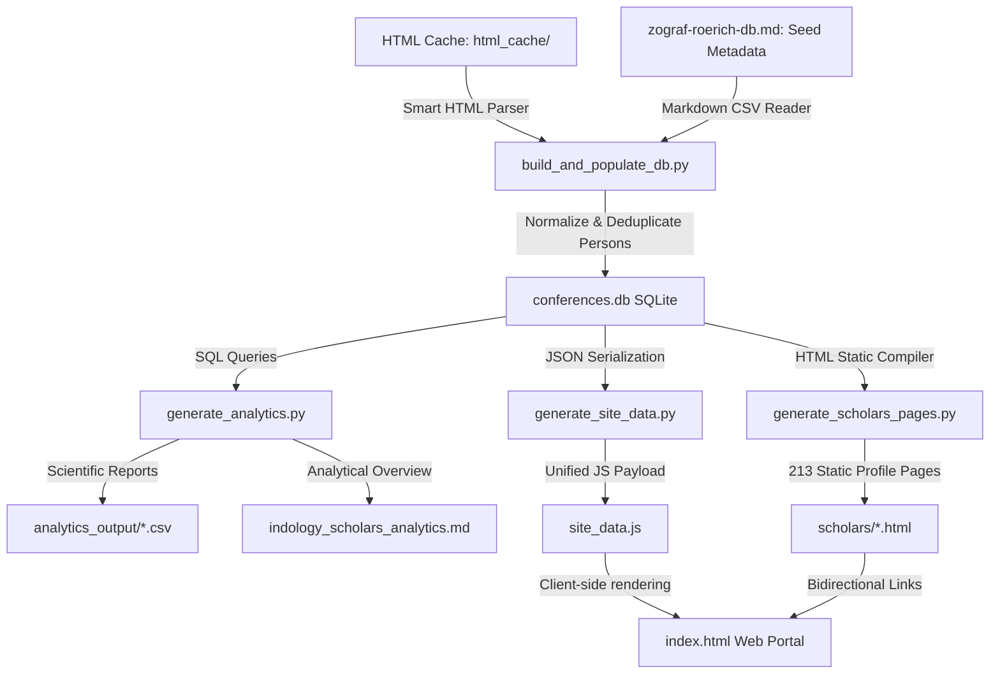
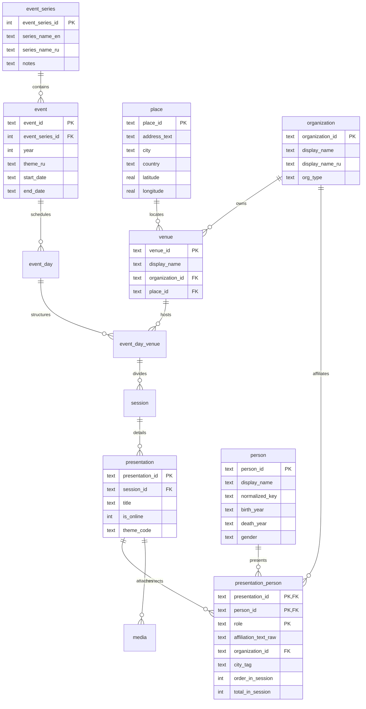

# Russian Indological Scholarship: Unified Relational Archive

> [!NOTE]
> This repository houses a premier digital humanities research platform and automated data pipeline integrating two decades of historical program archives from Russia's two preeminent Indological conferences: the **Zograf Readings** (St. Petersburg, IOM RAS / SPbSU, since 2004) and the **Roerich Readings** (Moscow, IAS RAS, since 2007).

The project features a complete modular ETL pipeline in Python that extracts, normalizes, and matches Cyrillic scholar names, resolves lifespans and historical affiliations, compiles a referentially-sound SQLite database, exports scientific datasets (CSV), and compiles a high-fidelity glassmorphic dark-mode web portal featuring 213 static scholar profile pages, five interactive SVG analytics charts, and real-time bilingual (Russian/English) state toggles.

---

## 🏛️ 1. System Architecture & Data Pipeline

The system is designed with a strict Separation of Concerns, dividing the lifecycle into five autonomous phases:



### Phase 1: Local HTML Cache (`html_cache/`)
Conference programs across all historical years are safely cached locally in raw HTML formats. This guarantees a completely hermetic build environment, immune to online URL restructuring or server downtime from institutional web portals.

### Phase 2: Relational DDL Compilation & Ingestion (`build_and_populate_db.py`)
The primary assembly engine:
1.  **Table Compilation:** Compiles 12 highly normalized SQL tables enforcing strict referential integrity (foreign keys).
2.  **Seed Ingestion:** Parses seed metadata (venues, geographic coords, calendars) directly from `zograf-roerich-db.md`.
3.  **Smart Parsers:** Extracts session timelines, speaker names, raw Cyrillic affiliations, presentation titles, and calendar schedules from the raw HTML templates.
4.  **Identity Matching Engine:** Enforces advanced regex matching to map name variations (e.g. "V. V. Vertogradova", "Victoria Vertogradova", "Vertogradova V.") into singular deduplicated researcher identities, automatically tracking academic transitions and lifespans.

### Phase 3: Scientific Analytics Engine (`generate_analytics.py`)
Computes cross-conference affinity indices and cohort overlapping:
*   Identifies the **overlapping cohort** (the core intellectual bridge presenting active research at both SPb and Moscow forums).
*   Generates targeted scientific CSV tables inside `analytics_output/` and outputs the Markdown overview [indology_scholars_analytics.md](file:///c:/Users/user/Documents/GitHub/IndologyScholars/indology_scholars_analytics.md).

### Phase 4: Static Profile Generation (`generate_scholars_pages.py`)
Compiles **213 custom static HTML pages** under `scholars/` (e.g., [scholars/PERS_f074f69f.html](file:///c:/Users/user/Documents/GitHub/IndologyScholars/scholars/PERS_f074f69f.html)). Each file is a standalone, SEO-optimized glassmorphic card showcasing the scholar's complete historical presentation chronology, institutional changes, regional mobility tracks, and thematic profiles.

### Phase 5: Client-Side Web Portal & Interactive Charts (`index.html`)
A state-of-the-art Single Page Application built on vanilla CSS and JS:
*   **Bilingual Translation Core:** Automatically launches in Russian by default (retaining zero English in UI text). A toggle in the top navigation swaps the entire application state (metrics cards, charts, legend, titles, table headers, DDL documentation) to English in real-time.
*   **Cross-filtering & City Tags:** Allows users to click on any affiliation or city tag to instantly search, filter, and paginate the master database.

---

## 🗃️ 2. Relational Database Schema (`conferences.db`)

The relational database is fully normalized and modeled according to the Third Normal Form (3NF), ensuring zero duplication of transactional metadata.



---

## 💼 3. Practical Use Cases & Research Applications

The IndologyScholars platform enables deep historical and sociological analysis of academic communities. Below are six practical use cases for researchers, historians of science, and academic coordinators.

### Use Case A: Prosopographical Profiling & Career Chronologies
*   **Objective:** Reconstruct the complete academic lifespan and scientific trajectory of a specific indologist.
*   **Method:** A researcher searches for **«Вертоградова Виктория Викторовна»** in the directory. By clicking her name, the platform redirects to her dedicated academic profile: [scholars/PERS_f074f69f.html](file:///c:/Users/user/Documents/GitHub/IndologyScholars/scholars/PERS_f074f69f.html).
*   **Result:** The researcher discovers her exact lifespan, gender, and complete chronological progression of presentations. The profile automatically highlights that she has presented classical research on art history, epigraphy, and Prakrits, displaying time intervals, days of the week, and exact session structures for each presentation.

### Use Case B: Geographic Mobility & Regional Network Mapping
*   **Objective:** Identify the regional distribution of scholars presenting Indological research and locate regional academic hubs (outside Moscow/St. Petersburg).
*   **Method:** A historian wants to see the role of regional institutes (e.g., Krasnodar or Penza). On the dashboard, they expand any detail card and click on the **«Краснодар»** city tag.
*   **Result:** The search engine instantly captures the tag, filtering all 213 scholars to show only those affiliated with Krasnodar institutions. By studying their presentation topics and years active, the researcher maps the growth of regional Buddhist and Sanskrit research clusters.

### Use Case C: Tracking Academic Migration & Institutional Shifts
*   **Objective:** Trace how scholars transition between academic organizations over their careers.
*   **Method:** In the expanded scholar row, the **«Careers & Analytics»** card detects whether a researcher has changed affiliations. If they have, it renders an active institutional path: e.g., `ИВ РАН → РГГУ → ИКВИА НИУ ВШЭ`.
*   **Result:** Clicking on any of these institutional links instantly queries the database, listing all other scholars active in that institution, allowing researchers to study academic hiring, migration waves, and departmental alignment over a 20-year period.

### Use Case D: Interdisciplinary Profile & Thematic Shifts Analysis
*   **Objective:** Evaluate if scholars adhere strictly to a single sub-field or if their research represents interdisciplinary coverage.
*   **Method:** In the scholar's expanded profile, the platform calculates their **Research Profile** and **Dominant Theme**. If they frequently swap categories between presentations (e.g. *Linguistics* in 2008 and *Philosophy* in 2018), they are tagged as an `Interdisciplinary Scholar` (`Междисциплинарный исследователь`).
*   **Result:** A coordinator filters the directory to find all interdisciplinary researchers, studying the intersections of linguistics, classic philosophy, and art history to trace how scientific paradigms cross-pollinate.

### Use Case E: Isolating Regional Cohorts & Conference Affinity
*   **Objective:** Isolate St. Petersburg-only or Moscow-only academic groups to analyze institutional affinity or regional isolation.
*   **Method:** A user selects **«Никогда не выступали на Рериховских чт.»** (Never active at Roerich Readings) in the advanced series filter.
*   **Result:** The directory filters out the Moscow cohort, isolating the 119 St. Petersburg-centric scholars who only present at the Zograf Readings. This allows sociologists of science to study localized academic groups, local traditions, and the communication gap between key regional forums.

### Use Case F: High-Performance Demographics & Gender Analysis
*   **Objective:** Audit the demographic health and gender balance of the Russian Indological community.
*   **Method:** A policymaker clicks on the **«Статистический анализ»** (Statistical Insights) tab.
*   **Result:** The platform renders the demographic bar chart showing age splits (*Young*, *Mid-career*, *Senior*, *Eminent Elders*) alongside the gender representation progress bar. This visualizes whether the field is successfully attracting young postgraduate researchers (under 35) or if it relies primarily on senior scholars.

---

## 🧑‍💻 4. For Developers

See **[CLAUDE.md](CLAUDE.md)** for comprehensive development guidance, including:
- Core pipeline commands and incremental workflows
- Database schema reference and data structures
- Development guidelines, testing procedures, and troubleshooting
- GitHub Actions deployment details

---

## 🚀 5. Quick Start & Execution

### Prerequisites
*   **Python 3.8+** installed locally.
*   A modern web browser.

### Ingestion & Compilation Pipeline
To compile, process, and deploy the entire platform from scratch, run the scripts in sequence:

1.  **Compile Database:** Rebuilds the normalized SQLite schema and parses all HTML files from the cached directories:
    ```bash
    python build_and_populate_db.py
    ```
2.  **Generate CSV & Analytics:** Calculates cohort statistics and exports datasets inside `analytics_output/`:
    ```bash
    python generate_analytics.py
    ```
3.  **Serialize JS Payload:** Serializes SQL entries into the high-performance `site_data.js` module for the browser:
    ```bash
    python generate_site_data.py
    ```
4.  **Compile Static Profile Pages:** Generates the 213 individual SEO-optimized scholar profile HTML pages:
    ```bash
    python generate_scholars_pages.py
    ```
5.  **Launch Local Web Server:** Start Python's built-in lightweight HTTP server to bypass CORS policy restrictions:
    ```bash
    python -m http.server 8000
    ```
    Open your browser and navigate to: **`http://localhost:8000/`**

---

## 🤖 6. Automated Semi-Annual Deployment Workflow

The project is configured with a automated **GitHub Actions** workflow (`.github/workflows/rebuild_and_deploy.yml`) scheduled to execute twice a year on critical academic boundary dates:

*   **June 20 (00:00 UTC):** Immediately following the completion of the spring **Zograf Readings** in St. Petersburg.
*   **December 20 (00:00 UTC):** Immediately following the completion of the winter **Roerich Readings** in Moscow.

### How It Works:
1.  **Active Crawling:** The workflow runs `fetch_latest_programs.py`, querying institutional portals (IOM RAS and IAS RAS) for newly announced programs, saving new programs directly to the HTML cache.
2.  **Rebuild Pipeline:** Sequentially runs `build_and_populate_db.py`, `generate_analytics.py`, `generate_site_data.py`, and `generate_scholars_pages.py`.
3.  **Git Commit:** Commits all updated databases, JS payloads, static profile pages, and analytical datasets back to the `main` branch.
4.  **GitHub Pages Deployment:** Automatically deploys the updated dashboard live to **`https://gasyoun.github.io/IndologyScholars/`**.

---

## 📈 7. Core Database Statistics

*   **Unique Indologists Deduplicated:** 213 scholars
*   **Total Presentations Parsed:** 732 talks
*   **Historical Timeline Covered:** 2004 – 2025
*   **Zograf Readings (St. Petersburg):** 21 events cataloged
*   **Roerich Readings (Moscow):** 18 events cataloged
*   **Cross-Conference Core Cohort (Overlap):** 32 scholars active in both forums
*   **St. Petersburg-Centric Cohort:** 119 scholars
*   **Moscow-Centric Cohort:** 62 scholars
*   **Verification Status:** **`PASSED`** (referential keys and identity constraints fully validated)
