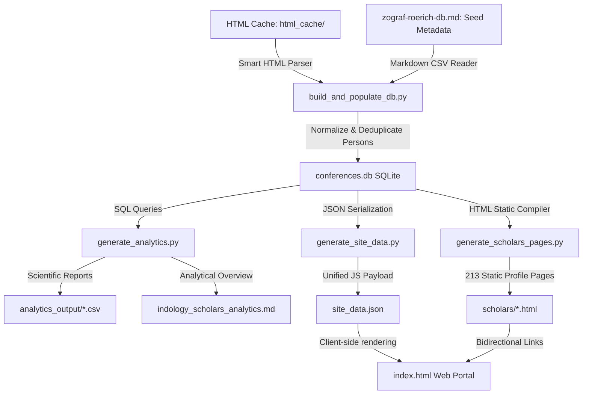
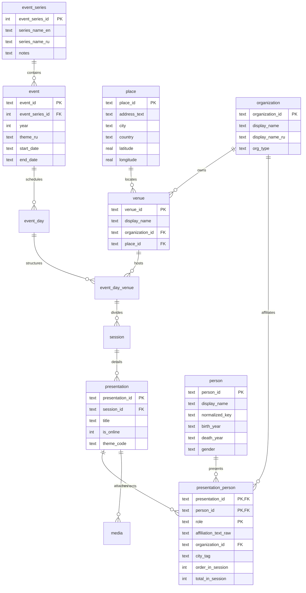

# Российская индологическая наука: Единый научно-аналитический архив

> [!NOTE]
> Данный репозиторий представляет собой передовой цифровой научно-исследовательский комплекс, объединяющий базы данных и инструменты статистического анализа двух главных индологических форумов России за последние 20 с лишним лет: **«Зографских чтений»** (Санкт-Петербург, ИВР РАН / СПбГУ, с 2004 г.) и **«Рериховских чтений»** (Москва, ИВ РАН, с 2007 г.).

Инфраструктура проекта построена на модульном конвейере, включающем автоматический сбор, очистку и сопоставление Cyrillic-имён докладчиков, разрешение годов жизни и полных ФИО, построение реляционной SQL-модели, экспорт структурированных научных реестров (CSV) и компиляцию интерактивного веб-портала. Портал содержит **213 персональных статических страниц учёных**, пять интерактивных аналитических SVG-графиков и бесшовное двуязычное (RU / EN) переключение состояния интерфейса.

---

## 🏛️ 1. Архитектурная структура и конвейер данных

Система спроектирована по принципу строгого разделения зон ответственности (Separation of Concerns). Полный цикл обработки данных состоит из 5 автономных этапов:



### Этап 1: Кэширование исходных страниц (`html_cache/`)
Программы конференций за все годы сохранены в локальном кэше в формате HTML. Это обеспечивает полную автономность (hermetic build) и защиту от изменений структуры страниц на сайтах институтов-организаторов.

### Этап 2: Извлечение, чистка и сборка БД (`build_and_populate_db.py`)
Основной скрипт сборки выполняет:
1.  **Создание схемы таблиц:** Создает реляционную структуру из 12 связанных таблиц (см. раздел «Схема БД»).
2.  **Загрузку справочников:** Извлекает структурированные данные о площадках, географических координатах и ключевых вехах из `zograf-roerich-db.md`.
3.  **Интеллектуальный HTML-парсинг:** Извлекает чистый текст из HTML-тегов с разбивкой по блокам заседаний.
4.  **Нормализацию имен ученых:**
    *   Регулярные выражения сопоставляют различные форматы написания (например, «Имя Отчество Фамилия», «И.О. Фамилия», «Фамилия И. О.»).
    *   Происходит автоматическое слияние дубликатов участников, приводящее имена к единому стандартизированному ключу, и связывание их с годами жизни и гендерной классификацией.

### Этап 3: Аналитический расчет (`generate_analytics.py`)
Вычисляет перекрестные статистические показатели:
*   Определяет **overlapping cohort** — ученых, которые активно выступали как в Петербурге (Зографские), так и в Москве (Рериховские).
*   Формирует три выходных CSV-реестра в папке `analytics_output/` и markdown-отчет [indology_scholars_analytics.md](file:///c:/Users/user/Documents/GitHub/IndologyScholars/indology_scholars_analytics.md).

### Этап 4: Компиляция статических страниц (`generate_scholars_pages.py`)
Автоматически собирает **213 премиальных статических HTML-страниц** в каталоге `scholars/` (например, [scholars/PERS_f074f69f.html](file:///c:/Users/user/Documents/GitHub/IndologyScholars/scholars/PERS_f074f69f.html)). Каждый файл представляет собой автономную страницу с полной хронологической историей докладов ученого, историей смены его аффилиаций, городов и тематическим профилем.

### Этап 5: Визуализация и интерактивный дашборд (`index.html`)
Современное веб-приложение, построенное на чистом CSS/JS.
*   **Двуязычная локализация:** Русский язык по умолчанию. Встроенный переключатель мгновенно адаптирует все элементы интерфейса (включая графики, фильтры, таблицы и DDL-схемы) на английский язык.
*   **Перекрестная фильтрация по клику:** Клик на любую аффилиацию или тег города в карточках докладов мгновенно фильтрует весь реестр ученых.

---

## 🗃️ 2. Реляционная схема базы данных (`conferences.db`)

База данных полностью нормализована и спроектирована согласно третьей нормальной форме (3NF). Ниже представлена структура таблиц и внешних ключей:



---

## 💼 3. Сценарии использования (Use Cases)

Система **IndologyScholars** разработана для глубокого историко-научного, библиографического и социологического анализа востоковедного сообщества. Ниже описаны шесть практических сценариев её применения.

### Сценарий А: Восстановление академической биографии (Просопография)
*   **Задача:** Восстановить полную хронологию выступлений и смену научных интересов конкретного учёного.
*   **Метод:** Исследователь находит в каталоге имя **«Вертоградова Виктория Викторовна»** и кликает по нему. Система перенаправляет его на персональную страницу [scholars/PERS_f074f69f.html](file:///c:/Users/user/Documents/GitHub/IndologyScholars/scholars/PERS_f074f69f.html).
*   **Результат:** Открывается полный просопографический профиль, отображающий годы жизни, пол, историю научных докладов (с 2004 г. по настоящее время), дни недели выступлений, точные интервалы времени и статус докладов (открывающий/закрывающий).

### Сценарий Б: Анализ географической мобильности и региональных центров
*   **Задача:** Выявить представленность региональных индологов и проследить активность ученых за пределами Москвы и Санкт-Петербурга.
*   **Метод:** Исследователь в раскрытой карточке любого доклада кликает по тегу города (например, **«Краснодар»** или **«Казань»**).
*   **Результат:** Главная таблица автоматически фильтрует список из 213 ученых, оставляя только тех, кто аффилирован с учреждениями выбранного города. Это позволяет наглядно оценить вклад региональных вузов в общую индологическую повестку.

### Сценарий В: Отслеживание академической миграции и карьерных траекторий
*   **Задача:** Выявить переходы ученых между научно-исследовательскими институтами и вузами.
*   **Метод:** В детальной карточке ученого блок **«Аффилиации за все годы»** отображает интерактивную траекторию: например, `ИВ РАН → РГГУ → ИКВИА НИУ ВШЭ`.
*   **Результат:** Клик на любое из учреждений в этой цепочке мгновенно находит всех остальных ученых, когда-либо работавших в этом институте. Историк науки может проанализировать кадровые волны и миграционные тенденции внутри отечественных центров востоковедения.

### Сценарий Г: Оценка междисциплинарности и тематического охвата
*   **Задача:** Определить, придерживаются ли авторы одной узкой темы (например, санскритской грамматики) или ведут широкие междисциплинарные исследования.
*   **Метод:** Алгоритм автоматически анализирует доклады ученого и выставляет статус: **«Междисциплинарный исследователь»** (если автор регулярно меняет категории докладов) или **«Узкий специалист»**, а также рассчитывает его **Доминантную научную область** (например, *Philosophy & Religion* или *Linguistics*).
*   **Результат:** Руководитель научной программы может быстро найти экспертов на стыке философии, языкознания и искусствоведения для междисциплинарных проектов.

### Сценарий Д: Выделение локальных научных когорт (Affinity Dynamics)
*   **Задача:** Разделить ученых на независимые группы по признаку участия в питерской (Зографские) или московской (Рериховские) конференциях.
*   **Метод:** Пользователь выбирает в фильтре опцию **«Никогда не выступали на Рериховских чт.»**.
*   **Результат:** Система мгновенно скрывает московскую часть и выводит список из 119 петербургских индологов, которые участвуют исключительно в Зографских чтениях. Это позволяет изучать закрытые академические школы и локальные научные традиции.

### Сценарий Е: Демографический и гендерный мониторинг сообщества
*   **Задача:** Оценить приток молодых кадров и баланс полов в современном востоковедении для принятия административных решений.
*   **Метод:** Администратор переходит на вкладку **«Статистический анализ»** и изучает интерактивные SVG-графики возрастных когорт и гендерного состава.
*   **Результат:** Графики наглядно показывают долю молодых ученых (аспирантов и студентов до 35 лет) и соотношение мужчин/женщин во всем архивном массиве данных, сигнализируя о необходимости поддержки молодых специалистов.

---

## 🚀 4. Быстрый старт и запуск конвейера

### Требования
*   Установленный интерпретатор **Python 3.8+**
*   Локальный веб-браузер

### Запуск полного цикла сборки
Для локального развертывания конвейера запускайте скрипты строго в следующем порядке:

1.  **Сборка базы данных:** Пересобирает схему СУБД SQLite и парсит HTML-кэш программ конференций:
    ```bash
    python build_and_populate_db.py
    ```
2.  **Генерация аналитики:** Рассчитывает показатели перекрытия и экспортирует CSV-реестры:
    ```bash
    python generate_analytics.py
    ```
3.  **Экспорт данных для веб-интерфейса:** Формирует JavaScript-файл с упакованными структурами:
    ```bash
    python generate_site_data.py
    ```
4.  **Компиляция статических страниц:** Генерирует 213 персональных HTML-файлов профилей в `scholars/`:
    ```bash
    python generate_scholars_pages.py
    ```
5.  **Запуск локального сервера:** Запускает встроенный HTTP-сервер Python для корректной работы путей и обхода CORS-политик:
    ```bash
    python -m http.server 8000
    ```
    Откройте в веб-браузере адрес: **`http://localhost:8000/`**

---

## 🤖 5. Автоматическое обновление дважды в год (GitHub Actions)

В проекте настроена автоматизация с помощью **GitHub Actions** (`.github/workflows/rebuild_and_deploy.yml`), которая дважды в год полностью пересобирает базу данных, подтягивает свежие материалы конференций и развертывает обновленный веб-сайт на GitHub Pages:

*   **Расписание (Cron):**
    *   **20 июня в 00:00 UTC:** Сразу после завершения весенних «Зографских чтений» в Санкт-Петербурге.
    *   **20 декабря в 00:00 UTC:** Сразу после завершения зимних «Рериховских чтений» в Москве.
*   **Механизм работы:**
    1.  Запускается скрипт **`fetch_latest_programs.py`**, который сканирует официальные порталы ИВР РАН и ИВ РАН в поисках новых материалов текущего года и автоматически добавляет их в кэш (`html_cache/`).
    2.  Запускается **`build_and_populate_db.py`**, пересобирающий `conferences.db` с учетом новых файлов.
    3.  Запускаются скрипты **`generate_analytics.py`**, **`generate_site_data.py`** и **`generate_scholars_pages.py`**.
    4.  Изменения коммитятся от имени бота `github-actions[bot]` обратно в ветку `main`.
    5.  Веб-портал автоматически переразвертывается на хостинге **GitHub Pages** по адресу **`https://gasyoun.github.io/IndologyScholars/`**.
*   **Ручной запуск:** Workflow можно запустить в любой момент вручную в один клик через вкладку **Actions** в интерфейсе GitHub.

---

## 📈 6. Итоги и результаты работы

Разработанный научно-аналитический комплекс позволил впервые в истории отечественной востоковедной науки:
1.  **Интегрировать разрозненные архивы:** Объединить программы двух ведущих индологических центров России за более чем 20 лет в единое цифровое пространство.
2.  **Выявить ядро сообщества:** Математически определить 32 ключевых индолога, формирующих интеллектуальный мост между петербургской и московской научными школами.
3.  **Оцифровать 732 доклада:** Сохранить и структурировать названия докладов, темы секций, даты проведения, дни недели и институциональные аффилиации участников.
4.  **Обеспечить открытость данных:** Предоставить исследователям удобные инструменты экспорта в CSV для дальнейшей статистической обработки в R/Python.
