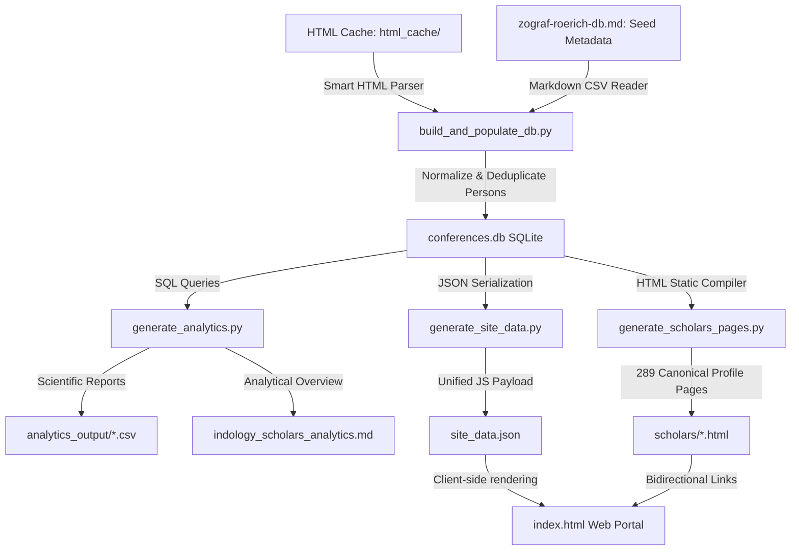
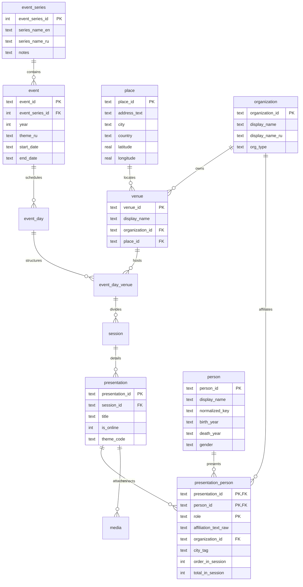

# Российская индологическая наука: Единый научно-аналитический архив

> [!NOTE]
> Данный репозиторий представляет собой передовой цифровой научно-исследовательский комплекс, объединяющий базы данных и инструменты статистического анализа двух главных индологических форумов России за последние 20 с лишним лет: **«Зографских чтений»** (Санкт-Петербург, ИВР РАН / СПбГУ, с 2004 г.) и **«Рериховских чтений»** (Москва, ИВ РАН, с 2007 г.).

Инфраструктура проекта построена на модульном конвейере, включающем сбор, очистку и сопоставление имен докладчиков, верификацию доступных годов жизни, реляционную SQL-модель, экспорт научных реестров (CSV) и сборку двуязычного веб-портала. Портал содержит **289 канонических профилей ученых** и интерактивные аналитические представления.

---

## 🏛️ 1. Архитектурная структура и конвейер данных

Система спроектирована по принципу строгого разделения зон ответственности (Separation of Concerns). Полный цикл обработки данных состоит из 5 автономных этапов:



### Этап 1: Кэширование исходных страниц (`html_cache/`)
Программы конференций за все годы сохранены в локальном кэше в формате HTML. Это обеспечивает полную автономность (hermetic build) и защиту от изменений структуры страниц на сайтах институтов-организаторов.

### Этап 2: Извлечение, чистка и сборка БД (`build_and_populate_db.py`)
Основной скрипт сборки выполняет:
1.  **Создание схемы таблиц:** Создает реляционную структуру из 12 связанных таблиц (см. раздел «Схема БД»).
2.  **Загрузку справочников:** Извлекает структурированные данные о площадках, географических координатах и ключевых вехах из `zograf-roerich-db.md`.
3.  **Интеллектуальный HTML-парсинг:** Извлекает чистый текст из HTML-тегов с разбивкой по блокам заседаний.
4.  **Нормализацию имен ученых:**
    *   Регулярные выражения сопоставляют различные форматы написания (например, «Имя Отчество Фамилия», «И.О. Фамилия», «Фамилия И. О.»).
    *   Происходит автоматическое слияние дубликатов участников, приводящее имена к единому стандартизированному ключу, и связывание их с годами жизни и гендерной классификацией.

### Этап 3: Аналитический расчет (`generate_analytics.py`)
Вычисляет перекрестные статистические показатели:
*   Определяет **overlapping cohort** — ученых, которые активно выступали как в Петербурге (Зографские), так и в Москве (Рериховские).
*   Формирует три выходных CSV-реестра в папке `analytics_output/` и markdown-отчет [indology_scholars_analytics.md](file:///c:/Users/user/Documents/GitHub/IndologyScholars/indology_scholars_analytics.md).

### Этап 4: Компиляция статических страниц (`generate_scholars_pages.py`)
Автоматически собирает **289 канонических HTML-профилей** в каталоге `scholars/`. Каждый профиль показывает хронологию докладов, зафиксированные аффилиации и города, тематические связи и поколенческую когорту при наличии проверенного года рождения.

### Этап 5: Визуализация, интерактивный дашборд и сетевая карта (`index.html` и `networks.html`)
Современный комплекс веб-приложений, построенный на чистом CSS/JS.
*   **Двуязычная локализация:** Русский язык по умолчанию. Встроенный переключатель мгновенно адаптирует все элементы интерфейса (включая графики, фильтры, таблицы и DDL-схемы) на английский язык.
*   **Перекрестная фильтрация по клику:** Клик на любую аффилиацию или тег города в карточках докладов мгновенно фильтрует весь реестр ученых.
*   **Видео и уровни обобщения:** Страницы `videos/` показывают полный список YouTube-записей и сопоставления с докладами, а сопоставленный доклад получает плашку `Видео`; страницы `gumilyov/` раскрывают классификацию докладов по микро-, региональному и глобальному уровню. Эти ссылки также встроены в карточки докладов на страницах конференций, городов, институций, рубрик и мезоуровней.
*   **Именные сюжеты и ссылочный поиск:** Страница `topics/ramayana.html` собирает доклады о Рамаяне по годам и названиям; поиск названий на главной сохраняется в URL (`?talks=рамаяны`) и показывает не только авторов, но и найденные доклады.
*   **Поколения и сеть:** Страница `generations/` дает поименные когорты по десятилетиям рождения - от когорты Василькова до когорты Толчельникова - и отдельно показывает записи без проверенного года рождения; `networks.html` отображает всех 289 ученых как узлы с коллаборациями и сессионными пересечениями.

---

## 🗃️ 2. Реляционная схема базы данных (`conferences.db`)

База данных полностью нормализована и спроектирована согласно третьей нормальной форме (3NF). Ниже представлена структура таблиц и внешних ключей:



---

## 💼 3. Сценарии использования (Use Cases)

Система **IndologyScholars** разработана для глубокого историко-научного, библиографического и социологического анализа востоковедного сообщества. Ниже описаны шесть практических сценариев её применения.

### Сценарий А: Восстановление академической биографии (Просопография)
*   **Задача:** Восстановить полную хронологию выступлений и смену научных интересов конкретного учёного.
*   **Метод:** Исследователь находит в каталоге имя **«Вертоградова Виктория Викторовна»** и кликает по нему. Система перенаправляет его на персональную страницу [scholars/PERS_f074f69f.html](file:///c:/Users/user/Documents/GitHub/IndologyScholars/scholars/PERS_f074f69f.html).
*   **Результат:** Открывается полный просопографический профиль, отображающий годы жизни, пол, историю научных докладов (с 2004 г. по настоящее время), дни недели выступлений, точные интервалы времени и статус докладов (открывающий/закрывающий).

### Сценарий Б: Анализ географической мобильности и региональных центров
*   **Задача:** Выявить представленность региональных индологов и проследить активность ученых за пределами Москвы и Санкт-Петербурга.
*   **Метод:** Исследователь в раскрытой карточке любого доклада кликает по тегу города (например, **«Краснодар»** или **«Казань»**).
*   **Результат:** Главная таблица фильтрует список из 289 ученых по городскому сигналу в аффилиации. Это позволяет оценить вклад региональных центров, не отождествляя городскую приписку с работой в местном вузе: восстановленные записи Обнинска, например, показывают доклады М. Ю. Гасунса в программах 2023 и 2024 гг.

### Сценарий В: Отслеживание академической миграции и карьерных траекторий
*   **Задача:** Выявить переходы ученых между научно-исследовательскими институтами и вузами.
*   **Метод:** В детальной карточке ученого блок **«Аффилиации за все годы»** отображает только институциональные записи. Городские маркеры (`СПб`, `Санкт-Петербург`) остаются географией, а подтвержденная траектория заполняет пропуски лишь в документированном временном интервале.
*   **Результат:** Клик на любое из учреждений в этой цепочке мгновенно находит всех остальных ученых, когда-либо работавших в этом институте. Историк науки может проанализировать кадровые волны и миграционные тенденции внутри отечественных центров востоковедения.

### Сценарий Г: Оценка междисциплинарности и тематического охвата
*   **Задача:** Определить, придерживаются ли авторы одной узкой темы (например, санскритской грамматики) или ведут широкие междисциплинарные исследования.
*   **Метод:** Алгоритм автоматически анализирует доклады ученого и выставляет статус: **«Междисциплинарный исследователь»** (если автор регулярно меняет категории докладов) или **«Узкий специалист»**, а также рассчитывает его **Доминантную научную область** (например, *Philosophy & Religion* или *Linguistics*).
*   **Результат:** Руководитель научной программы может быстро найти экспертов на стыке философии, языкознания и искусствоведения для междисциплинарных проектов.

### Сценарий Д: Выделение локальных научных когорт (Affinity Dynamics)
*   **Задача:** Разделить ученых на независимые группы по признаку участия в питерской (Зографские) или московской (Рериховские) конференциях.
*   **Метод:** Пользователь выбирает в фильтре опцию **«Никогда не выступали на Рериховских чт.»**.
*   **Результат:** Система выводит 183 участника, наблюдаемых только в Зографских чтениях, и 66 участников, наблюдаемых только в Рериховских чтениях.

### Сценарий Е: Демографический и гендерный мониторинг сообщества
*   **Задача:** Оценить приток молодых кадров и баланс полов в современном востоковедении для принятия административных решений.
*   **Метод:** Администратор переходит на вкладку **«Статистический анализ»** и изучает интерактивные SVG-графики возрастных когорт и гендерного состава.
*   **Результат:** Графики наглядно показывают долю молодых ученых (аспирантов и студентов до 35 лет) и соотношение мужчин/женщин во всем архивном массиве данных, сигнализируя о необходимости поддержки молодых специалистов.

### Сценарий Ж: Коллаборационные сети и академические мосты
*   **Задача:** Визуализировать и проанализировать структуру соавторства, сессионного со-присутствия и институционального взаимодействия между учеными московского и петербургского форумов.
*   **Метод:** Исследователь открывает **«Интерактивную сетевую карту»** ([networks.html](networks.html)) и переключает режим графа на **«Экосистему»** или вводит в поиске **«ИВ РАН»**.
*   **Результат:** Интерфейс отображает динамический физический граф связей сообщества. В режиме **«Коллаборации»** видны плотные кластеры соавторства, а в режиме **«Экосистема»** визуализируются межинституциональные связи и ключевые «мосты» — 38 ученых перекрестной когорты, которые активно связывают московские Рериховские чтения с петербургскими Зографскими, раскрывая каналы интеллектуального обмена.

---

## 🚀 4. Быстрый старт и запуск конвейера

### Требования
*   Установленный интерпретатор **Python 3.8+**
*   Локальный веб-браузер

### Запуск полного цикла сборки
Для локального развертывания конвейера запускайте скрипты строго в следующем порядке:

1.  **Сборка базы данных:** Пересобирает схему СУБД SQLite и парсит HTML-кэш программ конференций:
    ```bash
    python build_and_populate_db.py
    ```
2.  **Генерация аналитики:** Рассчитывает показатели перекрытия и экспортирует CSV-реестры:
    ```bash
    python generate_analytics.py
    ```
3.  **Экспорт данных для веб-интерфейса:** Формирует JavaScript-файл с упакованными структурами:
    ```bash
    python generate_site_data.py
    ```
4.  **Компиляция статических страниц:** Генерирует 289 персональных HTML-файлов профилей в `scholars/`:
    ```bash
    python generate_scholars_pages.py
    ```
5.  **Запуск локального сервера:** Запускает встроенный HTTP-сервер Python для корректной работы путей и обхода CORS-политик:
    ```bash
    python -m http.server 8000
    ```
    Откройте в веб-браузере адрес: **`http://localhost:8000/`**

---

## 🤖 5. Автоматическое обновление дважды в год (GitHub Actions)

В проекте настроена автоматизация с помощью **GitHub Actions** (`.github/workflows/rebuild_and_deploy.yml`), которая дважды в год полностью пересобирает базу данных, подтягивает свежие материалы конференций и развертывает обновленный веб-сайт на GitHub Pages:

*   **Расписание (Cron):**
    *   **20 июня в 00:00 UTC:** Сразу после завершения весенних «Зографских чтений» в Санкт-Петербурге.
    *   **20 декабря в 00:00 UTC:** Сразу после завершения зимних «Рериховских чтений» в Москве.
*   **Механизм работы:**
    1.  Запускается скрипт **`fetch_latest_programs.py`**, который сканирует официальные порталы ИВР РАН и ИВ РАН в поисках новых материалов текущего года и автоматически добавляет их в кэш (`html_cache/`).
    2.  Запускается **`build_and_populate_db.py`**, пересобирающий `conferences.db` с учетом новых файлов.
    3.  Запускаются скрипты **`generate_analytics.py`**, **`generate_site_data.py`** и **`generate_scholars_pages.py`**.
    4.  Изменения коммитятся от имени бота `github-actions[bot]` обратно в ветку `main`.
    5.  Веб-портал автоматически переразвертывается на хостинге **GitHub Pages** по адресу **`https://gasyoun.github.io/IndologyScholars/`**.
*   **Ручной запуск:** Workflow можно запустить в любой момент вручную в один клик через вкладку **Actions** в интерфейсе GitHub.

---

## 📄 6. Научная статья и гипотезы (v0.7)

Результаты исследований по проекту обобщены в академической рукописи: **`article/ppv_draft.md`** (версия v0.7). В статье анализируются структурные параметры, институциональное позиционирование и социологическая фрагментация российского индологического сообщества. Скомпилированные варианты статьи в форматах HTML и Word доступны по ссылкам: [ppv_draft.html](file:///c:/Users/user/Documents/GitHub/IndologyScholars/article/ppv_draft.html) и [ppv_draft.docx](file:///c:/Users/user/Documents/GitHub/IndologyScholars/article/ppv_draft.docx).

**Статус пересмотра (24.05.2026):** восстановление строк официальных программ расширило действующий корпус до 289 участников, 1350 уникальных докладов и 1377 авторских участий. Прежние тематические выводы и результаты шкалы Гумилева в рукописи сохранены как предыдущий снимок и требуют повторной разметки расширенного корпуса; в нынешнем числовом виде статья не готова к подаче.

В рамках исследования сформулированы и протестированы 10 ключевых научных гипотез (H1–H10), сгруппированных по нескольким аналитическим направлениям:

### Тематические и хронологические структуры
*   **H1 (Тематическая энтропия):** *Подтверждена.* Рериховские чтения в Москве демонстрируют существенно более узкий тематический спектр (более низкую информационную энтропию Шеннона по дисциплинам уровня L1) по сравнению с Зографскими чтениями в Санкт-Петербурге, что указывает на локальную традиционную специфику.
*   **H2 (Подневная тематическая дифференциация):** *Подтверждена.* Отдельные дни Зографских чтений характеризуются высокой тематической специфичностью (измеренной с помощью косинусного расстояния дневных тематических векторов), что подтверждает структурированное планирование программы.
*   **H8 (Смена организационной эпохи — Зографские чтения):** *Подтверждена.* Сопоставление эпохи Василькова ($\le 2024$) с эпохой Альбедиль — Иванова ($2025–2026$) выявило статистически значимый хронологический сдвиг на уровне L2-периодов ($p = 0,0459$): доля классических тем снизилась с 36,2% до 26,3%, а доля хронологически неопределенных сюжетов выросла с 8,2% до 16,7%.

### Гейткипинг и динамика участия
*   **H3 и H4 (Консистентность отбора и прикладные темы):** *Уточнена.* Предполагалось, что критерии отбора Зографских чтений 2026 года были направлены на отсеивание «прикладных» и метанаучных докладов. Однако агрегированная статистика показывает практически идентичные доли прикладных докладов на обеих конференциях за все годы (около 4-5%). Это указывает на то, что ограничения носят скорее избирательный персональный характер, а не реализуются как системный тематический фильтр.
*   **H5 (Институциональная монополия — «вечная пятерка»):** *Подтверждена.* Пятеро наиболее активных участников московских чтений от ИВ РАН (Вертоградова, Тюлина, Вырщиков, Шустова, Дробышев) занимают непропорционально большую долю слотов в программе, снижая возможности для дебютов и интеграции молодых исследователей.
*   **H6 (Затухание онлайн-экспансии):** *Подтверждена.* Переход к онлайн- и гибридным форматам (после 2020 г.) временно расширил круг участников, однако к 2024–2025 гг. состав вновь сузился до столичного ядра, а удаленный формат стал использоваться преимущественно признанными специалистами для дистанционного участия.
*   **H10 (Сериализация докладов / «Salami Slicing»):** *Уточнена.* Статистически значимых различий в уровне сериализации (повторяемости) докладов между ядром сообщества и периферией не обнаружено ($p = 0,1649$). Тем не менее, сериализация положительно коррелирует с общим жизненным числом докладов автора ($\rho = 0,223$, $p = 0,0007$), выступая как индивидуальная карьерная стратегия.

### Географическое притяжение и институциональный подсчет
*   **H7 (Метод подсчета долей участия):** Оценка получена для прежнего размеченного снимка и требует повторной проверки на расширенном корпусе из 22 программных лет.
*   **H9 (Географическое притяжение и выживаемость регионов):** *Подтверждена.* Зографские чтения в Петербурге демонстрируют паритетный географический баланс (43,8% из СПб vs 42,6% из Москвы), тогда как Рериховские чтения в Москве в основном внутренне ориентированы (всего 9,0% участников из Петербурга). Кроме того, выживаемость (коэффициент возвращения) региональных индологов (из городов за пределами Москвы и СПб) существенно ниже, чем у их столичных коллег (36,1% vs ~59%, $p = 0,0191$).

---

## 📈 7. Итоги и результаты работы

Разработанный научно-аналитический комплекс позволил впервые в истории отечественной востоковедной науки:
1.  **Интегрировать разрозненные архивы:** Объединить программы двух ведущих индологических центров России за более чем 20 лет в единое цифровое пространство.
2.  **Выявить ядро сообщества:** Математически определить **38** ключевых индологов, формирующих интеллектуальный мост между петербургской и московской научными школами (перекрестная когорта).
3.  **Оцифровать 1377 авторских участий** (1350 уникальных докладов): сохранить и структурировать названия докладов, темы секций, даты проведения, дни недели и зафиксированные аффилиации участников.
4.  **Расширить охват до 2026 года:** Включить программу XLVII Зографских чтений (май 2026 г.) в качестве самого свежего материала. Хронологический диапазон Зографа — 2004–2026, Рериха — 2007–2025.
5.  **Обеспечить открытость данных:** Предоставить исследователям удобные инструменты экспорта в CSV для дальнейшей статистической обработки в R/Python.
