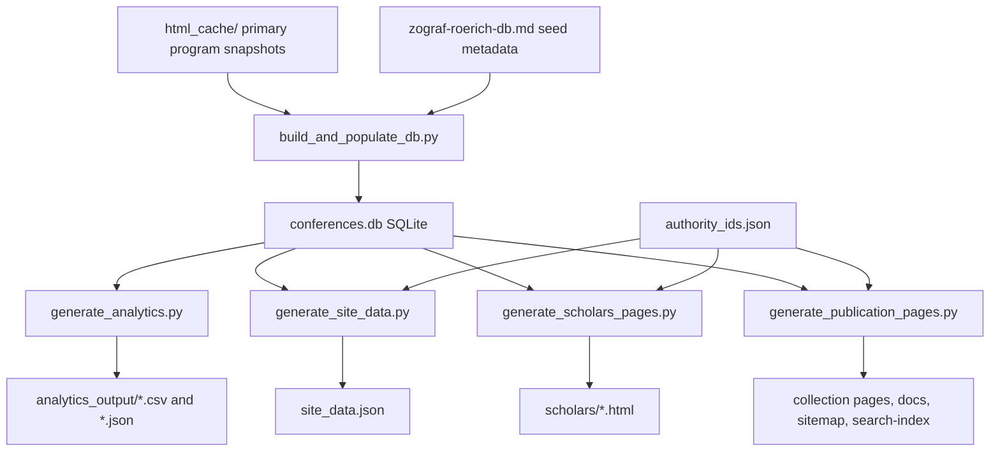

# IndologyScholars Architecture Plan

Date: 2026-05-21  
Status: historical planning document; implementation has since advanced.
Scope: architecture hardening for stable identifiers, provenance, schema versions, authority data, and reproducible generated outputs.

> For current build and contribution guidance, see
> [docs/development-en.md](../../docs/development-en.md) or
> [docs/development.md](../../docs/development.md). Current publication counts are
> taken from `site_data.json`, not from this dated plan.

## 1. Purpose

`IndologyScholars` is already more than a static website. It is a small generated research infrastructure:

1. cached primary sources are parsed into SQLite;
2. SQLite feeds analytical CSVs and JSON payloads;
3. generators compile static pages, search index, sitemap, JSON-LD, and downloadable data;
4. GitHub Pages publishes the result.

The next architecture goal is to make this pipeline durable enough for external reuse. The largest current risk is unstable row identifiers, especially `presentation_id`, which breaks joins with theme codes, video mappings, review queues, and future authority enrichment.

## 2. Current Pipeline



### Source Of Truth

The source of truth should remain:

- `html_cache/`
- `zograf-roerich-db.md`
- curated authority files such as `authority_ids.json`
- generator scripts

Generated HTML, generated JSON, generated CSV, and SQLite are build artifacts unless explicitly curated.

## 3. Current Pain Points

| Area | Current issue | Impact |
| --- | --- | --- |
| `presentation_id` | Generated with random UUID fragments during rebuilds | External CSV joins become stale |
| Theme codes | Some theme files are keyed by old `presentation_id` values | Codes can become semantically valid but unjoinable |
| Video mapping | Needs natural-key rematching because presentation IDs move | Extra complexity and review risk |
| Provenance | `source_url` and `source_snippet` exist, but derived fields do not always carry source/confidence | Harder audits |
| Schema versions | Outputs lack a consistent `schema_version` | Downstream consumers cannot detect breaking changes |
| Authority IDs | External identifiers exist but coverage/provenance is uneven | Risk of wrong public links |
| Generated docs | Methodology and quality pages are generated, but architecture assumptions are not centralized | Future agents may patch the wrong layer |

## 4. Target Architecture

The target architecture has six explicit layers.

### Layer 1: Primary Sources

Files:

- `html_cache/zograf_*.html`
- `html_cache/roerich_*.html`
- `html_cache/*.pdf`
- `zograf-roerich-db.md`

Responsibilities:

- preserve source material;
- store source URLs and source snippets;
- keep source files immutable unless the upstream source is intentionally refreshed.

### Layer 2: Parsing And Normalization

Files:

- `build_and_populate_db.py`
- `conferences.db`

Responsibilities:

- parse programs;
- normalize names, affiliations, sessions, dates, and presentation records;
- generate deterministic IDs;
- write provenance fields for each parsed entity.

### Layer 3: Identity And Authority

Files:

- `authority_ids.json`
- future `analytics_output/authority_coverage.csv`
- future `analytics_output/authority_review_queue.csv`

Responsibilities:

- store confirmed external identifiers;
- store confidence, source, reviewer, and checked date;
- keep candidate IDs separate from confirmed IDs.

### Layer 4: Derived Analytics

Files:

- `generate_analytics.py`
- `analytics_output/*.csv`
- `analytics_output/*.json`

Responsibilities:

- compute participation metrics;
- compute theme and network outputs;
- emit review queues;
- never change primary records.

### Layer 5: Publication

Files:

- `generate_site_data.py`
- `generate_scholars_pages.py`
- `generate_publication_pages.py`
- `site_data.json`
- `search-index.json`
- `sitemap.xml`
- `*.html`

Responsibilities:

- publish the current build;
- expose JSON-LD;
- expose downloadable data;
- explain metrics and limitations;
- avoid ranking scholars by bibliometric prestige.

### Layer 6: Validation And Release

Files:

- `validate_publication.py`
- `.github/workflows/*`
- `datapackage.json`
- `CITATION.cff`

Responsibilities:

- validate expected outputs;
- validate links and redirect behavior;
- validate schema/version expectations;
- deploy reproducible builds.

## 5. Stable Identifier Plan

### Principle

Each durable entity should have a deterministic ID derived from stable source-level evidence, not from random UUID generation.

### Proposed ID Families

| Entity | Proposed prefix | Suggested stable basis |
| --- | --- | --- |
| person | `PERS_` | normalized full name or curated identity key |
| event | `EVT_` | series + year |
| event_day | `DAY_` | event stable ID + day number or calendar date |
| session | `SESS_` | event day stable ID + venue/order + normalized session title/time |
| presentation | `PRES_` | event stable ID + normalized title + first speaker key + session/order hints |
| presentation_person | no standalone ID | presentation ID + person ID + role + author order |
| media | `MED_` | media URL or attached entity + URL |

### Presentation ID Formula

Recommended first implementation:

```text
PRES_ + first_10_hex(
  sha1(
    series_slug + "|" +
    year + "|" +
    normalized_title + "|" +
    normalized_first_speaker + "|" +
    normalized_source_url
  )
)
```

If the same title and speaker occur more than once in one year, add:

```text
event_day_number + "|" + session_order + "|" + order_in_session
```

### Migration Strategy

1. Add helper functions for canonical text normalization and stable hash creation.
2. Generate deterministic `presentation_id` values while keeping the same `PRES_` prefix.
3. Produce an audit file:
   - `analytics_output/id_migration_presentation.csv`
   - fields: `old_presentation_id`, `new_presentation_id`, `year`, `series`, `title`, `speaker`, `match_status`.
4. Update all generated CSVs to use new IDs.
5. Update video/theme workflows to use stable IDs directly.
6. Keep natural-key rematching code for one or two releases as fallback.
7. Add validation that a rebuild from the same inputs produces the same `presentation_id` set.

### Validation Rule

Add a validation check:

```text
Rebuild A presentation_id set == Rebuild B presentation_id set
```

This can be implemented by writing a sorted ID manifest:

- `analytics_output/presentation_id_manifest.csv`

## 6. Provenance Plan

### Field Provenance

Each derived or curated field should have, where practical:

- `source`
- `source_url`
- `source_snippet`
- `confidence`
- `checked_at`
- `reviewer`
- `notes`

### Priority Fields

Add provenance first for:

1. `birth_year`
2. `death_year`
3. `full_name_ru`
4. `full_name_en`
5. `organization_id`
6. `city_tag`
7. `theme_code`
8. external identifiers in `authority_ids.json`
9. media links

### Practical Storage Model

Short-term:

- keep compact provenance in JSON or CSV sidecars;
- avoid a large schema migration until stable IDs are fixed.

Medium-term:

- add a SQLite table:

```sql
CREATE TABLE assertion_provenance (
    entity_type TEXT NOT NULL,
    entity_id TEXT NOT NULL,
    field_name TEXT NOT NULL,
    field_value TEXT,
    source_type TEXT NOT NULL,
    source_url TEXT,
    source_snippet TEXT,
    confidence REAL,
    reviewer TEXT,
    checked_at TEXT,
    notes TEXT,
    PRIMARY KEY (entity_type, entity_id, field_name, field_value)
);
```

## 7. Schema Version Plan

Add schema metadata to every machine-readable public output.

### Required Fields

For JSON outputs:

```json
{
  "schema_version": "1.0.0",
  "generated": "2026-05-21",
  "build": {
    "source": "IndologyScholars",
    "pipeline_version": "2026-05-21"
  }
}
```

For CSV outputs, either:

1. add a companion metadata JSON file, or
2. document CSV schema in `datapackage.json`.

Preferred approach: keep CSV clean and use `datapackage.json` schemas.

### Version Rules

| Change | Version bump |
| --- | --- |
| New optional field | minor |
| New output file | minor |
| Renamed or removed field | major |
| Changed ID semantics | major |
| Formatting-only HTML change | patch |

## 8. Authority Architecture

### Confirmed Versus Candidate Data

Authority records should have two states:

1. confirmed data in `authority_ids.json`;
2. candidate data in generated review queues.

Candidates must not appear in public JSON-LD `sameAs`.

### Suggested Person Fields

```json
{
  "preferred_latin_name": "Victoria Lysenko",
  "orcid": "https://orcid.org/...",
  "wikidata": "https://www.wikidata.org/wiki/Q...",
  "viaf": "https://viaf.org/viaf/...",
  "openalex": "https://openalex.org/A...",
  "google_scholar": "https://scholar.google.com/citations?user=...",
  "official_url": "https://...",
  "rinc_profile_url": "https://...",
  "confidence": "confirmed",
  "source": "manual",
  "checked_at": "2026-05-21",
  "notes": ""
}
```

### Rules

1. Public `sameAs` should contain URL-like confirmed identifiers only.
2. Bare IDs should be normalized before publication or left internal.
3. External IDs should not override local conference evidence.
4. OpenAlex is enrichment, not a source for birth years.
5. RINC/eLIBRARY is manual-review only unless an official export path is available.

## 9. Generated Output Policy

### Edit These

- Python generators
- `authority_ids.json`
- curated markdown planning files
- source cache only when intentionally refreshing source data
- seed metadata

### Do Not Edit Directly Unless Debugging

- generated HTML pages
- generated `site_data.json`
- generated `search-index.json`
- generated `sitemap.xml`
- generated analytics CSVs
- generated SQLite database

If generated files need a content change, change the generator and rebuild.

## 10. Implementation Roadmap

### Phase 0: Document The Architecture

Deliverables:

- `architecture.md`
- cross-reference from `sciguide.md` or README if desired

Status:

- this file is the first deliverable.

### Phase 1: ID Stability Audit

Deliverables:

- helper function design for stable hashes;
- `analytics_output/presentation_id_manifest.csv`;
- audit script that reports ID churn between two builds.

Acceptance criteria:

- current random-ID behavior is measured and documented;
- no production ID migration yet.

### Phase 2: Deterministic Presentation IDs

Deliverables:

- deterministic `presentation_id`;
- migration CSV from old to new IDs;
- updated theme/video joins;
- validation check for stable ID set.

Acceptance criteria:

- two consecutive rebuilds from unchanged inputs produce identical presentation IDs;
- `theme_codes_final.csv` and video mapping can join reliably.

### Phase 3: Provenance Sidecars

Deliverables:

- provenance sidecar for biographical and theme fields;
- quality page links to provenance/review queues;
- data package documents provenance resources.

Acceptance criteria:

- each high-risk derived field has a source/confidence path.

### Phase 4: Schema Versions

Deliverables:

- `schema_version` in JSON outputs;
- schemas in `datapackage.json`;
- validation checks for expected fields.

Acceptance criteria:

- downstream consumers can detect breaking changes.

### Phase 5: Authority Workflow

Deliverables:

- authority coverage report;
- authority review queue;
- confirmed-only public `sameAs`;
- documented candidate workflow.

Acceptance criteria:

- no unreviewed external IDs are published as authority links.

### Phase 6: Network And Metrics Layer

Deliverables:

- `network_nodes.csv`;
- `network_edges.csv`;
- metric guide page;
- explicit `edge_type` and `metric_scope`.

Acceptance criteria:

- all networks are reproducible from SQLite and documented as participation networks, not citation networks.

## 11. Testing And Validation Commands

For a documentation or generator-only patch:

```bash
python generate_publication_pages.py
python generate_scholars_pages.py
python validate_publication.py
```

For a full pipeline check:

```bash
python build_and_populate_db.py
python generate_analytics.py
python generate_site_data.py
python generate_scholars_pages.py
python generate_publication_pages.py
python validate_publication.py
```

For future stable-ID verification:

```bash
python build_and_populate_db.py
python scratch/export_presentation_id_manifest.py --out scratch/manifest_a.csv
python build_and_populate_db.py
python scratch/export_presentation_id_manifest.py --out scratch/manifest_b.csv
python scratch/compare_id_manifests.py scratch/manifest_a.csv scratch/manifest_b.csv
```

## 12. Success Criteria

The architecture hardening effort is successful when:

1. core IDs are deterministic across rebuilds;
2. generated outputs declare schema versions;
3. high-risk derived fields have provenance;
4. external IDs are confirmed before public display;
5. validation catches broken joins and ID churn;
6. methodology pages explain the limits of each metric;
7. generated artifacts can be reused by external researchers without reading generator code first.

## 13. Immediate Next Task

The most valuable next engineering task is Phase 1:

1. create a presentation ID manifest exporter;
2. measure ID churn across two rebuilds;
3. design the deterministic ID helper;
4. write an implementation patch only after the churn audit is visible.

This keeps the migration controlled and prevents accidental breakage of current pages, videos, and theme outputs.
