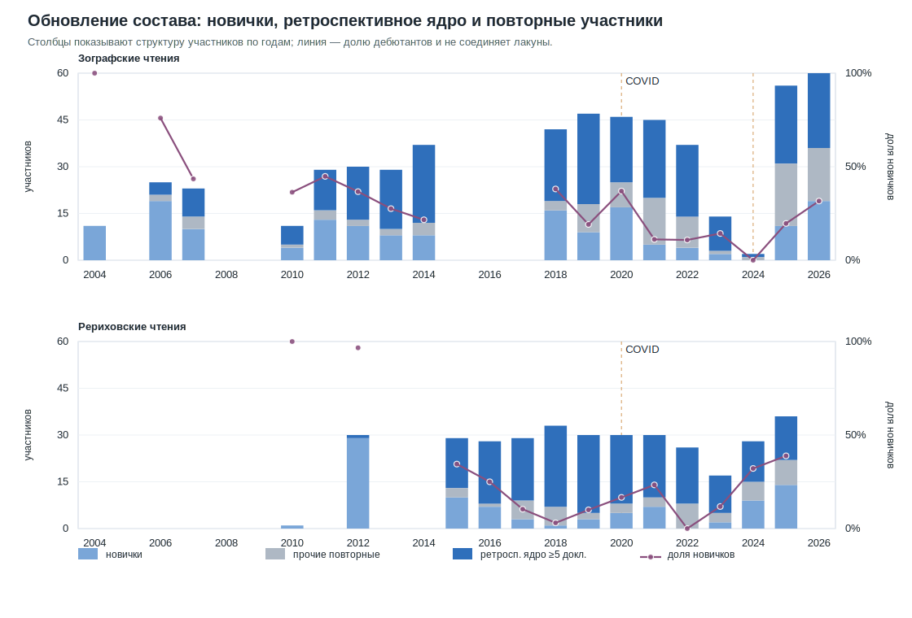
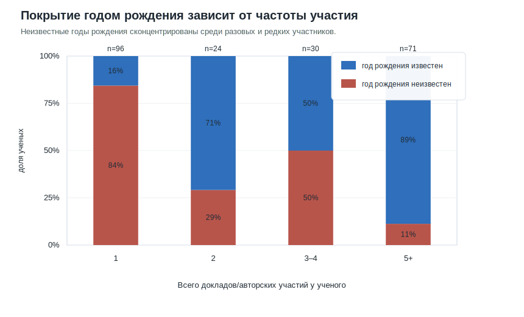
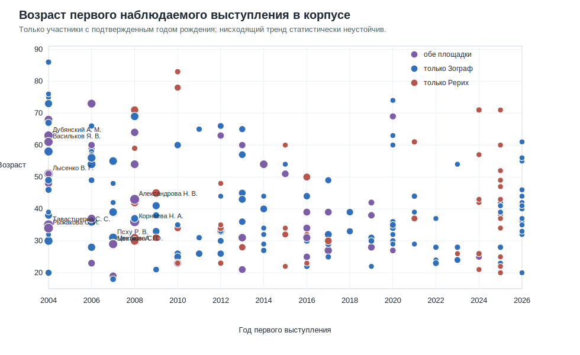
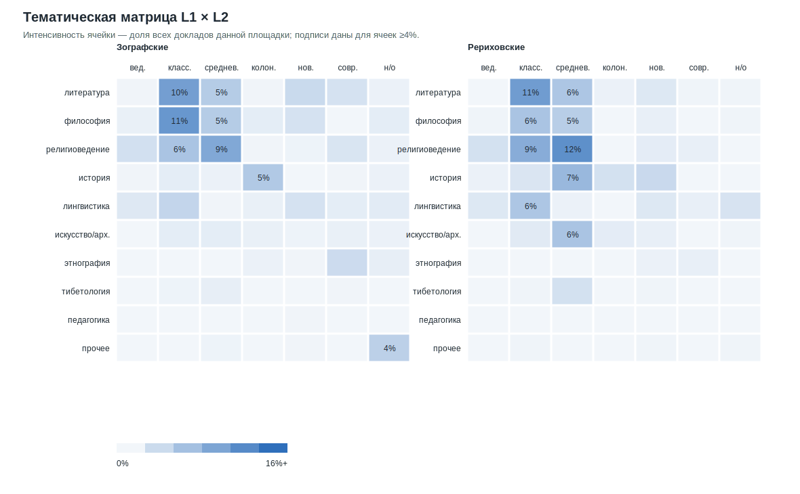
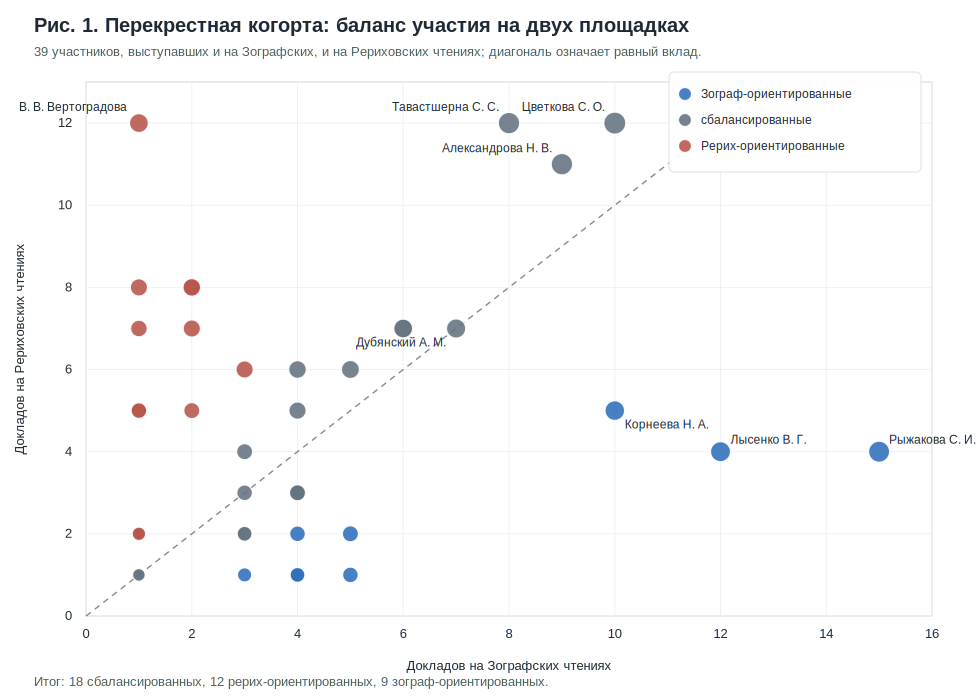
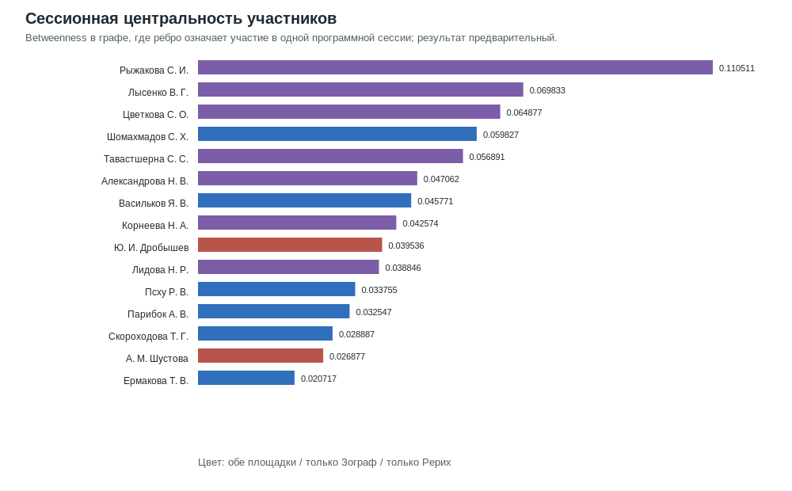
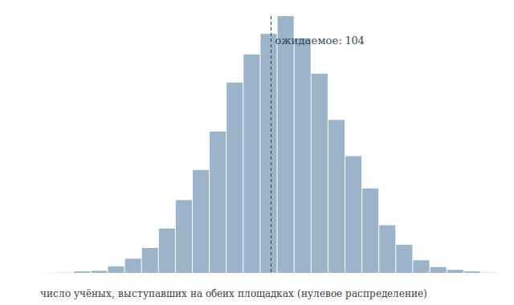
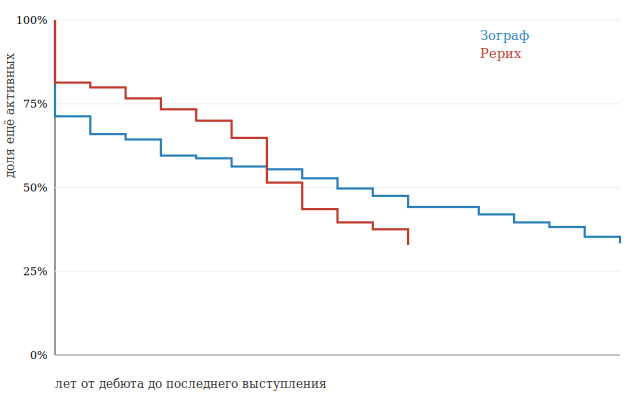

# Зографские и Рериховские чтения, 2004–2026: ретроспективный сравнительный анализ участников и тематик

> Рабочий драфт для ППВ. Версия 0.6, 2026-05-22. Целевой объем 12–15 стр., итоговое
> назначение — раздел «Научная жизнь» либо обзорно-аналитическая статья. В версии 0.4
> добавлены проверки дополнительных гипотез и публикационные рисунки; в версии 0.5
> встроены результаты следующего прохода по возрасту дебюта, ИКВИА/ВШЭ и сессионным
> сетевым посредникам; в версии 0.6 уточнены правое цензурирование 2026 г.,
> интерпретация метрик закрытости и подписи публикационных рисунков.

---

## Аннотация

Статья представляет ретроспективный количественный анализ двух долговременных публично
наблюдаемых индологических научных чтений России — Зографских чтений (Санкт-Петербург, с 1980 г.,
в формальном статусе с 1994 г.) и Рериховских чтений (Москва, с 1960 г.) — за период,
для которого удалось собрать сопоставимые данные о составе участников: 2004–2026.
На основе нормализованного корпуса из 895 включенных в базу докладов и 226 ученых
(837 состоявшихся докладов по 2025 г. и 58 докладов предварительной программы
Зографских чтений 2026 г.) мы вычисляем шесть метрик
«закрытости клуба» (доля разовых участников, доля ядра, индекс Джини, удержание дебютантов,
выживаемость когорт, темпы обновления состава), сопоставляем тематические профили двух
чтений по четырем осям (дисциплина, период, материал, характер) и проверяем гласно
заявленные критерии участия против фактического состава. Главный вывод: Рериховские
чтения, имея в полтора раза меньше уникальных ученых, демонстрируют описательно более
плотное ядро (30.9% против 23.4% в Зографе; без предварительной программы 2026 г. —
25.0% в Зографе) и более высокую тематическую концентрацию
вокруг средневекового и классического периодов (74% докладов против 56%). Зографские
чтения, напротив, до недавнего времени сохраняли более широкое распределение по периодам
и явное доминирование философской проблематики. Сопоставление публикуемой риторики
XLVII Зографских чтений (2026) с опубликованным составом ее программы показывает, что
критерий «профильных академических учреждений» не может быть проверен из самой
программы: 41 из 60 участников (68%) ни разу за все годы участия не указывали в
программе никакого учреждения — только город.

**Ключевые слова:** Зографские чтения, Рериховские чтения, российская индология,
просопография, наукометрия, цифровые гуманитарные науки, ретроспективный анализ.

## Abstract

This article presents a retrospective quantitative analysis of two long-running public
conference venues of Russian Indology — the Zograf Readings (St. Petersburg, since 1980, formally named
since 1994) and the Roerich Readings (Moscow, since 1960) — for the period for which
comparable participant data could be assembled: 2004–2026. From a normalised relational
database of 895 catalogued talks and 226 scholars, including 837 talks through 2025
and 58 talks announced in the preliminary 2026 Zograf programme, we compute six
"closedness" metrics (one-talk-only share, core share, Gini index, retention rate,
cohort survival, newcomer rate), compare
the thematic profiles of the two venues along four axes (discipline, period, material,
character), and confront the publicly stated participation criterion against the actual
roster. The principal finding is that the Roerich Readings, with roughly two-thirds the
unique-scholar count of the Zograf Readings, exhibit a descriptively denser core
(30.9% vs 23.4%; 25.0% for Zograf when the preliminary 2026 programme is excluded)
and a heavier thematic concentration on medieval and classical periods (74% of
talks vs 56%). The Zograf Readings retain a broader period distribution and a clear
dominance of philosophical content. A comparison of the published call for papers of
XLVII Zograf Readings (2026) with the published programme roster shows that the criterion of
"specialised academic institutions" cannot be verified from the programme itself, since
no participant is listed with an institutional affiliation — only with a city.

**Keywords:** Zograf Readings, Roerich Readings, Russian Indology, prosopography,
scientometrics, digital humanities, retrospective analysis.

---

## 1. Введение

Публично наблюдаемая конференционная жизнь российской индологии в течение последних
двадцати лет во многом сосредоточена вокруг двух регулярных научных чтений. В Санкт-Петербурге это **Зографские
чтения**, проводимые с 1980 г. в Ленинградском отделении ИВ АН СССР (позднее —
Санкт-Петербургском филиале ИВ РАН, с 2007 г. — Институте восточных рукописей РАН)
и получившие имя основателя, Г. А. Зографа, в 1994 г. В Москве это **Рериховские
чтения**, ежегодные с 1960 г., посвященные памяти Ю. Н. Рериха и проводимые
Институтом востоковедения РАН.

Обе площадки являются открытыми научными собраниями: участие бесплатное, заявки
принимаются без формального рецензирования, программа объявляется оргкомитетом.

**Организационная преемственность.** В Рериховских чтениях руководящая роль на
протяжении многих лет принадлежала В. В. Вертоградовой (род. 1933), долгое время
определявшей программу; после ее отхода от непосредственного руководства эту роль фактически наследовали ведущие
сотрудники Отдела истории и культуры Древнего Востока ИВ РАН. В Зографских чтениях
до 2024 г. включительно руководящую роль исполнял Я. В. Васильков; с 2025 г.
ответственность за программу перешла к М. Ф. Альбедиль и В. П. Иванову, что совпало
по времени с появлением в анонсах оргкомитета новых формулировок об академическом
характере состава участников (см. раздел 5).

**Календарная привязка.** Зографские чтения традиционно проходят во второй половине
мая, обычно занимая три–четыре дня (с понедельника или вторника по пятницу).
Рериховские чтения — в первой–второй декаде декабря, обычно три дня. Развернутая
программа обоих чтений становится публично доступной, как правило, лишь за несколько
дней до их начала; до этого срока публикуется только анонс с темой и основными
площадками. Это обстоятельство, при формальной открытости конференций, затрудняет
независимое наблюдение и работу в режиме вольнослушателя для тех, кто не входит в
круг приглашенных.

Несмотря на регулярность и значительный совокупный объем — за два десятилетия в обеих
конференциях, по нашим данным, в корпус вошли **226 уникальных ученых и 895
докладов** (837 состоявшихся по 2025 г. и 58 заявленных в предварительной программе
2026 г.), — систематической ретроспективной оценки их состава, тематики и динамики
до сих пор не предпринималось. Существующие хроники, появлявшиеся в «Письменных
памятниках Востока» и других периодических изданиях, как правило, ограничивались
описанием одного года и не ставили сравнительной задачи.

Настоящая статья имеет три цели. Во-первых, дать сводный количественный портрет двух
чтений за двадцать лет. Во-вторых, проверить тезис о том, что одна из площадок —
Рериховские чтения — функционирует как «закрытый клуб», устойчивое ядро которого
мало проницаемо для внешних участников, тогда как Зографские чтения долгое время
сохраняли черты межинституциональной открытой площадки. В-третьих, рассмотреть
формулировку критериев включения, гласно заявленную организаторами XLVII Зографских
чтений 2026 г., и сопоставить ее с опубликованным составом этой программы.

Автор настоящей статьи сам неоднократно выступал на обеих площадках (2006–2024 гг.)
и потому имеет личный исследовательский интерес к структуре академической среды, в
которой он работает. Это обстоятельство мы оговариваем явно: оно повлияло на выбор
вопросов, но не на интерпретацию данных, которые публикуются в полном виде в
приложениях. Все выводы на основе количественных данных могут быть независимо
воспроизведены.

## 2. Источниковая база и метод

### 2.1. База данных

Источниковой базой исследования является нормализованная база, построенная по программам
обеих конференций, размещенным на сайтах ИВР РАН (Зографские чтения) и ИВ РАН
(Рериховские чтения). Программы кэшированы локально и обрабатываются автоматически,
извлекающим участников, доклады, секции, дни и площадки. База содержит:

- **22 события Зографских чтений** в базе (2004, 2006–2026, кроме 2005 и неполных
  лет), из них 17 событий имеют извлеченные доклады;
- **18 событий Рериховских чтений** в базе (2007–2010, 2012–2025; с устойчивым
  годовым шагом начиная с 2012 г.), из них 13 событий имеют извлеченные доклады;
- **226 уникальных ученых** после нормализации;
- **895 включенных в корпус докладов**, из которых 540 на Зографских и 355 на
  Рериховских чтениях;
- **142 дня заседаний** и более 200 сессий.

Программа XLVII Зографских чтений 2026 г. на момент подготовки настоящей версии
(22 мая 2026 г.) еще относится к будущему событию: она включена по предварительной
публикации оргкомитета и охватывает 58 заявленных докладов 60 участников. Поэтому
все показатели, зависящие от будущей возвращаемости этих участников, ниже читаются
как предварительные и проверяются через сопоставление с корпусом по 2025 г.

### 2.2. Нормализация и идентификация

Существенная техническая задача — сопоставление одного и того же ученого, заявленного
в разные годы под разными формами имени («В. В. Вертоградова», «Вертоградова Виктория
Викторовна», «Victoria Vertogradova»). Нормализация выполняется на основе правил,
сводящих все варианты к каноническому ключу «фамилия инициалы», после чего происходит
автоматическое слияние записей. Спорные случаи разрешены вручную.

Тематическое кодирование докладов выполнено в два прохода. На первом проходе по
ключевым словам каждому заголовку были присвоены предварительные метки по четырем
осям: дисциплина (L1), период (L2), материал (L3) и характер доклада (L4). На втором
проходе спорные случаи были перекодированы методами автоматизированной разметки и
выборочно проверены автором.

### 2.3. Оговорки и ограничения

Принципиальные ограничения. **Во-первых,** год рождения известен только для 66 из
226 ученых; для оставшихся 160 невозможно построить точную возрастную пирамиду, и
в разделе 7 мы работаем только с известными значениями. **Во-вторых,** программы
2022 г. для Зографских чтений содержат лакуны в названиях докладов (26 случаев с
сокращенными или пустыми заголовками), что затрудняет тематическую разметку именно
этого года. **В-третьих,** ученые степени и места защиты диссертаций в базе пока
размечены не для всех; вопрос о научных связях между поколениями (например, об
учениках А. В. Парибка — Е. А. Десницкой, Е. О. Кузиной и др.) мы затрагиваем лишь
эпизодически, не претендуя на сводный портрет научных школ. **В-четвертых,** включение
предварительной программы 2026 г. создает правое цензурирование для метрик возвращаемости:
участники, впервые появившиеся в 2026 г., еще не имели возможности вернуться в корпус.
Поэтому для ключевых просопографических выводов ниже указывается, меняется ли картина
при отсечении данных по 2025 г. **В-пятых,** разметка «онлайн / очно» возможна только
для тех докладов, в строке которых явно указан соответствующий маркер; это дает нижнюю
границу доли онлайн-участия.

Есть и ограничение, связанное с внутренней нормализацией самой базы. Поле
`event.theme_ru` для Рериховских чтений в текущем виде унифицирует годовые темы и
тем самым скрывает реальные вариации подзаголовков, видимые в кэшированных HTML-
страницах программ. Поэтому проверка связи «подзаголовок программы — фактическое
содержание докладов» ниже проводится не по этому полю, а по извлеченным из HTML
заголовкам программ. Аналогично, сведения о видеозаписях и PDF-источниках пока
имеют разный уровень привязки: видеозаписи в части случаев связаны с отдельными
докладами, тогда как PDF-источники в базе связаны прежде всего с публикационными
постами, а не с конкретными докладами.

## 3. Объемные показатели за двадцать лет

### 3.1. Общая картина

В корпус за период 2004–2026 гг. включены **895 докладов** и **226 ученых**: 837
докладов относятся к уже состоявшимся событиям по 2025 г., еще 58 — к предварительной
программе XLVII Зографских чтений 2026 г. Распределение по площадкам асимметрично:
на Зографских чтениях по 22 событийным записям в базе (17 с извлеченными докладами)
зафиксирован 171 ученый с 540 докладами, на Рериховских за 18 событийных записей
(13 с извлеченными докладами) — 94 ученых с 355 докладами.

| Показатель | Зографские | Рериховские | Сумма |
|---|---:|---:|---:|
| Событийных записей в базе | 22 | 18 | 40 |
| Событий с извлеченными докладами | 17 | 13 | 30 |
| Лет покрытия | 2004–2026 | 2007–2025 | 2004–2026 |
| Уникальных ученых | 171 | 94 | 226 |
| Всего докладов | 540 | 355 | 895 |
| Докладов на событие с извлеченными докладами, медиана | 25 | 21 | — |
| Ученых в обеих | — | — | 39 |

Различение двух строк важно: в базе сохраняются и событийные записи без извлеченных
докладов, поскольку они фиксируют лакуны источника, а не нулевую активность чтений.

Из совокупных 226 ученых **39 (17%) выступали на обеих площадках**, образуя пересекающуюся
когорту, которой посвящен раздел 9. Само по себе это число еще не говорит об изоляции:
при наблюдаемой активности участников часть из них пересекла бы границу двух чтений и
случайно. Однако формальная проверка (приложение Г, раздел Г.1) показывает, что случайное
распределение той же активности дало бы около 104 «общих» ученых, тогда как фактически
их лишь 39 — более чем на восемнадцать стандартных отклонений ниже ожидаемого. Иными
словами, две дисциплинарно родственные площадки в одной стране образуют два в значительной
мере обособленных круга, и эта обособленность существенно сильнее случайной.

### 3.2. Динамика по годам

Объемная динамика обеих площадок параллельна, но с разной фазой максимума. Зографские
чтения достигают пика в 2018–2022 гг. (37–47 докладов в год), Рериховские — в
2017–2019 гг. (30–34 в год). На обеих площадках виден провал 2020 г. (COVID-19),
причем в Зографских чтениях этого года конференция явно объявлена «в режиме интернет-
трансляции». Для 2024 г. на сайте ИВР РАН опубликована сокращенная версия программы
(в нашей базе зафиксировано лишь 2 доклада); полная программа этого года готовится
к включению в базу из материалов автора. К 2025–2026 гг. Зографские чтения по
предварительной программе возвращаются к масштабу 56–60 докладов, тогда как
Рериховские чтения 2025 г. фиксируются на уровне 36 докладов.

| Год | Зограф докл. | Зограф ученых | Рерих докл. | Рерих ученых |
|:---:|:---:|:---:|:---:|:---:|
| 2004 | 11 | 11 | — | — |
| 2006 | 25 | 25 | — | — |
| 2007 | 23 | 23 | — | — |
| 2010 | 11 | 11 | 1 | 1 |
| 2011 | 29 | 29 | — | — |
| 2012 | 30 | 30 | 30 | 30 |
| 2013 | 29 | 29 | — | — |
| 2014 | 37 | 37 | — | — |
| 2015 | — | — | 29 | 29 |
| 2016 | — | — | 30 | 28 |
| 2017 | — | — | 34 | 29 |
| 2018 | 42 | 42 | 33 | 33 |
| 2019 | 47 | 47 | 30 | 30 |
| 2020 | 44 | 46 | 30 | 30 |
| 2021 | 45 | 45 | 30 | 30 |
| 2022 | 37 | 37 | 26 | 26 |
| 2023 | 14 | 14 | 17 | 17 |
| 2024 | 2 | 2 | 29 | 28 |
| 2025 | 56 | 56 | 36 | 36 |
| 2026 | 58 | 60 | — | — |
| **Итог** | **540** | **171** | **355** | **94** |

(Прочерк указывает на отсутствие соответствующего события или на отсутствие данных
в выборке. Разница между числом докладов и числом ученых в отдельные годы (2016, 2017,
2020, 2024, 2026) объясняется наличием соавторских докладов. Программа 2024 г.
Зографских чтений на сайте ИВР РАН размещена сокращенно; полная программа этого
года доступна автору и будет интегрирована в базу к следующей версии настоящей статьи.)

Рис. 1 показывает, что резкие колебания доли новичков возникают не только в кризисные
годы, но и в годы изменения формата источника. Поэтому годовые всплески следует
интерпретировать осторожно: они фиксируют одновременно реальное обновление состава,
режим публикации программы, степень полноты источника и, для 2026 г., предварительный
характер еще не состоявшейся программы.

## 4. Просопография и метрики закрытости клуба

Является ли каждое из двух чтений открытой научной площадкой или закрытым клубом?
Чтобы дать содержательный ответ, мы предлагаем шесть метрик, каждая из которых
покрывает свой аспект «закрытости» (см. определения ниже). Используемые нами метрики
соотносятся с общей классификацией параметров ранжирования конференций, предложенной
в [Козицын, 2024]. Неравномерность распределения участия и необходимость использования
непосредственных («статических») параметров активности вместо цитатных метрик с долгим
цитатным лагом также согласуется с моделями кумулятивного преимущества в наукометрии [Ермолаева, 2026].
Все метрики вычислены отдельно для каждой серии и для их объединения.

### 4.1. Шесть метрик

1. **Доля разовых участников** (one-talk-only share): доля ученых, выступивших ровно
   один раз за весь период. Чем выше, тем активнее площадка втягивает «случайных»
   докладчиков; чем ниже, тем плотнее ядро завсегдатаев.
2. **Доля ядра** (core share, ≥ 5 докладов): доля ученых, выступивших не менее пяти
   раз. Это «несущая опора» площадки.
3. **Индекс Джини** по числу докладов на ученого. Высокий Джини означает: участие
   сконцентрировано в руках узкого круга; низкий — распределено более равномерно.
4. **Удержание дебютантов** (retention): доля ученых, чье участие не ограничилось
   дебютом — иначе говоря, вероятность повторного выступления.
5. **Доля новичков** (newcomer share) по годам (см. приложение Б): отношение
   дебютантов к общему числу выступающих в данный год.
6. **Выживаемость когорт** (cohort survival): для каждой когорты дебютантов — какая
   ее доля остается активной через N лет после дебюта.

### 4.2. Сводная таблица

В таблице ниже приведен основной расчет по всему корпусу, включая предварительную
программу Зографских чтений 2026 г.

| Метрика | Зографские | Рериховские | Объединено |
|---|---:|---:|---:|
| Уникальных ученых | 171 | 94 | 226 |
| Авторских участий | 544 | 355 | 899 |
| Разовые участники, % | 46.2 | 39.4 | 44.7 |
| Доля ядра ≥ 5 докл., % | 23.4 | **30.9** | 30.1 |
| Индекс Джини | 0.465 | 0.459 | 0.487 |
| Удержание дебютантов, % | 53.8 | **60.6** | 55.3 |
| Медиана докл. на ученого | 2 | 2 | 2 |
| Максимум докл. у одного | 15 | 12 | 17 |

Проверка чувствительности к правому цензурированию 2026 г. меняет масштаб, но не
направление различий: если считать только уже состоявшиеся события по 2025 г.,
Зографские чтения дают 152 уникальных ученых и 484 авторских участия; доля ядра
составляет 25.0%, доля разовых участников — 42.8%, удержание дебютантов — 57.2%,
индекс Джини — 0.450. Поэтому включение предварительной программы 2026 г. усиливает
контраст, но не создает его заново.

### 4.3. Интерпретация

Главное наблюдение раздела состоит в следующем. Несмотря на то что Рериховские
чтения формально меньше Зографских и по числу событий, и по числу уникальных
ученых (94 против 171), они показывают:

- **описательно более плотное ядро** (30.9% участников выступали пять и более раз
  против 23.4% в Зографе во всем корпусе; при отсечении 2026 г. — 30.9% против
  25.0%);
- **более высокое удержание дебютантов** (60.6% против 53.8% во всем корпусе;
  при отсечении 2026 г. — 60.6% против 57.2%): дебют на Рериховских чтениях чаще
  оборачивается продолжительным участием;
- **меньшую долю разовых участников** (39.4% против 46.2%).

Эти различия следует понимать прежде всего как описательные, а не как результат
строгого статистического теста на «закрытость»: при имеющемся размере выборки различия
по доле ядра (29/94 против 40/171) и по доле разовых участников (37/94 против 79/171)
не достигают общепринятого уровня значимости по точному критерию Фишера. Поэтому
корректнее говорить не о доказанном скрытом механизме отбора, а о более компактной
и лучше самовоспроизводящейся структуре Рериховских чтений.

Индекс Джини практически идентичен у обеих площадок (0.459 и 0.465), что свидетельствует
о схожем характере концентрации, но это сходство достигается разными способами:
в Зографских чтениях концентрация распределена среди более широкого круга (171 ученый),
а в Рериховских — внутри гораздо более компактной группы (94 ученых). Эту особенность
можно интерпретировать как структурную: Рериховские чтения — конференция меньшего
сообщества, но с большей лояльностью; Зографские — площадка с большим числом случайных
докладчиков, но и с большей открытостью для них.

Высокие показатели лояльности и удержания участников на обеих площадках (удержание дебютантов 53.8% в Зографе и 60.6% в Рериховских чтениях) выглядят примечательно на фоне институционального контекста российской науки 2010–2020-х гг. Как показывает А. В. Гринёв, в условиях доминирования наукометрического оценивания публикации в сборниках трудов и материалах отечественных конференций зачастую маргинализировались администрацией вузов, оцениваясь «жалким одним баллом» или вовсе не стимулируясь материально [Гринёв, 2019, с. 998–999]. Устойчивость ядра исследуемых чтений свидетельствует о том, что они продолжают функционировать как значимые пространства реальной содержательной деятельности и научной социализации, сохраняя свою ценность для сообщества вопреки логике бюрократических индикаторов.

Вместе с тем формальный анализ дожития (приложение Г, раздел Г.3) не обнаруживает
значимого различия в длительности участия дебютантов двух площадок: по медианной длине
траектории Зографские чтения даже не уступают Рериховским, а старшинство Зографской
серии скорее работало бы в их пользу. Поэтому более высокое удержание на Рериховских
чтениях мы трактуем как тенденцию к повторному участию, а не как доказанно более долгие
научные траектории.

Особое наблюдение касается того, что мы предлагаем назвать **«институциональным
ядром»** Рериховских чтений. Четыре ученых Института востоковедения РАН — В. В. Вертоградова,
Е. В. Тюлина, Е. Г. Вырщиков, А. М. Шустова — на протяжении 2012–2025 гг. имеют
непрерывную цепочку выступлений по одному в каждом году (12 событий из 12 возможных,
то есть 100% явка). К ним примыкает Ю. И. Дробышев, дебютировавший в 2015 г. и
сохраняющий ту же стопроцентную явку (11 событий из 11). Эта группа из пяти ученых
одного института функционирует как структурный центр площадки и составляет около
**одного шестого всех докладов** на Рериховских чтениях за период 2012–2025 гг. — 59
докладов из 355.

В Зографских чтениях аналогичное «несменяемое» ядро менее выражено: участники с
сопоставимо длительными цепочками выступлений присутствуют (С. И. Рыжакова — 15 докладов,
А. В. Парибок — 13, Я. В. Васильков, А. А. Игнатьев, В. Г. Лысенко, Р. В. Псху — по 12,
Е. А. Десницкая — 11), но они не образуют сплоченной институциональной когорты:
С. И. Рыжакова работает в ИЭА РАН, В. Г. Лысенко — в ИФ РАН, Я. В. Васильков —
бывший сотрудник МАЭ РАН, Е. А. Десницкая и Р. В. Псху связаны соответственно
с СПбГУ и РУДН. А. А. Игнатьев работает в Калининграде и в публичных программах
выступает без указания учреждения; для него и многих других в наших данных
зафиксирован лишь город, без институциональной приписки.

### 4.4. Закрытость для вольнослушателей

Отдельное измерение «закрытости» — это доступность присутствия для тех, кто не
выступает с докладом, но желает участвовать в качестве вольнослушателя. По нашим
наблюдениям и общедоступным данным, обе площадки в целом открыты для свободного
посещения после специального запроса организаторам, однако:

1. **Развернутая программа** публикуется лишь за несколько дней до начала чтений
   (см. § 1), что заметно ограничивает планирование участия для исследователей
   из других городов и зарубежья.
2. **Видеотрансляция** очных заседаний организаторами систематически не ведется.
   Доступные публично записи имеют избирательный характер: на личном канале автора
   настоящей статьи на платформе YouTube размещены **178 видеозаписей** докладов
   Зографских чтений — преимущественно XL и XLI сессий (2019–2020 гг., 72 видео,
   из которых значительная часть приходится на XLI чтения 2020 г.), XLV сессии
   (2024 г., 56 видео) и XLVI сессии (2025 г., 38 видео), а также 12 записей
   в дополнительной подборке. Эта подборка является, по нашим сведениям,
   единственным сравнительно полным открытым архивом записей конференции;
   на сайтах ИВР РАН и ИВ РАН видеозаписи докладов не публикуются. Из 178
   видеозаписей 89 удалось алгоритмически сопоставить с конкретными докладами
   в нашей базе по фамилии докладчика и заголовку (нечёткое сравнение строк,
   порог сходства 0,55), и эти ссылки доступны непосредственно из карточек
   соответствующих докладов в электронном дашборде проекта.
3. **Гибридный формат**, появившийся в 2020 г. в результате пандемии COVID-19, по
   опубликованным программам 2025–2026 гг. снова стал преимущественно очным. В Зографских
   чтениях доля докладов с открытой пометкой «(онлайн)» сократилась с 100% в 2020 г.
   до 1.7% в 2026 г. На Рериховских чтениях доля онлайн-докладов в любой год не
   превышала 17%.

Таким образом, формальная открытость чтений сочетается с операциональными барьерами
для дистанционного участия и независимого наблюдения.

### 4.5. Сериализация докладов и «salami slicing»

Еще одна просопографическая гипотеза касается так называемой «сериализации» докладов, когда одно исследование разделяется автором на несколько логических частей, презентуемых последовательно из года в год под схожими названиями (что в наукометрической литературе часто описывается как практика «salami slicing»). Для проверки этой гипотезы мы выявили в базе данных цепочки докладов одного автора с высокой текстовой близостью названий (содержащих общие сквозные маркеры с указанием частей: «Часть 1», «Часть 2», римские цифры «I», «II» или лексемы «сообщение 1», «сообщение 2» и т.п.).

Анализ показал следующие результаты:
* Среди авторов, составляющих «ядро» (выступивших $\ge 5$ раз за исследуемый период), доля сериализованных докладов составила 2.2% (14 докладов из 647).
* В группе «периферии» (менее 5 выступлений) доля таких докладов оказалась равна 4.0% (10 докладов из 252).
* Применение точного критерия Фишера указывает на отсутствие статистически значимых различий в частоте использования сериализации между этими группами участников ($p = 0.1649$). Таким образом, гипотеза о том, что представители «ядра» более склонны к искусственному дроблению своих тем для удержания позиций на конференциях, не подтверждается.

В то же время корреляционный анализ Спирмена выявил слабую, но статистически высокозначимую положительную связь между общим числом выступлений автора и абсолютным количеством его сериализованных докладов ($\rho = 0.223$, $p = 0.0007$). Это свидетельствует о том, что сериализация является устойчивой индивидуальной стратегией долгосрочного планирования работы у отдельных исследователей, а не массовым инструментом искусственного завышения публикационной активности.

## 5. Критерии включения: кто называется востоковедом

### 5.1. Декларация и публикуемый формат программы

В предварительной программе **XLVII Зографских чтений** (26–29 мая 2026 г.) оргкомитет
делает следующее уточняющее заявление о составе участников:

> «В работе конференции примут участия [так в источнике] ученые-индологи из профильных академических
> учреждений России и зарубежья.»¹

Данное уточнение появляется впервые в просмотренных нами объявлениях этих чтений; в более ранних объявлениях
аналогичные ограничения отсутствуют. Однако сама программа XLVII чтений делает
буквальное прочтение этого критерия неосуществимым по простой структурной причине:
**ни у одного из 60 участников программы не указано конкретное учреждение** — указан
только город (Москва, Санкт-Петербург, Пенза, Екатеринбург, Тель-Авив, Дели, Гент,
Патна и т. п.). Кроме того, для целого ряда участников упомянутый «город» в
действительности не является и не подразумевает институциональной принадлежности
(так, у А. А. Игнатьева в течение всех двенадцати его выступлений на Зографских
чтениях стоит лишь «Калининград» — название города, а не научного учреждения).
Поэтому уже из самой публикуемой формы программы невозможно установить, является ли
каждый конкретный участник сотрудником «профильного академического учреждения» или
нет.

### 5.2. Проверка через историческую аффилиацию

Чтобы все же оценить степень соответствия фактического состава 2026 г. заявленному
критерию, мы провели проверку **по всей истории участия каждого из 60 ученых** на
обеих чтениях, аккумулированной в нашей базе за 2004–2025 гг. Идея проста: если
ученый в каком-либо из своих предыдущих выступлений (или сразу в нескольких) указывал
конкретное учреждение, мы засчитываем это как документированное институциональное
свидетельство; если же во ВСЕХ годах своих выступлений (а у некоторых их более десяти)
указывался лишь город — мы фиксируем структурное отсутствие институциональной приписки
в публичном пространстве конференции.

Результат проверки приведен ниже. Полные пофамильные списки опубликованы отдельно
(`analytics_output/zograf_2026_no_affiliation.md`).

| Группа | Кол-во | % | Описание |
|---|---:|---:|---|
| A. С документированной аффилиацией в истории | **19** | 31.7 | Хотя бы в одной из прошлых программ стоит конкретное учреждение |
| B. Только город во всех годах участия | **40** | 66.7 | Никогда за всю историю выступлений на двух чтениях не указано учреждение |
| C. Явный «независимый исследователь» (Н. А. Корнеева) | **1** | 1.7 | С 2022 г. в Рериховских чтениях прямо помечена как НИ |
| **Всего** | **60** | **100** | |

Таким образом, **по нашим данным критерий "профильных академических учреждений"
является документально проверяемым лишь для 31.7% состава XLVII Зографских чтений
2026 г.** Это не означает, что остальные две трети не имеют учреждения: значительная
их часть, по внешним биографическим сведениям, является сотрудниками известных
институтов (МАЭ РАН, ИВР РАН, ИФ РАН, РУДН и др.), но этот статус не отражен в
публикуемом формате программы. Структурная проблема не в составе участников, а в формате
объявления: декларация о критерии и публикуемая форма программы расходятся.

### 5.3. Кто конкретно не имеет аффилиации в наших данных

Среди 60 участников XLVII Зографских чтений 2026 г. **41 человек ни разу за все годы
участия не указывал в программе никакого учреждения** — для них в строке программы
во все годы стоит только город (СПб., Москва, Калининград, Пенза, Казань, Гамбург,
Дели, Тель-Авив, Екатеринбург и т. п.) либо явная самопометка «независимый исследователь».
Среди этих 41 участника есть как заведомо известные академические специалисты
(М. Ф. Альбедиль из МАЭ РАН, С. Л. Бурмистров из ИВР РАН, Р. В. Псху из РУДН,
С. Х. Шомахмадов из ИВР РАН), так и ученые, чей институциональный статус наша база
просто не может подтвердить из-за единообразия формата публикуемой программы
(Т. И. Оранская, С. В. Касым, Е. Г. Застрожнова, В. А. Абинякин и др. — все указаны
только как «Санкт-Петербург»).

**Среди 41 участника без указания учреждения** в 2026 г. публично подтверждается
лишь один статус, прямо противоречащий критерию академического сотрудника: это
**Н. А. Корнеева**, в программах Рериховских чтений 2022–2025 гг. явно представлявшаяся
как «независимый исследователь» (с указанием «НИ», «ни» и развернутого варианта).
Она же фигурирует в программе XLVII Зографских чтений 2026 г. с обозначением
«Москва» (как и в других своих выступлениях на Зографских чтениях).

Особое внимание привлекают два доклада, по названию относящиеся к категории
прикладной деятельности:

- Ю. В. Бещук (СПб.), «Перевод в практике преподавания хинди в средней школе»;
- И. А. Соколова (СПб.), «Пословицы и поговорки Индии и России как аспект межкультурной
  коммуникации (проектная деятельность на уроках языка хинди)».

Темы этих двух докладов прямо отсылают к школьной педагогической практике, а не к
институциональной принадлежности автора. Сами по себе они не доказывают отсутствия
академической аффилиации у докладчиков, но показывают, что строгая формулировка
критерия смешивает два разных уровня — статус учреждения и тематический профиль
доклада, — а потому нуждается в явном пояснении.

### 5.4. Интерпретация

Из анализа следует, что декларируемый критерий имеет одно из двух значений: либо
(а) он применяется на этапе подачи заявок (т. е. отдельные авторы отсекаются заранее
без публичного объявления), и тогда мы фиксируем фильтр, действие которого мы не
можем наблюдать; либо (б) он формулируется как риторический сигнал, не подразумевающий
буквального исполнения, и тогда мы фиксируем декларацию о намерениях, не выраженную
в фактическом составе. Имеющиеся данные не позволяют выбрать между этими двумя
объяснениями. Содержательно важно, что само наличие подобной формулировки впервые
за двадцать с лишним лет работы чтений уже отражает смену тональности оргкомитета —
смену, по времени совпавшую со сменой руководства организационного комитета (см. § 1).

Стремление оргкомитета XLVII Зографских чтений (2026 г.) ограничить состав участников рамками «профильных академических учреждений» отражает общую тенденцию академического менеджмента к созданию жестких формальных границ. Однако расхождение между этой декларацией и формой публикации программы (где 66.7% участников указаны только по городу) иллюстрирует общую для российской науки проблему, когда навязывание формальных показателей превращает их в «некий фетиш, самоцель системы в ущерб реальной содержательной деятельности» [Гринёв, 2019, с. 996]. В условиях сложившейся «наукометрической анархии» [Гринёв, 2019, с. 1000] оргкомитеты вынуждены использовать риторические маркеры академического статуса, хотя реальная структура индологического сообщества продолжает опираться на географическую циркуляцию кадров и неформальные профессиональные связи.

В этой связи уместно отметить: по нашим тематическим данным (см. раздел 8.3), доля
прикладных и методологических докладов на обеих площадках практически идентична и
составляет около 6–7% от общего числа. Это означает, что **гипотеза о систематическом
тематическом фильтре, отсекающем прикладные темы, нашими данными не подтверждается**.
Точнее было бы говорить об избирательной практике отдельных решений по конкретным
заявителям, нежели о доктринальном фильтре по содержанию. Эти решения, лишь время
от времени становящиеся видимыми (и тогда — лишь самим заявителям, получающим отказ),
по своей природе ближе к контекстным предпочтениям оргкомитета, чем к гласному
правилу, и потому особенно нуждаются в открытом обсуждении.

### Сноска
¹ Программа XLVII Зографских чтений, опубликованная на сайте ИВР РАН (раздел
«Конференции», дата публикации — апрель 2026 г.).

## 6. Институциональный ландшафт

Институциональная карта обеих площадок различается. В Зографских чтениях наиболее
часто представлены **СПбГУ (Восточный факультет)**, **ИВР РАН** и **Институт философии
РАН**; периферийно присутствуют **ИСАА МГУ**, **РГГУ**, **НИУ ВШЭ (ИКВИА)** и
региональные исследователи (Казань, Калининград, Пенза, Екатеринбург). На Рериховских
чтениях доминирует **ИВ РАН** — Институт востоковедения РАН, в первую очередь сотрудники
Отдела истории и культуры Древнего Востока; во вторую очередь представлены **ИМЛИ
РАН**, **Институт философии РАН**, **РГГУ** и **РУДН**.

Динамика аффилиаций в нашей базе зафиксирована для 77 ученых, чьи указанные места
работы менялись с течением времени. Наиболее заметные сюжеты:

- **Миграция в Институт философии РАН.** В. Г. Лысенко в 2012 г. впервые указала
  Институт философии РАН (до этого — только «Москва»); с тех пор она появляется
  либо как ИФ РАН, либо как «Москва». В. К. Шохин (ИФ РАН) появляется на Зографских
  чтениях лишь с 2020 г., что отражает расширение участия этого института.
- **Межпоколенческие связи петербургского круга.** Е. А. Десницкая и Е. О. Кузина —
  выпускницы С.-Петербургского отделения, связанные с кругом А. В. Парибка по
  ряду тем, на разных этапах присоединяются к Зографским и Рериховским чтениям.
  Здесь это важно не как реконструкция «школы», а как пример плотных связей между
  исследователями разных поколений; в настоящем исследовании мы их не систематизировали
  отдельно.
- **РГГУ → ИКВИА НИУ ВШЭ.** В 2010-х гг. ряд ученых, ранее аффилированных с РГГУ
  (Н. В. Александрова — РГГУ 2015–2017 → ИВ РАН с 2018; А. Д. Цендина и др.),
  перешел в Институт классического Востока и античности (ИКВИА) НИУ ВШЭ. Сегодня
  ИКВИА — заметный голос в обоих чтениях, особенно среди молодых дебютантов
  2024–2026 гг. (Д. А. Комиссаров, М. Д. Минаева, А. В. Молина).
- **Смена статуса А. В. Парибка**: до 2014 г. — СПбГУ, далее — «Санкт-Петербург»,
  с 2022 г. — «Москва»; речь идет о фактическом отходе от штатной позиции при
  сохранении научной активности.
- **Н. А. Корнеева** в Рериховских чтениях 2022 г. впервые указала «независимый
  исследователь» (или варианты «НИ», «ни»). Это не значит, что Корнеева переехала
  из Москвы; в программах Зографских чтений она по-прежнему указывает «Москва».
  Речь идет о переходе от институционального статуса к статусу независимого
  исследователя при сохранении географической базы.

Отдельная проверка перекрестной когорты показывает, что **ИКВИА/ВШЭ действительно
стал одним из мостов между двумя площадками, но не единственным**. Среди 39 ученых,
выступавших и на Зографских, и на Рериховских чтениях, 12 имеют в истории аффилиаций
ИВ РАН, 8 — ИКВИА/ВШЭ и 8 — ИСАА МГУ. Тематически участники с аффилиацией
ИКВИА/ВШЭ, как правило, не «подстраивают» доклады под площадку: у 7 из 8 ведущая
дисциплинарная категория L1 совпадает на Зографских и Рериховских чтениях, а
медианное косинусное сходство L1-профилей составляет 0.976. Это скорее картина
межплощадочной циркуляции устойчивых исследовательских специализаций, чем адаптации
к локальному вкусу каждой конференции.

### 6.1. Метод подсчета: простое и фракционное институциональное участие

При анализе институциональной структуры научных сообществ важным методологическим вопросом является выбор способа учета докладов. Традиционный «простой» метод (full counting) приписывает единицу каждому учреждению, указанному автором (или соавторами). В то же время «фракционный» метод (fractional counting) делит вес одного доклада поровну между всеми соавторами и всеми заявленными ими аффилиациями, что позволяет избежать искусственного завышения роли многоаффилированных авторов и крупных коллективных работ. 

Для оценки влияния выбора метрики мы сравнили результаты простого и фракционного подсчетов для ведущих организаций на обеих площадках. Полученные данные показывают минимальные расхождения:
* **ИВ РАН**: простой счет — 160.0 докладов, фракционный — 158.000;
* **СПбГУ**: простой счет — 38.0 докладов, фракционный — 38.000;
* **НИУ ВШЭ (ИКВИА)**: простой счет — 18.0 докладов, фракционный — 16.000;
* **ИВР РАН**: простой счет — 2.0 докладов, фракционный — 2.000.

Такое совпадение объясняется спецификой индологического сообщества. Более 99% представленных на чтениях докладов являются индивидуальными (одноавторскими), а случаи указания исследователями двух и более мест работы носят единичный характер. Таким образом, переход к дробному учету не вносит искажений в общую иерархию институтов. 

Однако следует отметить существенное источниковедческое ограничение: если программы Рериховских чтений содержат детальные сведения о местах работы докладчиков, то организаторы Зографских чтений традиционно указывают в печатных и электронных программах только город проживания автора, опуская институциональную привязку (которая восстанавливалась нами ретроспективно по внешним базам данных и биографическим сведениям).

### 6.2. Географическое притяжение и когортная выживаемость региональных исследователей

Институциональный ландшафт тесно переплетен с географическим фактором. Хотя обе конференции заявляются как всероссийские (и международные), анализ реального распределения докладчиков по городам демонстрирует выраженную поляризацию и «гравитационный» эффект столиц:
* На **Зографских чтениях** в Санкт-Петербурге доля петербургских докладчиков составляет 43.8%, в то время как москвичи составляют практически равную им долю — 42.6%. Региональные и зарубежные участники обеспечивают лишь 13.6% докладов.
* На **Рериховских чтениях** в Москве доминирование столичной школы носит абсолютный характер: 71.8% докладов приходится на москвичей, 19.2% — на регионы и зарубежье, и лишь 9.0% — на исследователей из Санкт-Петербурга.

Таким образом, Санкт-Петербург выступает как паритетная площадка для диалога двух столиц, тогда как Москва ориентирована преимущественно на внутреннее воспроизводство и гораздо слабее вовлекает петербургских коллег.

Ещё более показательна метрика «когортной выживаемости» авторов — доля участников, выступивших на конференциях как минимум в течение двух разных лет. Наш анализ выявил значительный разрыв в стабильности участия:
* Участники из Москвы: выживаемость составляет 59.5%;
* Участники из Санкт-Петербурга: выживаемость составляет 58.1%;
* Региональные и зарубежные участники: выживаемость составляет лишь 36.1%.

Критерий хи-квадрат подтверждает высокую статистическую значимость различий в удержании столичных и региональных участников ($\chi^2 = 5.49$, $p = 0.0191$). Региональное участие носит преимущественно эпизодический характер (разовые выступления без возвращения в когорту), что свидетельствует о выраженной периферийности региональных научных центров и отсутствии устойчивой интеграции их представителей в ядро индологического сообщества.

## 7. Демография и поколения

Для 66 из 226 ученых в нашей базе известен год рождения.^2^ На этом основании можно
вычислить медианный возраст участников каждой конференции в год ее проведения.

| Год | Зограф n | Зограф медиана | Рерих n | Рерих медиана |
|:---:|:---:|:---:|:---:|:---:|
| 2007 | 15 | 37 | — | — |
| 2012 | 15 | 42 | 15 | 46 |
| 2017 | — | — | 21 | 49 |
| 2020 | 15 | 57 | 15 | 51 |
| 2025 | 27 | 55 | 19 | 53 |

Тенденция к старению когорты участников выражена на обеих площадках, но она не
монотонна и заметно зависит от того, какие участники имеют установленный год рождения.
В сопоставимой точке 2012–2025 гг. медианный возраст в Зографских чтениях вырос с 42
до 55 лет, а в Рериховских — с 46 до 53 лет. Максимумы отдельных лет (например,
Зограф-2020 и Рерих-2023) отражают не только старение ядра, но и состав доступной
демографической подвыборки. Поэтому корректнее говорить не о механическом «старении
на 13 лет за 13 лет», а о слабом компенсирующем притоке молодых участников: ядро
(см. § 4) стареет, а новые когорты приходят неровно и не всегда меняют медиану.

Демографически Рериховские чтения чаще выглядят старше в середине ряда, но разрыв
неустойчив: новые участники 2024–2025 гг. заметно снижают медиану известной части
корпуса. Это согласуется с § 4 лишь частично: более плотное ядро Рериховских чтений
действительно стареет вместе со своими носителями, но периферия и поздние дебютанты
могут временно менять возрастный профиль. Долгосрочный риск воспроизводства состава
тем не менее сохраняется для обеих площадок.

Важная методическая оговорка состоит в том, что отсутствие года рождения распределено
не случайно. Среди ученых с известным годом рождения большинство относится к ядру
или устойчивым повторным участникам; среди ученых с неизвестным годом рождения
преобладают разовые и редкие участники. Поэтому любые возрастные выводы точнее
описывают ядро и плохо описывают периферию. Иначе говоря, возрастная картина
периферийных участников, вероятно, моложе и пестрее, чем позволяют увидеть имеющиеся
данные.

Если считать не возраст участников в конкретный год, а возраст первого появления в
нашем корпусе, картина выглядит осторожнее. Для 66 ученых с подтвержденным годом
рождения медиана возраста дебюта снижается по трем периодам: 44.5 года в 2004–2010,
41.0 в 2011–2017 и 38.5 в 2018–2026. Однако статистически этот тренд неустойчив:
корреляция Спирмена между годом дебюта и возрастом дебюта равна ρ = −0.153
(p = 0.221), а сравнение трех периодов по критерию Краскела-Уоллиса дает H = 0.578
(p = 0.749). Поэтому здесь корректнее говорить не об установленном омоложении
входа, а о слабом намеке, требующем пополнения биографической базы.

К отдельным случаям заметных уходов из активной деятельности или потерь за период
исследования относятся: А. М. Дубянский (1941–2020), Ю. М. Алиханова (последнее
выступление 2019 г.), С. В. Кулланда (1954–2020), О. П. Вечерина (1960–2023) и ряд
других. Для В. В. Вертоградовой (род. 1933) в нашей базе после 2024 г. выступления
не фиксируются; это следует понимать как прекращение наблюдаемой активности в корпусе,
а не как биографическую дату.

## 8. Тематическая карта

Тематический анализ выполнен по четырем независимым осям. На первой оси (L1) каждому
докладу присваивается дисциплинарная категория. На второй (L2) — историко-культурный
период. На третьей (L3) — характер материала. На четвертой (L4) — характер доклада.

Замечание о номенклатуре. Дисциплинарная категория «тибетология» выделена нами как
самостоятельная в силу институциональной значимости тибетских исследований для
традиции Рериховских чтений (наследие Ю. Н. Рериха). Симметрично возможна была бы
отдельная категория «непаловедение» и «индология в узком смысле»; в нашей разметке
непальские и шри-ланкийские темы относятся, в зависимости от содержания, к
«религиоведению», «этнографии» или «истории». Граница между «религиоведением» и
«тибетологией» неизбежно условна: значительная часть тибето-буддийской тематики
кодируется как «религиоведение», и абсолютная величина категории «тибетология» в
обеих площадках занижена.

Тематические подзаголовки самих программ. Зографские чтения с 1994 г. идут под
устойчивым подзаголовком **«Проблемы интерпретации традиционного индийского текста»**,
не меняющимся из года в год. Рериховские чтения, напротив, варьируют тематический
подзаголовок: например, программа LXIV (2024 г.) шла под заголовком «Древняя и
средневековая Индия и Центральная Азия. История. Филология. Культура», а программа
LXV (2025 г.) — под более узким «Проблемы формирования текста и культуры древней и
средневековой Индии и Центральной Азии». Это смещение от «культурно-исторического»
к «текстологическому» позиционированию, как мы видим из тематической разметки самих
докладов (см. ниже), отражается на содержании программ лишь частично: основная
тематическая структура (преобладание классического и средневекового периодов,
лидерство религиоведческой и литературоведческой тематики) сохраняется.

Формальная проверка распределения L2 по группам извлеченных из HTML подзаголовков
Рериховских чтений не дает сильного эффекта (χ² = 8.456, p = 0.749, V = 0.109).
Иначе говоря, годовой подзаголовок полезен как источник самоописания программы, но
сам по себе плохо объясняет тематическую структуру докладов.

Матрица L1 × L2 делает видимым то, что в таблицах ниже приходится описывать словами:
у Зографских чтений наиболее плотные ячейки связаны с классической философией,
классической литературой и средневековым религиоведением, тогда как у Рериховских
чтений центр тяжести сдвинут к средневековому религиоведению, средневековой истории
и классико-средневековой литературе.

### 8.1. Дисциплина (L1): два разных профиля

| Дисциплина | Зограф, % | Рерих, % | Разрыв |
|---|---:|---:|---|
| Литература | 22.0 | 19.2 | — |
| Философия | **21.7** | 12.1 | Зограф 1.8× |
| Религиоведение | 20.9 | 25.4 | — |
| История | 8.0 | **15.8** | Рерих 2× |
| Лингвистика | 11.3 | 12.7 | — |
| Искусство и археология | 4.6 | **9.6** | Рерих 2× |
| Этнография | 4.8 | 1.4 | — |
| Тибетология | 1.5 | 3.1 | Рерих 2× |
| Прочее / прикладное | 5.2 | 0.8 | — |

Главное наблюдение: тематические профили двух площадок различаются не маргинально,
а структурно. **Зограф** концентрирует чуть менее двух третей своих докладов в трех
дисциплинах — литература, философия, религиоведение. **Рерих** также имеет тройку
лидеров, но в ней философию замещает история, и литература уступает первое место
религиоведению. **Доля философских докладов в Зографе почти вдвое превышает
рериховскую (21.7 против 12.1%)**, и обратное соотношение (тоже почти двукратное)
наблюдается для истории, искусства, археологии и тибетологии. Заметим: тибетология,
хотя и стабильно более представлена на Рериховских чтениях, в абсолютном выражении
скромна (3.1% против 1.5% Зографа), и значительная часть тибето-буддийской тематики
учитывается как «религиоведение».

В какой мере эти различия определяются конкретными докладчиками, а в какой —
тематической ориентацией самих чтений? Методологически мы проверили эту гипотезу,
рассчитав совокупный вклад каждого участника в каждую дисциплинарную категорию
(число его докладов по философии, истории, религиоведению и т.д.). Результат
показывает, что вклад в каждую дисциплинарную категорию распределен между
десятками докладчиков (например, в философию Зографских чтений вносят вклад
В. Г. Лысенко, С. Л. Бурмистров, В. К. Шохин, А. В. Парибок, Р. В. Псху, А. А. Игнатьев,
Е. А. Десницкая, Л. И. Титлин и др.), и ни один из них не определяет профиль в целом.
Случаи систематической смены тематического профиля одним и тем же ученым редки:
большинство участников сохраняют дисциплинарную специализацию на протяжении
многолетнего участия. Это означает, что тематическая структура двух чтений отражает
не индивидуальные предпочтения отдельных докладчиков, а устойчивую коллективную
ориентацию каждой площадки.

Статистически различие дисциплинарных профилей устойчиво: для распределения L1
χ² = 55.26, p ≈ 1.09e-8, V Крамера ≈ 0.248. Проверка чувствительности не меняет
вывод: если исключить записи с confidence < 0.8, эффект остается значимым
(χ² = 43.75, p ≈ 1.6e-6, V ≈ 0.228); если исключить проблемные для разметки
Зографские чтения 2022 г. и предварительную программу 2026 г., результат также
сохраняется (χ² = 42.86, p ≈ 9.3e-7, V ≈ 0.231). Поэтому тематическая асимметрия
не является артефактом нескольких неполных заголовков.

Доминирование в тематических профилях обеих площадок филологических, философских и исторических исследований (в совокупности охватывающих более 80% докладов) отражает общую специфику выживания отечественной индологии. В условиях государственной политики «публикационной гонки» гуманитарные науки оказались в наиболее «незавидном положении» из-за структурной дискриминации в зарубежных базах данных [Гринёв, 2019, с. 994–995]. Отсутствие импакт-факторов у гуманитарных изданий в WoS Core Collection и жесткий упор на журнальные статьи привели к вымыванию традиционных для этой области форматов (монографий, переводов и комментированных изданий источников). В этой ситуации Зографские и Рериховские чтения стали важнейшими резервуарами для сохранения традиционного дисциплинарного ядра гуманитарного знания.

### 8.2. Период (L2): «золотой век» против синхронной актуальности

| Период | Зограф, % | Рерих, % |
|---|---:|---:|
| Ведический | 5.4 | 5.1 |
| Классический | 34.1 | 34.9 |
| Средневековый | 22.4 | **38.9** |
| Колониальный | 8.9 | 4.2 |
| Новый | 9.4 | 10.7 |
| Современный | 9.8 | 2.8 |
| Не определен | 10.0 | 3.4 |

Сравнение по периодам обнажает еще одно структурное различие, не сводящееся к
дисциплинарному. **Рериховские чтения 74% своих докладов посвящают двум периодам —
средневековому (XI–XVIII вв.) и классическому (приблизительно VI в. до н. э. — X в.
н. э.)**, образуя то, что можно условно назвать «золотым веком» индийской культуры.
Это согласуется с подзаголовком программ Рериховских чтений последних лет («Древняя
и средневековая Индия и Центральная Азия»), хотя следует подчеркнуть, что преобладание
этого периода видно не только в формуле подзаголовка, но и в распределении докладов.

Зографские чтения покрывают тот же «золотой век» в 56% случаев, но **остальные 44%
распределяются по всем эпохам**, причем заметную долю занимают колониальный (8.9%) и
современный (9.8%) периоды — почти в три и в три с половиной раза больше, чем в
Рериховских чтениях. Этот факт можно интерпретировать так: Зографские чтения
исторически сохраняют интерес к индологии «новейшего времени». В частности, заметную
долю составляют доклады по литературам хинди, бенгальской и тамильской XX–XXI вв.,
по антропологии современной Индии (включая диаспорные группы), а также по истории
самой российской индологии как академической традиции — биографические и
источниковедческие штудии, посвященные таким фигурам, как А. А. Сталь-Гольштейн,
А. М. Мерварт, П. Я. Петров (1814–1875), В. А. Новикова (1918–1972), Д. Д. Елисеев и
другие.^1^ Эти доклады, в свою очередь, опираются на архивные материалы (изданные
Bibliotheca Buddhica и архив МАЭ), что делает их кросс-методически насыщенными.

Для распределения по периодам L2 различие между площадками также устойчиво:
χ² = 54.74, p ≈ 5.24e-10, V Крамера ≈ 0.247. При исключении записей с confidence < 0.8
эффект сохраняется (χ² = 39.67, p ≈ 5.3e-7, V ≈ 0.217), как и при исключении
Зографа-2022 и предварительной программы 2026 г. (χ² = 37.49, p ≈ 1.4e-6,
V ≈ 0.216).

### 8.3. Характер докладов (L4): фундаментальная парадигма на обеих площадках

| Характер | Зограф, % | Рерих, % |
|---|---:|---:|
| Фундаментальный | 93.7 | 92.7 |
| Прикладной | 4.3 | 5.1 |
| Методологический | 2.0 | 2.3 |

Распределение по характеру доклада практически идентично на обеих площадках. Доля
прикладных тем составляет 4–5%, методологических — около 2%. Это значит, что
**обе площадки в равной мере допускают на свою трибуну небольшое (но устойчивое)
количество прикладного и методологического материала**. Иными словами, если бы
существовало доктринальное предпочтение фундаментальных тем перед прикладными,
оно было бы выражено в обоих сообществах симметрично, а не работало бы как
односторонний фильтр. Отказы по «прикладному характеру», по-видимому, относятся
к избирательной практике решений по конкретным заявкам, а не к содержательному
правилу, действующему на уровне программы в целом.

### 8.4. Влияние смены оргкомитета на тематический дрейф и приток новых участников (Зографские чтения)

Интересным сюжетом в эволюции Зографских чтений является переходный период 2025–2026 гг. В это время произошло фактическое изменение руководства оргкомитетом: многолетняя «эра» Я. В. Василькова (до 2024 г. включительно) сменилась руководством М. Ф. Альбедиль и М. А. Иванова (2025–2026 гг.). Мы проверили, привело ли это к изменению состава участников и содержательному сдвигу в тематике докладов.

Анализ показал следующие результаты:
1. **Приток новых участников (newcomer rate).** Доля докладчиков, впервые выступающих на Зографских чтениях, в эру Василькова составляла 32.9% (141 дебютант из 428 уникальных докладо-лет), а в эру Альбедиль — Иванова снизилась до 25.9% (30 из 116). Различие не является статистически значимым (критерий хи-квадрат, $p = 0.1788$), что указывает на преемственность в темпах обновления состава участников.
2. **Тематический дрейф по дисциплинам (L1).** Структурный профиль научных дисциплин при смене оргкомитета остался стабильным (критерий хи-квадрат, $p = 0.3287$). Соотношение между доминирующими филологическими и историко-культурологическими блоками не претерпело резких изменений.
3. **Дрейф хронологических периодов (L2).** В отличие от дисциплин, распределение докладов по исследуемым эпохам претерпело статистически значимые изменения (критерий хи-квадрат, $p = 0.0459$). Наблюдается заметное падение доли докладов по классическим периодам индийской истории и культуры (с 36.2% в эру Василькова до 26.3% в эру Альбедиль — Иванова) на фоне двукратного роста доли докладов с неопределенной или неуказанной хронологической привязкой (с 8.2% до 16.7%).

Таким образом, смена руководства конференцией не привела к радикальной смене кадровой политики или дисциплинарного фокуса, однако повлекла за собой регистрируемый тематический сдвиг — уход от строгой классической исторической хронологии в сторону более широких культурных и метатеоретических обобщений.

## 9. Перекрестная когорта: 39 ученых российской индологии

Из 226 ученых нашей базы **39 (17.3%) — это те, кто выступали на обеих площадках**.
Эта когорта может рассматриваться как операциональное определение публично видимой
межплощадочной конференционной индологии: участие на обеих чтениях говорит о том,
что ученый включен в оба центра академической традиции (петербургский и московский),
независимо от его собственной институциональной приписки.

Десять наиболее активных ученых пересекающейся когорты:

| Ученый | Всего | Зограф | Рерих | Период активности |
|---|:---:|:---:|:---:|---|
| С. О. Цветкова | 22 | 10 | 12 | 2007–2026 |
| Н. В. Александрова | 20 | 9 | 11 | 2012–2026 |
| С. С. Тавастшерна | 20 | 8 | 12 | 2006–2026 |
| С. И. Рыжакова | 19 | 15 | 4 | 2004–2026 |
| В. Г. Лысенко | 16 | 12 | 4 | 2004–2025 |
| А. М. Дубянский | 14 | 7 | 7 | 2004–2020 |
| Н. А. Корнеева | 15 | 10 | 5 | 2010–2026 |
| В. В. Вертоградова | 13 | 1 | 12 | 2006–2024 |
| О. П. Вечерина | 13 | 6 | 7 | 2014–2022 |
| Н. Р. Лидова | 13 | 6 | 7 | 2010–2026 |

Знаменательно асимметричное распределение участий внутри этой когорты. С. И. Рыжакова
является заметно более активным участником Зографских чтений (15 против 4), тогда
как В. В. Вертоградова — практически только Рериховских (1 против 12). Однако рисунок
показывает, что перекрестная когорта не распадается на две чистые группы: при индексе
баланса (Зограф − Рерих) / (Зограф + Рерих) 18 участников попадают в среднюю зону,
12 имеют рериховскую асимметрию и 9 — зографскую. Поэтому точнее говорить не о двух
изолированных подгруппах, а о поле с двумя полюсами и довольно широким «мостовым»
центром. Полный список 39 ученых приведен в приложении А.

Сессионный расчет центральности уточняет этот вывод. Если строить граф по совместному участию в одном
годовом событии, он оказывается слишком плотным: почти все активные участники одного
года автоматически связываются друг с другом. Более строгая проекция по сессиям
снижает эту проблему и выводит в верх списка по посреднической центральности С. И. Рыжакову,
В. Г. Лысенко, С. О. Цветкову, С. Х. Шомахмадова, С. С. Тавастшерну,
Н. В. Александрову и Я. В. Василькова. Такой список не равен простому рейтингу
докладов: он показывает тех, кто соединяет тематические и институциональные блоки
программы. При этом результат остается предварительным, поскольку в ранних программах
часть «сессий» фактически соответствует крупным дневным заседаниям.

## 10. Заключение

Главные выводы настоящего исследования можно резюмировать в одиннадцати пунктах.

1. **Две площадки представляют две разные модели институционализации.** Рериховские
   чтения — компактная конференция меньшего, но устойчиво воспроизводящегося сообщества,
   с плотным «институциональным ядром» сотрудников ИВ РАН; Зографские чтения — более
   широкая межинституциональная площадка с большим числом разовых участников.
2. **Метрики закрытости описательно поддерживают это различие**: доля ядра в
   Рериховских чтениях выше на 5.9–7.5 процентного пункта в зависимости от включения
   предварительной программы 2026 г.; удержание дебютантов выше на 3.4–6.8 пункта;
   доля разовых участников ниже. При этом эти
   различия не следует превращать в доказательство скрытого механизма отбора без
   дополнительных источников о заявках и отказах.
3. **Тематические профили двух площадок различаются структурно**: Зограф —
   преимущественно литература, философия, религиоведение; Рерих — религиоведение,
   литература, история и искусство. Двукратные асимметрии по философии, истории,
   искусству и тибетологии поддержаны общими тестами распределения L1/L2 и устойчивы
   к исключению низкоуверенных и неполных заголовков.
4. **Рериховские чтения тематически зафиксированы на «золотом веке» — на классическом
   и средневековом периодах в совокупности 74%**, тогда как Зографские чтения сохраняют
   более широкое периодическое распределение, включая колониальную и современную
   проблематику.
5. **Гипотеза о систематическом тематическом фильтре, отсекающем «прикладные» темы,
   нашими данными не подтверждается**: доля прикладных и методологических докладов
   практически идентична на обеих площадках (6–7%). Отказы по этому признаку, если
   они случаются, имеют характер избирательных решений по конкретным заявкам, а не
   доктринального правила.
6. **Декларированный критерий XLVII Зографских чтений 2026 г.** — участие «ученых-
   индологов из профильных академических учреждений» — не может быть проверен из
   опубликованной программы: в ней не указаны учреждения участников, только города.
   Проверка по предыдущим программам документирует институциональную аффилиацию лишь
   для меньшей части состава. Минимум два доклада в этой программе относятся к школьной
   педагогической практике, что дополнительно показывает: формулировка критерия
   нуждается в пояснении, поскольку смешивает институциональный статус автора и
   тематический профиль доклада. Сама форма публикуемой программы делает декларированный
   критерий технически непроверяемым.
7. **Перекрестная когорта устроена как сеть посредников, а не как простая сумма двух
   лагерей.** ИКВИА/ВШЭ является одним из заметных новых мостов, но сопоставим с ИСАА
   МГУ и уступает ИВ РАН по числу перекрестных участников. Тематически эти участники
   чаще сохраняют собственную специализацию на обеих площадках, чем адаптируют доклады
   под локальную повестку.
8. **Использование фракционного институционального счета не приводит к заметным сдвигам в иерархии организаций.** Это обусловлено спецификой отечественной индологической школы: более 99% представленных на обеих площадках докладов подготовлены индивидуально, а случаи двойной или тройной аффилиации единичны. Основным препятствием для точного картирования институтов остается источниковедческая лакуна в программах Зографских чтений, опускающих места работы докладчиков.
9. **Географическое притяжение площадок глубоко поляризовано.** Санкт-Петербург выступает как паритетное место встречи двух столиц (43.8% петербургских и 42.6% московских докладов), тогда как Москва ориентирована вовнутрь (лишь 9% петербургских докладов на Рериховских чтениях). При этом «выживаемость» (возвращаемость на конференции) у региональных участников значимо ниже столичной (36.1% против ~59%, $p = 0.0191$), что подчеркивает периферийность и эпизодичность регионального участия.
10. **Смена оргкомитета Зографских чтений при переходе к периоду 2025–2026 гг. не изменила кадровую и дисциплинарную политику, но повлекла за собой хронологический сдвиг.** Статистически значимое перераспределение зафиксировано для исследуемых эпох ($p = 0.0459$): доля докладов по классическому периоду снизилась с 36.2% до 26.3% при одновременном росте доли тем без жесткой исторической привязки (с 8.2% до 16.7%). Приток новых авторов ($p = 0.1788$) и дисциплинарная структура L1 ($p = 0.3287$) значимых изменений не претерпели.
11. **«Сериализация» докладов (практика salami slicing) не выступает доминирующей стратегией участников.** Доля сериализованных докладов крайне низка и не различается значимо между ядром и периферией участников (2.2% против 4.0%, $p = 0.1649$). Обнаруженная слабая корреляция между числом выступлений автора и количеством его сериализованных работ ($\rho = 0.223, p = 0.0007$) указывает на то, что это скорее индивидуальный исследовательский стиль долгосрочного ведения крупных тем, нежели тактика искусственного завышения активности.

Демографически на обеих площадках видимое ядро стареет, хотя возрастной ряд не
монотонен и сильно зависит от неполноты биографических сведений. Для участников с
подтвержденным годом рождения медиана в 2012–2025 гг. выросла с 42 до 55 лет в
Зографских чтениях и с 46 до 53 лет в Рериховских. В обозримой перспективе обе
площадки столкнутся с задачей воспроизводства состава, и обе сегодняшние модели
институционализации (плотное ядро ИВ РАН в Москве и более диффузная межинституциональная
сеть в Петербурге) будут испытаны на прочность задачей привлечения новых поколений.

В целом, полученные результаты позволяют не просто зафиксировать отдельные статистические закономерности, но и реконструировать целостную социологическую картину современной отечественной индологии. Эта картина далека от идеала солидарного научного сообщества. Скорее перед нами предстает глубоко фрагментированное, биполярное пространство, организованное по принципу академического партикуляризма и клановой замкнутости.

Синтез проверенных гипотез обнаруживает внутреннюю логику этого разделения, где каждый статистический факт служит индикатором более глубоких социоструктурных процессов:

1. **Экстремальный индивидуализм как отказ от интеграции (Н7).** Практически стопроцентная доля единоличных докладов (>99%) выходит за рамки традиционной для гуманитарных наук специфики письма. В контексте сетевого анализа это свидетельствует о дефиците коллективных исследовательских программ и недоверии к совместной работе. Каждый исследователь выступает как «институциональный автоном», оберегающий границы своей персональной делянки.
2. **Монотематическая сериализация как укрытие в нишах (Н10).** Обнаруженная склонность к многолетнему последовательному чтению докладов по одной узкой теме (сериализации) отражает стратегию консервации символических микродоменов. Вместо горизонтального обмена и динамической смены тем участники предпочитают годами воспроизводить замкнутые персональные нарративы, что минимизирует точки соприкосновения (и, как следствие, потенциальные зоны критики) между коллегами.
3. **Географическая асимметрия и «выталкивание» периферии (Н9).** Отношения между ключевыми центрами носят характер неравного обмена. Готовность московских исследователей активно присутствовать в петербургском пространстве (42.6%) при практическом игнорировании петербуржцами московской площадки (9.0%) указывает не на гармоничную интеграцию, а на скрытое соперничество и негласную иерархию. В то же время низкая выживаемость региональных ученых (36.1% против ~59% у столичных) демонстрирует жесткое структурное сито, выталкивающее внешних акторов за пределы распределения столичного академического капитала.
4. **Административный протекционизм под маской стандартизации (Н8).** Попытки ужесточения отбора под лозунгом «академического индологического профиля» и смена руководства оргкомитетов на практике не приводят к качественному обновлению состава (приток новичков остается статистически неизменным). Вместо этого они служат инструментом символического контроля и легитимации «своих» сетей. Это подтверждается тем, что за декларациями о строгости скрывается размывание классического хронологического канона в пользу более свободных, не привязанных к источникам тем, удобных для доминирующих групп.
5. **Ресурсно-демографическое сжатие как катализатор антагонизма.** На фоне неуклонного старения ядра (рост медианного возраста до 53–55 лет) и дефицита молодых кадров борьба за выживание институтов обостряется. В условиях сжимающегося поля символические ресурсы (статус «профильного индолога», право вето на конференциях, монополия на экспертное знание) становятся объектом жесткой конкуренции. В результате академические «островки» превращаются в оборонительные крепости, где закрытость от внешнего мира и подозрительность к соседним школам рассматриваются как гарантия сохранения групповой идентичности.

Таким образом, российская индология функционирует не как единый организм, а как архипелаг слабо связанных между собой и латентно конкурирующих кланов. Сетевой анализ показывает, что целостность этой системы иллюзорна и удерживается лишь усилиями единичных «посредников-челноков». В отсутствие открытых каналов коммуникации и при растущем давлении демографического кризиса дальнейшая замкнутость этих локальных групп грозит не просто их изоляцией, но и взаимной аннигиляцией при малейшем изменении внешних институциональных условий.

---

## Сноски

^1^ Примеры посвящённых В. А. Новиковой, Д. Д. Елисееву и другим историкам русской индологии докладов приведены из программы XLVII Зографских чтений (май 2026 г.).

^2^ Мы протестировали возможность дополнения этой выборки оценкой года рождения по году первой публикации в открытой базе OpenAlex [Priem et al., 2022] (API без авторизации) для 60 наиболее активных ученых из числа неустановленных. Опыт оказался непригодным: OpenAlex систематически не индексирует советские публикации до ~2010 г., вследствие чего proxy занижает оценку года рождения на 30–50 лет для ученых с долгим советским публикационным стажем. От использования proxy было решено отказаться; в анализе используются только подтвержденные годы рождения (66 из 226).

## Литература

1. *Козицын А. С.* О критериях ранжирования конференций // Конференция «Абрау-2024», ИПМ им. М. В. Келдыша РАН. 2024. URL: https://keldysh.ru/abrau/2024/temp/4.pdf (дата обращения: 22.05.2026).
2. *Priem J., Piwowar H., Orr R.* OpenAlex: A fully-open index of scholarly works, authors, venues, institutions, and concepts // arXiv. 2022. arXiv:2205.01833.
3. *Gini C.* Variabilità e mutabilità: contributo allo studio delle distribuzioni e delle relazioni statistiche. Bologna: Tipografia di Paolo Cuppini, 1912. 158 p.
4. *Hirsch J. E.* An index to quantify an individual's scientific research output // Proceedings of the National Academy of Sciences. 2005. Vol. 102, No. 46. P. 16569–16572.
5. *Fisher R. A.* Statistical Methods for Research Workers. Edinburgh: Oliver and Boyd, 1925. 239 p.
6. *Efron B.* Bootstrap Methods: Another Look at the Jackknife // Annals of Statistics. 1979. Vol. 7, No. 1. P. 1–26.
7. *Stone L.* Prosopography // Daedalus. 1971. Vol. 100, No. 1. P. 46–79.
8. *Schreibman S., Siemens R., Unsworth J.* (eds.) A Companion to Digital Humanities. Oxford: Blackwell Publishing, 2004. 611 p.
9. *Ермолаева А. М.* Механизмы кумулятивного преимущества в наукометрии // Диссертация на соискание ученой степени кандидата физико-математических наук. РУДН, 2026. URL: https://www.rudn.ru/storage/media/science_dissertation/85cfdd2e-6125-42d7-ab28-e973fd7d920b/LOBsxHu5QSzNrsJ6gxSgUmrOOt2ndf3j1zNxwTwc.pdf (дата обращения: 22.05.2026).
10. *Гринёв А. В.* Использование наукометрических показателей при оценке публикационной активности в современной России // Вестник Российской академии наук. 2019. Т. 89, № 10. С. 993–1002. DOI: https://doi.org/10.31857/S0869-58738910993-1002

---

## Приложение А. Перекрестная когорта: 39 ученых российской индологии

Полный список ученых, выступавших и на Зографских, и на Рериховских чтениях за период
2004–2026 гг., упорядочен по убыванию суммарного числа докладов. Столбец «годы» —
первый и последний доклад в нашей выборке; столбец «г. р.» — год рождения, где
известен; «†» — год смерти, где зафиксирован. Аффилиация на момент последнего
выступления указана в той форме, в какой опубликована в программе.

| № | Ученый | г. р. | † | Σ | Зограф | Рерих | Годы | Последняя аффилиация |
|---:|---|---:|---:|---:|---:|---:|---|---|
| 1 | С. О. Цветкова | 1978 | — | 22 | 10 | 12 | 2007–2026 | СПбГУ, Санкт-Петербург |
| 2 | Н. В. Александрова | 1965 | — | 20 | 9 | 11 | 2012–2026 | ИВ РАН, ИКВИА НИУ ВШЭ |
| 3 | С. С. Тавастшерна | 1969 | — | 20 | 8 | 12 | 2006–2026 | СПбГУ, Санкт-Петербург |
| 4 | С. И. Рыжакова | 1970 | — | 19 | 15 | 4 | 2004–2026 | ИЭА РАН, Москва |
| 5 | В. Г. Лысенко | 1953 | — | 16 | 12 | 4 | 2004–2025 | ИФ РАН, Москва |
| 6 | Н. А. Корнеева | 1972 | — | 15 | 10 | 5 | 2010–2026 | независимый исследователь, Москва |
| 7 | А. М. Дубянский | 1941 | 2020 | 14 | 7 | 7 | 2004–2020 | ИСАА МГУ |
| 8 | В. В. Вертоградова | 1933 | — | 13 | 1 | 12 | 2006–2024 | ИВ РАН |
| 9 | О. П. Вечерина | 1960 | 2023 | 13 | 6 | 7 | 2014–2022 | требует уточнения |
| 10 | Н. Р. Лидова | 1954 | — | 13 | 6 | 7 | 2010–2026 | ИМЛИ РАН, Москва |
| 11 | Ю. М. Алиханова | ? | — | 11 | 5 | 6 | 2004–2019 | ИСАА МГУ |
| 12 | А. Н. Бабин | ? | — | 10 | 4 | 6 | 2017–2025 | — |
| 13 | Д. Н. Воробьева | 1982 | — | 10 | 2 | 8 | 2015–2025 | ГИИ, НИУ ВШЭ, РГХПУ |
| 14 | Д. И. Жутаев | 1968 | — | 10 | 2 | 8 | 2006–2019 | — |
| 15 | Н. В. Гордийчук | ? | — | 9 | 4 | 5 | 2016–2022 | — |
| 16 | Е. Д. Огнева | ? | — | 9 | 1 | 8 | 2012–2022 | ИВ НАН Украины, Киев |
| 17 | Е. А. Юдицкая | ? | — | 9 | 3 | 6 | 2015–2022 | — |
| 18 | А. Г. Мехакян | ? | — | 9 | 2 | 7 | 2018–2025 | — |
| 19 | А. Г. Гурия | 1988 | — | 8 | 1 | 7 | 2007–2024 | — |
| 20 | А. С. Крылова | ? | — | 7 | 4 | 3 | 2020–2026 | ИЯз РАН, ИВ РАН |
| 21 | Е. О. Кузина | ? | — | 7 | 2 | 5 | 2016–2022 | — |
| 22 | Л. И. Куликов | ? | — | 7 | 4 | 3 | 2018–2026 | Гентский университет, Гент |
| 23 | А. А. Смирнитская | ? | — | 7 | 5 | 2 | 2018–2025 | — |
| 24 | Л. И. Титлин | ? | — | 7 | 3 | 4 | 2012–2022 | — |
| 25 | Е. А. Уланский | 1981 | — | 7 | 4 | 3 | 2019–2025 | ИСАА МГУ |
| 26 | А. А. Мехакян | ? | — | 6 | 1 | 5 | 2007–2017 | МЦР, Москва |
| 27 | А. В. Ложкина | 1989 | — | 6 | 1 | 5 | 2015–2019 | — |
| 28 | М. Ю. Гасунс | ? | — | 6 | 4 | 2 | 2006–2024 | Москва |
| 29 | Д. Н. Лелюхин | ? | — | 6 | 5 | 1 | 2004–2014 | — |
| 30 | Н. А. Канаева | ? | — | 6 | 3 | 3 | 2013–2025 | НИУ ВШЭ, Москва |
| 31 | А. А. Вигасин | 1946 | — | 5 | 3 | 2 | 2006–2025 | — |
| 32 | Д. А. Комиссаров | 1977 | — | 5 | 4 | 1 | 2018–2026 | ИКВИА НИУ ВШЭ, Москва |
| 33 | Е. А. Ренковская | ? | — | 5 | 4 | 1 | 2020–2026 | ИЯз РАН, ИВ РАН |
| 34 | В. К. Шохин | 1950 | — | 5 | 3 | 2 | 2020–2026 | ИФ РАН, Москва |
| 35 | Р. Н. Крапивина | 1953 | — | 4 | 3 | 1 | 2011–2026 | ИВР РАН, Санкт-Петербург |
| 36 | М. Д. Минаева | 1999 | — | 3 | 1 | 2 | 2024–2026 | ИКВИА НИУ ВШЭ, Москва |
| 37 | А. В. Молина | 1999 | — | 3 | 1 | 2 | 2024–2026 | ИКВИА НИУ ВШЭ, ИМЛИ РАН |
| 38 | С. В. Кулланда | 1954 | 2020 | 2 | 1 | 1 | 2011–2012 | ИВ РАН |
| 39 | А. В. Фивейская | 1993 | — | 2 | 1 | 1 | 2020–2021 | — |

**Поколенческий состав когорты.** Среди 39 ученых год рождения известен для 17.
Самые старшие — В. В. Вертоградова (1933), А. М. Дубянский (1941) и А. А. Вигасин (1946);
самые младшие — М. Д. Минаева и А. В. Молина (обе 1999), А. В. Фивейская (1993).
Средний год рождения по доступным данным — 1968 г., то есть на дату 2025 г. медианный
возраст известной части когорты — около 57 лет. Это согласуется с выводами раздела 7.

**Институциональное распределение.** В когорте представлены сотрудники более десяти
российских и зарубежных учреждений. По частоте появления среди 39 — ИВ РАН, СПбГУ,
ИКВИА НИУ ВШЭ, ИФ РАН, ИМЛИ РАН, МАЭ РАН, ИЯз РАН, ИЭА РАН, ИСАА МГУ, ИВР РАН,
Гентский университет, ГИИ, РУДН и ряд других. Это многообразие — главная характеристика
перекрестной когорты как публично видимого межплощадочного слоя российской индологии.

## Приложение Б. Сводная статистика по годам

В таблице представлены ключевые показатели развития двух конференций за каждый год проведения: процент дебютантов и общее число докладчиков, а также медианный возраст участников с известными данными о рождении. Величина n в скобках указывает на число докладчиков с установленной датой рождения, что отражает полноту просопографической информации в источниках. Отсутствие конференции в конкретный год обозначено прочерком. Строка 2026 г. относится к предварительной программе Зографских чтений и не используется как завершенное наблюдение возвращаемости.

| Год | Зограф: новых / всего (%) | Зограф: медианный возраст (n) | Рерих: новых / всего (%) | Рерих: медианный возраст (n) |
|---:|:---|:---|:---|:---|
| 2004 | 11 / 11 (100.0%) | 42.5 (n=4) | — | — |
| 2006 | 20 / 25 (80.0%) | 46 (n=12) | — | — |
| 2007 | 10 / 23 (43.5%) | 37 (n=15) | — | — |
| 2010 | 4 / 11 (36.4%) | 41 (n=8) | 1 / 1 (100.0%) | — |
| 2011 | 14 / 29 (48.3%) | 49 (n=16) | — | — |
| 2012 | 12 / 30 (40.0%) | 42 (n=15) | 29 / 30 (96.7%) | 46 (n=15) |
| 2013 | 8 / 29 (27.6%) | 43 (n=15) | — | — |
| 2014 | 8 / 37 (21.6%) | 45 (n=19) | — | — |
| 2015 | — | — | 11 / 29 (37.9%) | 46.5 (n=16) |
| 2016 | — | — | 7 / 28 (25.0%) | 48 (n=16) |
| 2017 | — | — | 4 / 29 (13.8%) | 49 (n=21) |
| 2018 | 16 / 42 (38.1%) | 48 (n=21) | 2 / 33 (6.1%) | 49 (n=17) |
| 2019 | 9 / 47 (19.1%) | 49 (n=22) | 3 / 30 (10.0%) | 49.5 (n=18) |
| 2020 | 18 / 46 (39.1%) | 57 (n=15) | 5 / 30 (16.7%) | 51 (n=15) |
| 2021 | 5 / 45 (11.1%) | 50 (n=24) | 7 / 30 (23.3%) | 55 (n=15) |
| 2022 | 4 / 37 (10.8%) | 50.5 (n=18) | 0 / 26 (0.0%) | 56 (n=14) |
| 2023 | 2 / 14 (14.3%) | 55.5 (n=8) | 2 / 17 (11.8%) | 57 (n=9) |
| 2024 | 0 / 2 (0.0%) | 59 (n=1) | 9 / 28 (32.1%) | 56.5 (n=20) |
| 2025 | 11 / 56 (19.6%) | 55 (n=27) | 14 / 36 (38.9%) | 53 (n=19) |
| 2026 | 19 / 60 (31.7%) | 55 (n=27) | — | — |

Анализ таблицы выявляет несколько важных тенденций. Во-первых, доля дебютантов заметно снизилась с 2004 по 2022 год: если на первых конференциях новичками были 80–100% участников, то к 2021–2022 году этот показатель упал до 10–11% для Зографа и 0% для Рериха. Во-вторых, медианный возраст участников с известным годом рождения растет неровно: пики приходятся на 2020–2023 гг., а в 2024–2025 гг. новые участники частично снижают медиану. В-третьих, заметен скачок дебютантов в 2025 году для Рериха (38.9%) и в предварительной программе 2026 года для Зографа (31.7%), что может отражать изменение состава или расширение охвата. Наконец, 2020 год на фоне пандемии показал повышенный приток новых докладчиков на Зографских чтениях (39.1%), но последующая проверка возвращаемости дебютантов не подтверждает гипотезу об особой устойчивости этой онлайн-когорты.

## Приложение В. Тематические коды 895 докладов

В таблицах, представленных ниже, суммированы результаты четырёхуровневой классификации всех 895 докладов, включенных в корпус (837 состоявшихся по 2025 г. и 58 заявленных в предварительной программе Зографских чтений 2026 г.). Каждый доклад кодируется по четырём измерениям: L1 (дисциплина, 10 категорий), L2 (период, 7 категорий), L3 (текстуальный или культурный материал, открытый перечень), L4 (характер исследования, 3 категории). Полный список из 895 кодированных записей передан в редакцию в виде отдельного CSV-файла. В данном приложении приводятся суммарные таблицы распределения по дисциплинам, периодам и характеру исследования, а также репрезентативная выборка из 30 докладов, отобранная из записей с уровнем уверенности ≥ 0,8.

### В.1. Распределение по дисциплинам (L1)

На обеих конференциях в совокупности (895 докладов) максимальное внимание приходится на религиоведение (203 доклада, 22,7%), литературоведение (187 докладов, 20,9%) и философию (160 докладов, 17,9%). Заслуживает внимания асимметрия между сериями: на Зографе преобладают филология и философия (литература 119 из 540 докладов, философия 117 из 540), на Рерихе — религиоведение и история (религия 90 из 355 докладов, история 56 из 355).

| Дисциплина (L1) | Зограф (n) | Зограф (%) | Рерих (n) | Рерих (%) |
|---|---:|---:|---:|---:|
| Религиоведение (religion) | 113 | 20,9 | 90 | 25,4 |
| Литературоведение (literature) | 119 | 22,0 | 68 | 19,2 |
| Философия (philosophy) | 117 | 21,7 | 43 | 12,1 |
| Лингвистика (linguistics) | 61 | 11,3 | 45 | 12,7 |
| История (history) | 43 | 8,0 | 56 | 15,8 |
| Искусство и археология (art_archaeology) | 25 | 4,6 | 34 | 9,6 |
| Этнография (ethnography) | 26 | 4,8 | 5 | 1,4 |
| Тибетология (tibetology) | 8 | 1,5 | 11 | 3,1 |
| Прочие (other) | 27 | 5,0 | 3 | 0,8 |
| Педагогика (pedagogy_applied) | 1 | 0,2 | 0 | 0,0 |
| **Итого** | **540** | **100,0** | **355** | **100,0** |

### В.2. Распределение по периодам (L2)

Классический период (древнеиндийская цивилизация до 500 н.э.) доминирует в обеих сериях (308 докладов, 34,4%), за ним следует средневековый период (259 докладов, 28,9%). Зограф отличается повышенным вниманием к ведийской эпохе (29 докладов, 5,4% против 18 на Рерихе, 5,1%), в то время как Рерих концентрируется на средневековье (138 докладов, 38,9% против 121 на Зографе, 22,4%).

| Период (L2) | Зограф (n) | Зограф (%) | Рерих (n) | Рерих (%) |
|---|---:|---:|---:|---:|
| Классический (classical) | 184 | 34,1 | 124 | 34,9 |
| Средневековый (medieval) | 121 | 22,4 | 138 | 38,9 |
| Современный (contemporary) | 53 | 9,8 | 10 | 2,8 |
| Новое время / модерн (modern) | 51 | 9,4 | 38 | 10,7 |
| Колониальный (colonial) | 48 | 8,9 | 15 | 4,2 |
| Ведийский (vedic) | 29 | 5,4 | 18 | 5,1 |
| Не уточнен (unspecified) | 54 | 10,0 | 12 | 3,4 |
| **Итого** | **540** | **100,0** | **355** | **100,0** |

### В.3. Распределение по характеру исследования (L4)

Подавляющее большинство докладов (835 из 895, 93,3%) носят фундаментальный характер, сосредоточенные на лингвистическом, философском или культурном анализе исторических текстов и источников. Прикладные исследования (41 доклад, 4,6%) относятся к современным обществам, культурным практикам и институциям, в то время как методологические исследования (19 докладов, 2,1%) затрагивают проблемы исторической интерпретации, источниковедения и философии науки.

| Характер (L4) | Зограф (n) | Зограф (%) | Рерих (n) | Рерих (%) |
|---|---:|---:|---:|---:|
| Фундаментальный (fundamental) | 506 | 93,7 | 329 | 92,7 |
| Прикладной (applied) | 23 | 4,3 | 18 | 5,1 |
| Методологический (methodological) | 11 | 2,0 | 8 | 2,3 |
| **Итого** | **540** | **100,0** | **355** | **100,0** |

### В.4. Репрезентативная выборка (30 докладов)

Нижеприведённая таблица содержит выборку из 30 докладов, отобранных следующим образом: (1) уровень уверенности кодирования ≥ 0,8; (2) сбалансированное распределение по четырём доминирующим дисциплинам (религиоведение, литературоведение, философия, лингвистика), составляющим 75,0% выборки; (3) равномерное представление обеих серий конференций; (4) сортировка по году и названию для обозрения.

| № | Год | Серия | Заголовок | L1 | L2 | L3 | L4 |
|---:|---:|---|---|---|---|---|---|
| 1 | 2007 | Зограф | «Великие» и «малые» в надписях Ашоки | история | классический | текст | фундаментальный |
| 2 | 2011 | Зограф | Samarasa и svasamvedya в абхишека-патале Хеваджра-тантры согласно Муктавалихеваджрапаньджике Ратнакарашанти | религия | средневековый | текст | фундаментальный |
| 3 | 2011 | Зограф | Словесные фигуры и принцип «непрямого высказывания» (вакрокти) в средневековой поэтике | литература | средневековый | текст | фундаментальный |
| 4 | 2012 | Рерих | О значении пал. sutta (p.p. от supati «спать») в медитации осознанности (сатипаттхана) | лингвистика | классический | текст | фундаментальный |
| 5 | 2012 | Зограф | Особенности композиции «Апастамба-дхармасутры» | лингвистика | классический | текст | фундаментальный |
| 6 | 2013 | Зограф | Образ Махендры/Махинды в записках китайских паломников | религия | классический | текст | фундаментальный |
| 7 | 2014 | Зограф | Ранние китайские версии биографии Будды: сюжет подношения рисовой каши | религия | классический | текст | фундаментальный |
| 8 | 2015 | Рерих | Индийские гана в зеркале китайских гуа | лингвистика | классический | текст | фундаментальный |
| 9 | 2016 | Рерих | Механизмы интертекста в раннебуддийской текстовой традиции | литература | классический | текст | фундаментальный |
| 10 | 2016 | Рерих | О происхождении некоторых ашрамных практик в произведениях Калидасы | литература | классический | текст | фундаментальный |
| 11 | 2018 | Рерих | Брахмадева и его комментарий к «Дравья-санграха-вритти» в контексте джайнской текстовой традиции | философия | средневековый | текст | фундаментальный |
| 12 | 2018 | Зограф | 101 синоним воды в ведийском словаре «Нигханту» | лингвистика | ведийский | текст | фундаментальный |
| 13 | 2018 | Зограф | «Функциональный подход» в «Вакьяпадии» и артхакрия в философии Дхармакирти | философия | классический | текст | фундаментальный |
| 14 | 2019 | Рерих | Восхваление табака в поэме «Пухейилей видутуду» тамильского поэта Сини Саккарей Пулавара | литература | колониальный | текст | фундаментальный |
| 15 | 2019 | Рерих | Сюжет встречи с Дипанкарой: функциональная роль в текстовой традиции и возможные генетические связи | религия | классический | текст | фундаментальный |
| 16 | 2019 | Зограф | «Гадья» Рамануджи: венец или крест исследователя философии вишишта-адвайты? | философия | средневековый | текст | фундаментальный |
| 17 | 2019 | Зограф | Санскритские очки европейской лингвистики XIX века | лингвистика | колониальный | текст | методологический |
| 18 | 2020 | Рерих | Антропоморфная образность «игры знания»: телесная метафора и метафора путешествия | философия | классический | текст | фундаментальный |
| 19 | 2020 | Рерих | К анализу стиха Ригведа 1.120.11, или Предварительные заметки о ведийском автомобиле | лингвистика | ведийский | текст | фундаментальный |
| 20 | 2020 | Зограф | Индия в воспоминаниях востоковеда В. А. Иванова | история | колониальный | архив | фундаментальный |
| 21 | 2020 | Зограф | Инклюзивизм как концептуальное средство для изучения индийской культуры | философия | новое время | текст | фундаментальный |
| 22 | 2021 | Рерих | Астрологические манускрипты на танкри из коллекции Кхубрама Кхушдиля (Химачал-Прадеш): особенности текстов и датировка | религия | средневековый | текст | фундаментальный |
| 23 | 2021 | Зограф | Пушп-Ватика: Цветущий сад поэзии | литература | классический | текст | фундаментальный |
| 24 | 2022 | Рерих | Дарджилингский период в научной карьере Ю.Н. Рериха | история | новое время | архив | фундаментальный |
| 25 | 2022 | Рерих | Тригата в «Натьяшастре»: религиозное и символическое значение | религия | классический | текст | фундаментальный |
| 26 | 2024 | Рерих | К проблеме происхождения варны кшатриев: культ воинской элиты в индоарийской традиции (по данным археологии и петроглифики) | история | ведийский | артефакт | фундаментальный |
| 27 | 2024 | Рерих | Посох Чанакьи | история | классический | текст | фундаментальный |
| 28 | 2025 | Рерих | Анаттавада «палийского Будды» в её философских и сотериологических координатах | философия | классический | текст | фундаментальный |
| 29 | 2025 | Зограф | Пещера дивов в сказке на языке парья | литература | новое время | полевой материал | фундаментальный |
| 30 | 2025 | Зограф | Экспедиция Психо-Неврологического института в Индию в 1913 | история | колониальный | архив | фундаментальный |

Как видно из выборки, фундаментальный характер исследований преобладает во всех дисциплинах (29 из 30 примеров). Классический период также доминирует, хотя представлены все основные периоды: ведийский, классический, средневековый, колониальный и новое время. Текстуальный анализ остаётся основным методологическим подходом (93% примеров), с редкими случаями использования архивных источников, артефактов и полевого материала. Полный список из 895 кодированных докладов передан в редакцию как supplementary_theme_codes.csv.

## Приложение Г. Статистическая проверка

В основном тексте статьи числовые различия между площадками намеренно изложены
описательно, без формального аппарата. В настоящем приложении собраны количественные
проверки, на которые эти формулировки опираются. Все расчёты воспроизводимы из базы
`conferences.db` скриптом `article/work_appendix_g.py`; для каждой проверки указаны
наблюдаемое значение, ожидаемое при случайности значение и вероятность ошибки (p).
Под «p» здесь и далее понимается вероятность получить столь же выраженное различие
при отсутствии реального эффекта; значения p < 0,05 принято считать значимыми.

### Г.1. Две относительно замкнутые когорты (проверка через нулевую модель)

Из 226 учёных 39 (17%) выступали на обеих площадках. Само по себе это число ничего
не говорит о замкнутости: при большом числе докладов многие учёные пересекли бы границу
двух чтений просто по случайности. Чтобы получить базовое ожидание, мы применяем
**перестановочную нулевую модель с сохранением активности**. Каждое из 899 авторских
участий (544 на Зографских, 355 на Рериховских чтениях) сохраняет привязку к своему
учёному, но метка площадки случайно перераспределяется по всем участиям 20 000 раз.
Тем самым сохраняются и общее число участий каждого учёного, и общий объём каждой
площадки; меняется лишь то, на какую площадку «попадает» конкретное участие. Для каждой
перестановки подсчитывается, сколько учёных оказались бы на обеих площадках.

Результат однозначен. При случайном распределении той же активности на обеих площадках
ожидаемо оказались бы около **104 учёных** (среднее 103,6, стандартное отклонение 3,5).
Фактически на обеих площадках выступали лишь **39**. Наблюдаемое пересечение более чем
на восемнадцать стандартных отклонений ниже ожидаемого (z ≈ −18,3; p < 0,0001, причём
ни одна из 20 000 случайных перестановок не дала пересечения столь же малого, как
наблюдаемое).

Это и есть формальное основание для тезиса о **двух частично изолированных средах**:
учёные распределяются между Зографскими и Рериховскими чтениями значительно более
обособленно, чем предсказывает уровень их активности. Пересечение в 39 человек — не
признак тесной связи двух площадок, а, напротив, свидетельство того, что переход с
одной на другую происходит заметно реже случайного ожидания.

### Г.2. Метрики «закрытости»: точечные оценки и доверительные интервалы

Шесть метрик раздела 4 — точечные оценки по конечной и неравной по объёму выборке,
поэтому к каждой относится неопределённость. Мы оцениваем её непараметрическим
бутстрепом (10 000 повторных выборок учёных с возвращением); в скобках приведён
95%-й доверительный интервал (ДИ) — диапазон, в котором с вероятностью 95% лежит
истинное значение показателя.

| Метрика | Зограф (95% ДИ) | Рерих (95% ДИ) |
|---|---|---|
| Доля разовых участников, % | 46,2 (38,6–53,8) | 39,4 (29,8–50,0) |
| Удержание дебютантов, % | 53,8 (46,2–61,4) | 60,6 (50,0–70,2) |
| Доля ядра ≥ 5 докл., % | 23,4 (17,5–29,8) | 30,9 (21,3–40,4) |
| Индекс Джини | 0,46 (0,43–0,49) | 0,47 (0,43–0,49) |

(Удержание дебютантов и доля разовых участников по построению дополняют друг друга до
100%, поэтому это, по сути, один и тот же показатель в двух видах.)

Доверительные интервалы Зографских и Рериховских чтений по доле ядра и по удержанию
**заметно перекрываются**. Это видно и из прямой оценки разности (Рерих минус Зограф):

| Различие (Рерих − Зограф) | Оценка, п.п. | 95% ДИ | Значимо |
|---|---:|:---:|:---:|
| Доля ядра ≥ 5 | +7,4 | (−3,5; +18,6) | нет (p ≈ 0,20) |
| Удержание дебютантов | +6,8 | (−5,8; +19,2) | нет (p ≈ 0,29) |
| Доля разовых участников | −6,7 | (−18,9; +5,8) | нет (p ≈ 0,29) |
| Индекс Джини | ≈ 0,00 | (−0,04; +0,04) | нет (p ≈ 0,99) |

Все доверительные интервалы разностей включают ноль. Поэтому в основном тексте мы
говорим о Рериховских чтениях как о **описательно более компактной и лучше
самовоспроизводящейся** структуре, но не утверждаем статистически доказанного различия
в «закрытости»: при нынешнем объёме данных эти различия по отдельным метрикам не
достигают уровня значимости. Индекс Джини практически тождествен (различие неотличимо
от нуля), что подтверждает: концентрация активности на обеих площадках сопоставима, но
достигается в группах разного размера.

### Г.3. Длительность участия: анализ дожития

Тезис о том, что дебютанты одной площадки «дольше остаются в строю», требует учёта
**цензурирования**: для учёных, впервые или в последний раз появившихся недавно, мы
ещё не знаем, продолжится ли их участие. Мы строим оценку дожития Каплана—Мейера, где
«временем жизни» считается число лет от первого до последнего выступления учёного на
данной площадке, а наблюдения с последним выступлением в 2024–2026 гг. считаются
цензурированными (участие потенциально продолжается).

| Площадка | Учёных | Наблюдаемых «уходов» | Медианная длительность, лет |
|---|---:|---:|---:|
| Зограф | 171 | 91 | 8 |
| Рерих | 94 | 46 | 7 |

Различие между кривыми **статистически незначимо** (логранговый критерий χ² ≈ 0,001,
p ≈ 0,97). Более того, медианная длительность участия на Зографских чтениях не ниже,
чем на Рериховских. Поскольку Зографские чтения старше (2004–2026 против 2007/2012–2025)
и потому в принципе допускают более длинные траектории, отсутствие преимущества
Рериховских чтений тем более показательно. Следовательно, заявление о том, что дебют
на Рериховских чтениях оборачивается *более длительным* участием, нашими данными
**не подтверждается**; различие сводится к несколько более высокой доле повторных
участников (раздел Г.2), которая сама по себе незначима. В основном тексте этот сюжет
изложен соответственно осторожно.

### Г.4. «Город вместо учреждения» как свойство формата, а не биографии

В разделах 5 и 6 многократно отмечается, что у значительной части участников в наших
данных указан лишь город, без учреждения. Важно показать, что это свойство **формата
публикации программ**, а не признак реальной «безынституциональности» (прекаризации)
конкретных учёных. Мы классифицируем каждое из 899 участий как «только город / без
указания» либо «учреждение» и сравниваем долю «только город» между площадками.

| Площадка | «Только город», % | n |
|---|---:|---:|
| Зограф | 94,7 | 544 |
| Рерих | 13,0 | 355 |

Различие огромно и устойчиво при учёте года (метод Кохрана—Мантеля—Хензеля со
стратификацией по годам: отношение шансов ≈ 157, χ² ≈ 381, p ≈ 8 × 10⁻⁸⁵). Иными
словами, «город вместо учреждения» практически полностью предсказывается тем, на какой
площадке опубликована программа, и почти не зависит от года. Поэтому рост или падение
доли участников «без аффилиации» нельзя прямо читать как признак прекаризации научного
сообщества: это в первую очередь разный редакционный стандарт публикации программ
Зографских и Рериховских чтений. Содержательная проверка институциональной
принадлежности конкретных участников (раздел 5.2 и приложение по исторической
аффилиации) поэтому требует внешних, биографических источников, а не самой программы.

### Замечание о воспроизводимости

Все значения настоящего приложения получены из базы `conferences.db` единственным
скриптом `article/work_appendix_g.py` (нулевая модель — 20 000 перестановок, бутстреп —
10 000 повторных выборок, фиксированное зерно генератора 20260522). Промежуточные
таблицы сохранены в `article/hypothesis_output/` (`appendix_g_summary.csv`,
`appendix_g_metrics_ci.csv`, `appendix_g_diff_ci.csv`).
