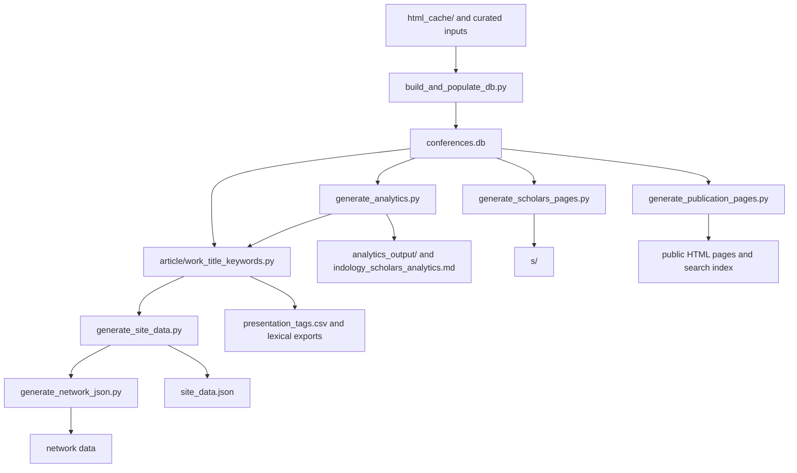

# Development and Reproducibility

[Русская версия](development.md) | [User guide](../README_EN.md) | [Documentation index](README.md)

This document is for developers and data curators working on
**IndologyScholars**. Build instructions are deliberately kept out of the
user-facing project page.

## Current Published Snapshot

The source for figures published on the site is the `summary` object in
`site_data.json`. As of 29 May 2026 it reports 270 speaker profiles,
1351 unique talks, 1378 author participations, and 40 events across 22
programme years (2004-2026). 41 speakers occur in both series, 165
occur only in the Zograf Readings, and 64 only in the Roerich Readings.

Historical manuscripts, reports, and change logs may preserve older snapshots
and must not be substituted for the current `site_data.json` publication state.

## Sources and Derived Files

Editable inputs and curation rules:

| Path | Role |
| --- | --- |
| `html_cache/` | Preserved conference programmes, the primary programme source. |
| `zograf-roerich-db.md` | Manually maintained source information on series, events, and places. |
| `curation/` | Verified corrections and dated affiliation trajectories. |
| `authority_ids.json` | Verified external person identifiers. |
| `analytics_output/classification_overrides.csv` | Editorial decisions for public classification examples. |

Do not manually edit derived artifacts: `conferences.db`, `site_data.json`,
`search-index.json`, `analytics_output/`, the `s/`, `p/`,
`conferences/`, `themes/`, `cities/`, `institutions/`, and `generations/`
directories, or generated informational HTML pages. Make a change in its
source or generator and rebuild the artifacts.

## Build

Requirements: Python 3.11 or a compatible Python 3 release, plus the dependencies in `requirements.txt`.

If `make` is available, you can perform the full build, validation, and packaging in a single command:

```bash
make all
```

Otherwise, execute the sequential build steps manually:

```bash
python -m pip install -r requirements.txt
python build_and_populate_db.py
python generate_analytics.py
python article/work_title_keywords.py
python generate_site_data.py
python generate_network_json.py
python generate_scholars_pages.py
python generate_publication_pages.py
python validate_publication.py
python -m pytest
```

To inspect the generated site locally from the repository root:

```bash
python -m http.server 8000
```

Open `http://localhost:8000/`.

`fetch_latest_programs.py` reaches external sources and is used when importing
new official programmes; it is not required for a reproducible rebuild of the
already preserved corpus.

## Data Flow



## Affiliations and Classification

A city marker in a programme is not converted into an institutional
affiliation. A verified trajectory with a closed interval applies only inside
that interval. An open verified trajectory may continue through a programme
gap as an explicitly tentative inference marked `(?)`, until an end date or a
new institution is found.

Argument-scale levels `L1`-`L3` are published only after valid coding. The
separate strict audit of elevated levels is documented in
[classification-audit-en.md](classification-audit-en.md); the Russian version
is [classification-audit.md](classification-audit.md).

## Validation and Publication

Run `validate_publication.py` and the unit tests before publication. The
validator checks consistency between the public summary and the database,
identifier stability, required public pages, and export metadata.

The `.github/workflows/rebuild_and_deploy.yml` workflow fetches new programmes,
runs the full build and validation, and deploys GitHub Pages on 20 June and
20 December at 00:00 UTC, as well as on manual dispatch.

## Technical Documents

| Document | Purpose |
| --- | --- |
| [../data_dictionary.md](../data_dictionary.md) | Public data schema and field provenance. |
| [classification-audit-en.md](classification-audit-en.md) | Audit of argument-scale coding. |
| [rinc-review-en.md](rinc-review-en.md) | Manual review of RINC/eLIBRARY profiles. |
| [ux-ui-audit.md](ux-ui-audit.md) | Interface audit and prioritized improvements to the user workflow (in Russian). |
| [archive/README.md](https://github.com/gasyoun/IndologyScholars/blob/main/archive/README.md) | Index of historical plans, snapshots, and handoff files. |
| [archive/plans/architecture.md](https://github.com/gasyoun/IndologyScholars/blob/main/archive/plans/architecture.md) | Historical architecture plan. |
| [archive/plans/architecture_implementation_plan.md](https://github.com/gasyoun/IndologyScholars/blob/main/archive/plans/architecture_implementation_plan.md) | Record of implemented architecture hardening. |

`CHANGELOG.md` and materials under `article/` are logs or research snapshots;
read their figures in the context of their stated date. Working documents
removed from the current documentation surface are retained under `archive/`.
