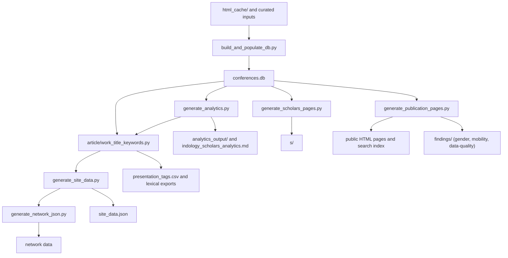

# Development and Reproducibility

[Русская версия](development.md) | [User guide](../README_EN.md) | [Documentation index](README.md)

This document is for developers and data curators working on
**IndologyScholars**. Build instructions are deliberately kept out of the
user-facing project page.

## Current Published Snapshot

The source for figures published on the site is the `summary` object in
`site_data.json`. As of 23 July 2026 it reports 268 speaker profiles,
1362 unique talks, 1388 author participations, and 40 events across 22
programme years (2004-2026). 41 speakers occur in both series, 163
occur only in the Zograf Readings, and 64 only in the Roerich Readings.
A separate historical prosopographical layer (26 figures) is stored under
`person_kind = historical` and does **not** change the speaker counts above.

Historical manuscripts, reports, and change logs may preserve older snapshots
and must not be substituted for the current `site_data.json` publication state.

Sibling subsystems (not part of the main conference build above):

| Path | Role |
| --- | --- |
| [`nagari/`](https://github.com/gasyoun/IndologyScholars/tree/main/nagari) | Closed Google Group archive + Pages retrospective. |
| [`vk-ors/`](https://github.com/gasyoun/IndologyScholars/tree/main/vk-ors) | VK wall export → SQLite+FTS5 + four analysis layers. |
| [`sources/vigasin/`](https://github.com/gasyoun/IndologyScholars/tree/main/sources/vigasin) | Raw Vigasin full-text sources (not yet in scholar-page generator). |
| [`gasyoun/IndologyArchiveAtlas`](https://github.com/gasyoun/IndologyArchiveAtlas) | Spun-out INDOLOGY-L atlas; this repo keeps a feed + redirect only. |

## Sources and Derived Files

Editable inputs and curation rules:

| Path | Role |
| --- | --- |
| `html_cache/` | Preserved conference programmes, the primary programme source. |
| `zograf-roerich-db.md` | Manually maintained source information on series, events, and places. |
| `curation/` | Verified corrections and dated affiliation trajectories. |
| `authority_ids.json` | Verified external person identifiers. |
| `analytics_output/classification_overrides.csv` | Editorial decisions for public classification examples. |
| `curation/teacher_student.csv` | Curated advisor/student relationships (issue #9 genealogy track). Schema and editing rules: `curation/teacher_student_schema.md`. |
| `curation/known_relationships.csv` | Curated personal/academic ties (e.g. spouse, advisor, co-workers) to support sociology/gatekeeping interpretations. |
| `curation/eastern_faculty_alumni.csv` | Curated SPbU Oriental/Eastern Faculty alumni review queue and verification statuses. |
| `assets/data/geography.json` | City keyword aliases and geographic coordinates for affiliation extraction. |
| `tools/` | Maintained support tools used by tests, curation queues, or CI. |
| `scratch/` | Historical experiments and logs; new local experiments should remain untracked. |

Do not manually edit derived artifacts: `conferences.db`, `site_data.json`,
`search-index.json`, `analytics_output/`, the `s/`, `p/`,
`conferences/`, `themes/`, `cities/`, `institutions/`, `generations/`,
and `findings/` directories, or generated informational HTML pages (including `known-relationships.html`, `gender.html`, `mobility.html`, and `voting.html`). Make a change in its
source or generator and rebuild the artifacts.

## Build

Requirements: Python 3.11 or a compatible Python 3 release, plus the dependencies in `requirements.txt`.

If `make` is available, you can perform the full build, validation, and packaging in a single command:

```bash
make all
```

Otherwise, execute the sequential build steps manually:

```bash
python -m pip install -r requirements.txt
python build_and_populate_db.py
python generate_analytics.py
python article/work_title_keywords.py
python tools/build_classification_reliability_sample.py
python extract_hypotheses.py
python generate_site_data.py
python generate_network_json.py
python generate_scholars_pages.py
python generate_publication_pages.py
python tools/build_scientometrics_guardrails.py
python tools/build_human_review_index.py
python generate_publication_pages.py
python validate_publication.py
python -m pytest
```

To inspect the generated site locally from the repository root:

```bash
python -m http.server 8000
```

Open `http://localhost:8000/`.

`fetch_latest_programs.py` reaches external sources and is used when importing
new official programmes; it is not required for a reproducible rebuild of the
already preserved corpus.

### Scientific Hypotheses Registry

The project supports an automated pipeline for the **Scientific Hypotheses Registry** (`hypotheses.html`), which hosts exactly 35 research hypotheses (H1–H35) on Russian Indology.
- **Extraction Script**: `extract_hypotheses.py` parses the article draft (`article/ppv_draft.md`) and related artifacts, automatically identifying `H1`–`H35` statements and exporting them to `assets/data/hypotheses.json`.
- **Manual Curation**: After the automated run, the curator can manually refine the generated placeholder metrics (Significance, Novelty, Unexpectedness, etc.) directly in `assets/data/hypotheses.json`.
- **Frontend Presentation**: `hypotheses.html` utilizes pure ES-module JavaScript to perform multi-dimensional array filtering in the client browser, rendered using premium HSL glassmorphism dark-mode card views.

## Data Flow


```mermaid
flowchart TD
    A["html_cache/ and curated inputs"] --> B["build_and_populate_db.py"]
    B --> C["conferences.db"]
    C --> D["generate_analytics.py"]
    C --> N["article/work_title_keywords.py"]
    D --> N
    N --> E["generate_site_data.py"]
    E --> F["generate_network_json.py"]
    C --> G["generate_scholars_pages.py"]
    C --> H["generate_publication_pages.py"]
    D --> I["analytics_output/ and indology_scholars_analytics.md"]
    N --> O["presentation_tags.csv and lexical exports"]
    E --> J["site_data.json"]
    F --> K["network data"]
    G --> L["s/"]
    H --> M["public HTML pages and search index"]
    H --> P["findings/ (gender, mobility, data-quality)"]
```

## Affiliations and Classification

A city marker in a programme is not converted into an institutional
affiliation. A verified trajectory with a closed interval applies only inside
that interval. An open verified trajectory may continue through a programme
gap as an explicitly tentative inference marked `(?)`, until an end date or a
new institution is found.

Argument-scale levels `L1`-`L3` are published only after valid coding. The
separate strict audit of elevated levels is documented in
[classification-audit-en.md](classification-audit-en.md); the Russian version
is [classification-audit.md](classification-audit.md).

### Known Relationships Layer
Extra-network personal, academic, or professional ties that are not directly visible from joint presentations or shared sessions are manually recorded in `curation/known_relationships.csv`. These ties (such as advisor-student, spouses, or former co-workers) provide necessary contextual evidence for the gatekeeping case. This data is rendered interactively on `known-relationships.html` and reviewed according to the editorial policy in `docs/sociology-gatekeeping-editorial-decisions.md`.

### Faculty Alumni Verification
Alumni of the St Petersburg University Faculty of Asian and African Studies (Oriental Faculty) are tracked via `curation/eastern_faculty_alumni.csv`. Heuristic candidates can be automatically generated from site metadata using `tools/extract_eastern_faculty_alumni.py`. An affiliation mentioning SPbU is not automatically treated as graduation; candidate status requires independent verification before being marked as `confirmed`.

## Validation and Publication

Run `validate_publication.py` and the unit tests before publication. The
validator checks consistency between the public summary and the database,
identifier stability, required public pages, and export metadata.

The `.github/workflows/rebuild_and_deploy.yml` workflow fetches new programmes,
runs the full build and validation, and deploys GitHub Pages on 20 June and
20 December at 00:00 UTC, as well as on manual dispatch.

The INDOLOGY-L mailing-list atlas split out into its own repo,
[`gasyoun/IndologyArchiveAtlas`](https://github.com/gasyoun/IndologyArchiveAtlas)
(H460, 19-07-2026) — its own monthly `update_indology_archive.yml` and Pages
deploy now live there. This site consumes only a small one-way feed from it
(`tools/fetch_indology_feed.py`, run before `generate_renou_layer.py` in
`rebuild_and_deploy.yml`) for the Renou cross-site comparison; the old
`/IndologyArchive/` path here now redirects to the new repo's Pages site.

### Article numbers consistency

`article/check_ppv_numbers.py` cross-checks every numeric claim in
`article/ppv_submission_article.md` against the rebuilt `conferences.db` and
`analytics_output/expanded_classification_deepseek.csv` (for G-scale counts).
It uses phrase-based regular expressions per metric — totals, per-series,
the Zograf-through-2025 censored block, Zograf 2026 preliminary, and G1/G2/G3
— and exits non-zero on any drift, so the pre-submission gate fails until the
article is synchronised. A current-state snapshot is written to
`article/hypothesis_output/ppv_numbers_snapshot.{md,json}`.

`article/check_data_paper_numbers.py` performs the same role for the English
data paper draft (`article/data_paper_draft.md`): derivable claims (corpus
counts, year range, birth-year coverage) are verified against the rebuilt
`site_data.json`, and figures that cannot be re-derived from current
artifacts are listed as warnings for manual re-derivation before submission.

`article/check_anonymity.py` validates the double-blind artifact
`article/ppv_submission_article_anonymous.md`: it must not contain the
author name, e-mail, ORCID, postal address, or the pre-UDK drafting block.
Both scripts run in the validation and rebuild/deploy workflows before
publication.

## Genealogy track

The advisor/student layer (issue #9) is curated, not derived. The schema in
`curation/teacher_student_schema.md` defines a twelve-column CSV format and an
anti-fabrication rule: `status=verified` requires a non-empty `evidence_url`
backing the specific tie. `pipeline/genealogy.py` is the read-side loader
with row-level validation (required fields, enum vocabularies for
`relationship_type` and `status`, self-loop rejection); it returns
`Relationship` dataclasses and exposes `by_advisor` / `by_student` indexes.

`article/work_lineage_candidates.py` produces heuristic suggestions in
`analytics_output/lineage_candidates.csv` from co-authorship (≥2 joint
presentations) and birth-year gap (≥15 years). These are starting points for
human verification, never asserted facts. The loader is not yet wired into
`site_data.json` or the profile pages — that wiring is a separate step kept
out of the standard build sequence.

## Internationalization and authority control

External identifiers live in `authority_ids.json` (validated against
`authority_ids.schema.json`): per-person `openalex` / `orcid` / `wikidata`
with a `confidence` field, and per-organization `wikidata`. City and theme
Q-IDs live in `assets/data/geography.json`. The Turtle knowledge graph
`indology_knowledge_graph.ttl` is regenerated by `generate_lod.py`.

The authority pipeline never asserts a match without human review:

1. `scratch/openalex_author_candidates.py` (or `scratch/resume_openalex.py`
   to continue an interrupted run) queries the OpenAlex Authors API by
   Cyrillic full name and Latin transliteration, scores candidates
   (RU affiliation, surname match, works count), and writes
   `analytics_output/openalex_author_candidates.csv` with `manual_status=todo`.
2. A human marks rows `confirmed`. `tools/inject_openalex_matches.py` then
   copies high-confidence (≥0.8) matches into `authority_ids.json` with
   `confidence='candidate'` — never `confirmed` automatically — pulling
   ORCID/Wikidata out of the OpenAlex response.
3. `tools/generate_wikidata_batch.py` emits a QuickStatements v2 batch
   (`analytics_output/wikidata_batch.txt`) for top scholars lacking a Q-ID,
   using ISO-9 transliteration and a stated-in/reference-URL source block.
   See `wikidata-guide.md`. **Known defect:** `Q_INDOLOGIST` and `Q_INDOLOGY`
   currently both point to `Q8088479` (the *field*, not the *occupation*);
   fix the `P106` Q-ID before submitting the batch.

`tools/build_interrater_sample.py` and `tools/compute_interrater_agreement.py`
support inter-rater reliability for the thematic/argument coding.
`tools/freeze_article_data.py` writes an immutable corpus snapshot under
`article/snapshots/<date>/` for DOI deposition. The English data paper draft
is `article/data_paper_draft.md` (target: Research Data Journal for the
Humanities and Social Sciences, Brill); `notebooks/example_analysis.py` is a
reproducible reuse example.

The `scratch/` Russian-indologist roster sub-project rosters Russian-language
indologists of the last ~200 years and cross-references Zograf/Roerich
participation (197 indologists, 60 tests). It is self-documented in
`scratch/roadmap.md`, `scratch/changelog.md`, and `scratch/ai_status.md`.
Reachability note: from the automation host only `en.wikipedia.org` is
reliably reachable; `ru.wikipedia` (RKN) and the Wikidata REST/SPARQL
endpoints are not, so `enwiki_bridge.py` is the primary path and the
ru-/Wikidata-dependent steps must run from a host with access.

## Technical Documents

| Document | Purpose |
| --- | --- |
| [../data_dictionary.md](../data_dictionary.md) | Public data schema and field provenance. |
| [classification-audit-en.md](classification-audit-en.md) | Audit of argument-scale coding. |
| [rinc-review-en.md](rinc-review-en.md) | Manual review of RINC/eLIBRARY profiles. |
| [ux-ui-audit.md](ux-ui-audit.md) | Interface audit and prioritized improvements to the user workflow (in Russian). |
| [visualisations.md](visualisations.md) | Stable IDs and use cases for interactive public visualisations. |
| [sociology-gatekeeping-editorial-decisions.md](sociology-gatekeeping-editorial-decisions.md) | Editorial, audience, naming, and claim-strength decisions for sociology and gatekeeping analyses. |
| [archive/README.md](https://github.com/gasyoun/IndologyScholars/blob/main/archive/README.md) | Index of historical plans, snapshots, and handoff files. |
| [archive/plans/architecture.md](https://github.com/gasyoun/IndologyScholars/blob/main/archive/plans/architecture.md) | Historical architecture plan. |
| [archive/plans/architecture_implementation_plan.md](https://github.com/gasyoun/IndologyScholars/blob/main/archive/plans/architecture_implementation_plan.md) | Record of implemented architecture hardening. |
| [../philology-research-agents/README.md](https://github.com/gasyoun/IndologyScholars/blob/main/philology-research-agents/README.md) | Portable six-agent evidence-lab prompt module for philology, linguistics, and Oriental studies, with journal-specific editor profiles (ППВ, IIJ, ВДИ, ВЯ, JAOS, OLZ) and a Haiku-based VAK *Perechen'* parser. Designed to be moved into its own repository. |
| [wikidata-guide.md](wikidata-guide.md) | Step-by-step guide to mapping scholars to Wikidata Q-IDs via the OpenAlex → Wikidata pipeline and QuickStatements. |
| [persons-data-policy.md](persons-data-policy.md) | What personal data the archive publishes, the research basis, and the correction/objection procedure for living scholars (Russian version: [persons-data-policy-ru.md](persons-data-policy-ru.md)). |
| [../article/data_paper_draft.md](https://github.com/gasyoun/IndologyScholars/blob/main/article/data_paper_draft.md) | English data paper describing corpus construction, data model, and reuse (target: Research Data Journal for the Humanities and Social Sciences). |
| [roster-merge-design.md](roster-merge-design.md) | Design for merging the `scratch/` Russian-indologist roster into the corpus (participants enriched, non-participants as a separate registry). |
| [ru-enrichment-runbook.md](ru-enrichment-runbook.md) | Step-by-step procedure for the Phase-5 enrichment that must run inside Russia (Wikidata life years, ru.wikipedia infoboxes, institutional scrapers). |
| [deepseek-clean-host-runbook.md](deepseek-clean-host-runbook.md) | Procedure for running the DeepSeek k-fold classification and video segmentation runners from a clean-egress host, because `api.openmodel.ai` inference is severed (DPI) from the automation host. |

`CHANGELOG.md` and materials under `article/` are logs or research snapshots;
read their figures in the context of their stated date. Working documents
removed from the current documentation surface are retained under `archive/`.
