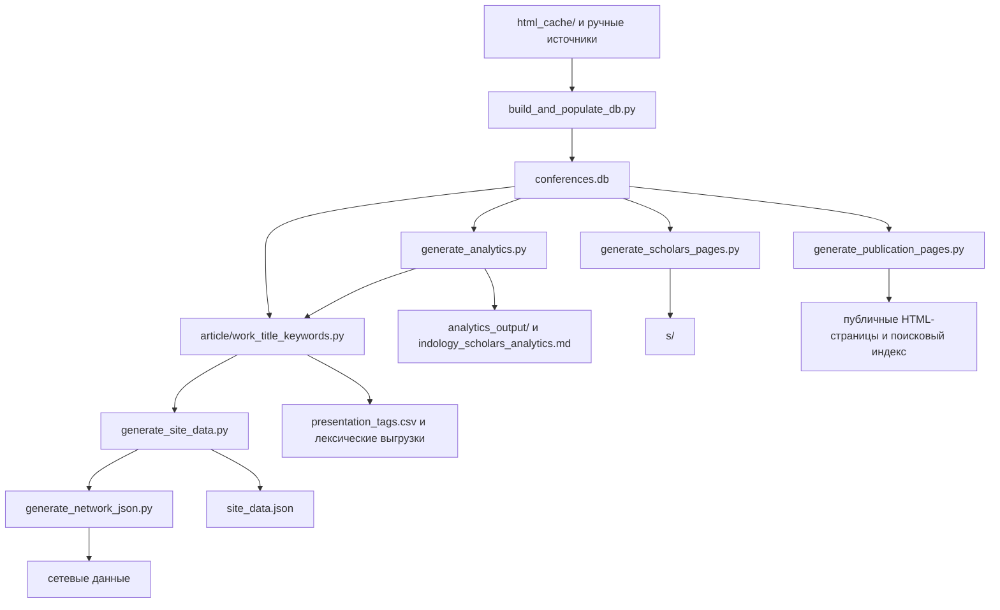

# Разработка и воспроизводимость

[English version](development-en.md) | [Пользовательское описание](../README.md) | [Указатель документации](README.md)

Этот документ предназначен для разработчиков и кураторов данных
**IndologyScholars**. Пользовательская страница проекта намеренно не содержит
инструкций по сборке.

## Актуальный публичный снимок

Источник чисел для публикуемого сайта - объект `summary` в
`site_data.json`. На 31 мая 2026 г. он содержит 270 профилей докладчиков,
1352 уникальных доклада, 1379 авторских участий и 40 событий за 22
программных года (2004-2026). Участников обеих серий - 41, только
Зографских чтений - 165, только Рериховских - 64.

Исторические рукописи, отчеты и журналы изменений могут фиксировать более
ранние снимки и не должны использоваться вместо текущего `site_data.json`.

## Источники и производные файлы

Редактируемые источники и правила:

| Путь | Роль |
| --- | --- |
| `html_cache/` | Сохраненные программы конференций, первичный программный источник. |
| `zograf-roerich-db.md` | Ручные исходные сведения о сериях, событиях и местах. |
| `curation/` | Проверенные исправления и датированные траектории аффилиаций. |
| `authority_ids.json` | Проверенные внешние идентификаторы персон. |
| `analytics_output/classification_overrides.csv` | Редакционные решения по публичным примерам классификации. |
| `curation/teacher_student.csv` | Кураторские связи руководитель/ученик (issue #9, генеалогический трек). Схема и правила правок: `curation/teacher_student_schema.md`. |
| `tools/` | Поддерживаемые служебные инструменты, используемые тестами или CI. |
| `scratch/` | Исторические эксперименты и журналы; новые локальные эксперименты должны оставаться неотслеживаемыми. |

Производные артефакты не правятся вручную: `conferences.db`,
`site_data.json`, `search-index.json`, `analytics_output/`, каталоги
`s/`, `p/`, `conferences/`, `themes/`, `cities/`,
`institutions/`, `generations/` и собранные информационные HTML-страницы.
Изменение их содержания выполняется в источнике или генераторе, после чего
артефакты пересобираются.

## Сборка

Требования: Python 3.11 либо совместимая версия Python 3 и зависимости из `requirements.txt`.

Если у вас установлен `make`, вы можете выполнить полную сборку, валидацию и упаковку одной командой:

```bash
make all
```

Иначе выполните последовательные шаги сборки вручную:

```bash
python -m pip install -r requirements.txt
python build_and_populate_db.py
python generate_analytics.py
python article/work_title_keywords.py
python tools/build_classification_reliability_sample.py
python extract_hypotheses.py
python generate_site_data.py
python generate_network_json.py
python generate_scholars_pages.py
python generate_publication_pages.py
python validate_publication.py
python -m pytest
```

Для проверки сайта локально из корня репозитория:

```bash
python -m http.server 8000
```

После этого сайт открывается по адресу `http://localhost:8000/`.

`fetch_latest_programs.py` обращается к внешним источникам и применяется,
когда требуется загрузить новые официальные программы; он не нужен для
воспроизводимой пересборки уже сохраненного корпуса.

### Реестр научных гипотез

Проект поддерживает автоматическое обновление **Реестра научных гипотез** (`hypotheses.html`), содержащего ровно 35 гипотез о российской индологии (H1–H35).
- **Скрипт извлечения**: `extract_hypotheses.py` сканирует черновик научной статьи (`article/ppv_draft.md`) и сопутствующие артефакты, автоматически обнаруживая гипотезы по тегам `H1`–`H35` и записывая результат в `assets/data/hypotheses.json`.
- **Ручная курация**: После автоматического извлечения куратор может вручную скорректировать сгенерированные случайным образом метрики (Significance, Novelty, Unexpectedness и др.) непосредственно в `assets/data/hypotheses.json`.
- **Интерактивный интерфейс**: Страница `hypotheses.html` использует чистый ES-модульный JavaScript для фильтрации и отрисовки гипотез в современном glassmorphism-интерфейсе.

## Поток данных



## Аффилиации и классификация

Городская отметка из программы не преобразуется в институциональную
аффилиацию. Подтвержденная траектория с закрытым интервалом применяется лишь
внутри интервала. Открытая подтвержденная траектория может продолжаться после
пропуска в программе как вывод с явной пометой `(?)`, пока не обнаружена
конечная дата или новая институция.

Уровни аргументации `L1`-`L3` публикуются только после валидной разметки.
Отдельный строгий аудит повышенных уровней описан в
[classification-audit.md](classification-audit.md); английская версия -
[classification-audit-en.md](classification-audit-en.md).

## Проверка и публикация

Перед публикацией следует выполнить `validate_publication.py` и модульные
тесты. Валидатор проверяет согласованность публичной сводки с базой,
стабильность идентификаторов, полноту обязательных страниц и метаданные
выгрузок.

Workflow `.github/workflows/rebuild_and_deploy.yml` выполняет загрузку новых
программ, полную сборку, валидацию и развертывание GitHub Pages по расписанию
20 июня и 20 декабря в 00:00 UTC, а также по ручному запуску.

### Сверка чисел статьи

`article/check_ppv_numbers.py` сверяет все числа в
`article/ppv_submission_article.md` с пересобранной `conferences.db` и
`analytics_output/expanded_classification_deepseek.csv` (для G-шкалы).
Используются phrase-based регулярные выражения по каждой метрике —
агрегаты, серия-уровень, цензурированный блок «Зографские чтения по 2025 г.»,
предварительная программа Зографских чтений 2026 г. и G1/G2/G3 — и
ненулевой код возврата при любом расхождении; pre-submission gate блокируется
до устранения расхождения. Снимок текущих чисел пишется в
`article/hypothesis_output/ppv_numbers_snapshot.{md,json}`.

`article/check_anonymity.py` проверяет double-blind версию
`article/ppv_submission_article_anonymous.md`: в ней не должно быть имени
автора, e-mail, ORCID, почтового адреса или чернового блока перед УДК. Оба
скрипта запускаются в validation и rebuild/deploy workflow перед публикацией.

## Генеалогический трек

Слой «руководитель/ученик» (issue #9) — курируемый, не выводимый из данных.
Схема в `curation/teacher_student_schema.md` задаёт CSV из двенадцати колонок
и правило «не выдумывать»: `status=verified` требует непустого `evidence_url`,
обосновывающего конкретную связь. `pipeline/genealogy.py` — загрузчик с
построчной валидацией (обязательные поля, словари `relationship_type` и
`status`, запрет self-loop); возвращает dataclasses `Relationship` и индексы
`by_advisor` / `by_student`.

`article/work_lineage_candidates.py` производит эвристические подсказки в
`analytics_output/lineage_candidates.csv` по со-авторству (≥ 2 совместных
докладов) и возрастному разрыву (≥ 15 лет). Это отправные точки для ручной
проверки, не утверждения как факты. Загрузчик пока не подключён к
`site_data.json` и страницам профилей — это отдельный шаг, специально
оставленный вне стандартной последовательности сборки.

## Технические документы

| Документ | Назначение |
| --- | --- |
| [../data_dictionary.md](../data_dictionary.md) | Схема публичных данных и происхождение полей. |
| [classification-audit.md](classification-audit.md) | Аудит разметки масштаба аргументации. |
| [rinc-review.md](rinc-review.md) | Ручная проверка профилей РИНЦ/eLIBRARY. |
| [ux-ui-audit.md](ux-ui-audit.md) | Аудит интерфейса и приоритеты улучшения пользовательского сценария. |
| [archive/README.md](https://github.com/gasyoun/IndologyScholars/blob/main/archive/README.md) | Указатель исторических планов, снимков и handoff-файлов. |
| [archive/plans/architecture.md](https://github.com/gasyoun/IndologyScholars/blob/main/archive/plans/architecture.md) | Исторический архитектурный план. |
| [archive/plans/architecture_implementation_plan.md](https://github.com/gasyoun/IndologyScholars/blob/main/archive/plans/architecture_implementation_plan.md) | Запись выполненного усиления архитектуры. |
| [../philology-research-agents/README.md](https://github.com/gasyoun/IndologyScholars/blob/main/philology-research-agents/README.md) | Портативный модуль из шести агентов-промптов для филологии, языкознания и востоковедения, с журнальными профилями редакторов (ППВ, IIJ, ВДИ, ВЯ, JAOS, OLZ) и Haiku-промптом для парсинга Перечня ВАК. Спроектирован для выноса в отдельный репозиторий. |

`CHANGELOG.md` и материалы `article/` служат журналом или исследовательскими
снимками; содержащиеся в них числа нужно читать в контексте указанной даты.
Снятые с текущего контура рабочие документы помещаются в `archive/`.
