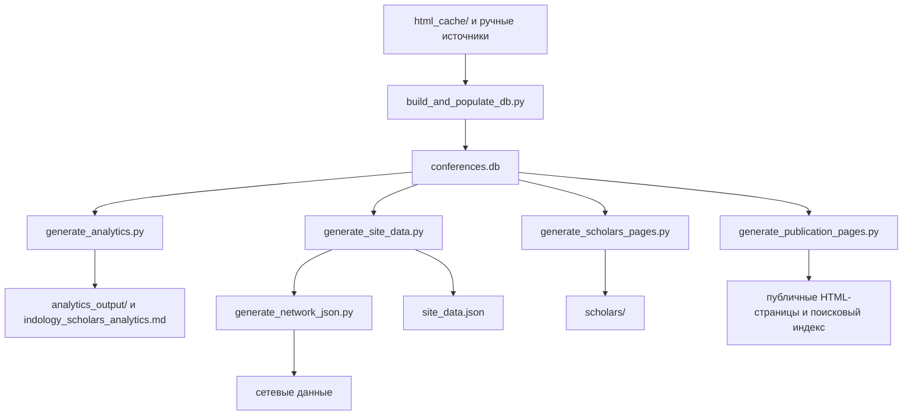

# Разработка и воспроизводимость

[English version](development-en.md) | [Пользовательское описание](../README.md) | [Указатель документации](README.md)

Этот документ предназначен для разработчиков и кураторов данных
**IndologyScholars**. Пользовательская страница проекта намеренно не содержит
инструкций по сборке.

## Актуальный публичный снимок

Источник чисел для публикуемого сайта - объект `summary` в
`site_data.json`. На 25 мая 2026 г. он содержит 285 профилей докладчиков,
1350 уникальных докладов, 1377 авторских участий и 40 событий за 22
программных года (2004-2026). Участников обеих серий - 41, только
Зографских чтений - 179, только Рериховских - 65.

Исторические рукописи, отчеты и журналы изменений могут фиксировать более
ранние снимки и не должны использоваться вместо текущего `site_data.json`.

## Источники и производные файлы

Редактируемые источники и правила:

| Путь | Роль |
| --- | --- |
| `html_cache/` | Сохраненные программы конференций, первичный программный источник. |
| `zograf-roerich-db.md` | Ручные исходные сведения о сериях, событиях и местах. |
| `curation/` | Проверенные исправления и датированные траектории аффилиаций. |
| `authority_ids.json` | Проверенные внешние идентификаторы персон. |
| `analytics_output/classification_overrides.csv` | Редакционные решения по публичным примерам классификации. |

Производные артефакты не правятся вручную: `conferences.db`,
`site_data.json`, `search-index.json`, `analytics_output/`, каталоги
`scholars/`, `presentations/`, `conferences/`, `themes/`, `cities/`,
`institutions/`, `generations/` и собранные информационные HTML-страницы.
Изменение их содержания выполняется в источнике или генераторе, после чего
артефакты пересобираются.

## Сборка

Требования: Python 3.11 либо совместимая версия Python 3 и зависимости из
`requirements.txt`.

```bash
python -m pip install -r requirements.txt
python build_and_populate_db.py
python generate_analytics.py
python generate_site_data.py
python generate_network_json.py
python generate_scholars_pages.py
python generate_publication_pages.py
python validate_publication.py
python -m unittest tests.test_stable_ids
```

Для проверки сайта локально из корня репозитория:

```bash
python -m http.server 8000
```

После этого сайт открывается по адресу `http://localhost:8000/`.

`fetch_latest_programs.py` обращается к внешним источникам и применяется,
когда требуется загрузить новые официальные программы; он не нужен для
воспроизводимой пересборки уже сохраненного корпуса.

## Поток данных



## Аффилиации и классификация

Городская отметка из программы не преобразуется в институциональную
аффилиацию. Подтвержденная траектория с закрытым интервалом применяется лишь
внутри интервала. Открытая подтвержденная траектория может продолжаться после
пропуска в программе как вывод с явной пометой `(?)`, пока не обнаружена
конечная дата или новая институция.

Уровни аргументации `L1`-`L3` публикуются только после валидной разметки.
Отдельный строгий аудит повышенных уровней описан в
[classification-audit.md](classification-audit.md); английская версия -
[classification-audit-en.md](classification-audit-en.md).

## Проверка и публикация

Перед публикацией следует выполнить `validate_publication.py` и модульные
тесты. Валидатор проверяет согласованность публичной сводки с базой,
стабильность идентификаторов, полноту обязательных страниц и метаданные
выгрузок.

Workflow `.github/workflows/rebuild_and_deploy.yml` выполняет загрузку новых
программ, полную сборку, валидацию и развертывание GitHub Pages по расписанию
20 июня и 20 декабря в 00:00 UTC, а также по ручному запуску.

## Технические документы

| Документ | Назначение |
| --- | --- |
| [../data_dictionary.md](../data_dictionary.md) | Схема публичных данных и происхождение полей. |
| [classification-audit.md](classification-audit.md) | Аудит разметки масштаба аргументации. |
| [rinc-review.md](rinc-review.md) | Ручная проверка профилей РИНЦ/eLIBRARY. |
| [ux-ui-audit.md](ux-ui-audit.md) | Аудит интерфейса и приоритеты улучшения пользовательского сценария. |
| [archive/README.md](https://github.com/gasyoun/IndologyScholars/blob/main/archive/README.md) | Указатель исторических планов, снимков и handoff-файлов. |
| [archive/plans/architecture.md](https://github.com/gasyoun/IndologyScholars/blob/main/archive/plans/architecture.md) | Исторический архитектурный план. |
| [archive/plans/architecture_implementation_plan.md](https://github.com/gasyoun/IndologyScholars/blob/main/archive/plans/architecture_implementation_plan.md) | Запись выполненного усиления архитектуры. |

`CHANGELOG.md` и материалы `article/` служат журналом или исследовательскими
снимками; содержащиеся в них числа нужно читать в контексте указанной даты.
Снятые с текущего контура рабочие документы помещаются в `archive/`.
