# Executive summary

This report designs a **maximum-detail, normalized PostgreSQL data model** and provides a **complete, CSV-style event/day/venue dataset** for every “Zograf Readings” (Зографские чтения) post in the specified site section (27 posts). The section is a Joomla “blogsection” listing that includes (a) **conference program posts** (HTML pages with schedules), (b) **publication records** (articles in PDF about particular years and one historical overview), and (c) **two monograph notices** that link to publication records with PDF attachments. citeturn5view0turn1view0

For the “day 1–4” requirement, the primary program pages consistently encode (with some year-to-year variation) a **multi-venue pattern across days**: day 1 is typically held at entity["organization","Institute of Oriental Manuscripts of the Russian Academy of Sciences","st petersburg, russia"] (IOM), while later days rotate among major partner sites including entity["organization","Museum of Anthropology and Ethnography (Kunstkamera)","st petersburg, russia"] (MAE), entity["organization","Saint Petersburg State University","st petersburg, russia"] (SPbU), entity["organization","Herzen State Pedagogical University of Russia","st petersburg, russia"] (Herzen), entity["organization","European University at Saint Petersburg","st petersburg, russia"] (EUSP), and entity["organization","Russian Christian Humanitarian Academy","st petersburg, russia"] (RCHA). citeturn6view0turn3view0turn7view0turn9view0turn10view0turn25view0turn11view0turn8view3turn23view0turn21view0

One year in the covered set is explicitly **online-only** (XLI / 2020), described as “в режиме интернет-трансляции,” so the event should be stored as `format='online'` with `online_platform='unspecified'` unless a platform is named. citeturn26view0

Speaker-level and talk-level extraction is **feasible and strongly supported by the schema**, but its *filled* tables (People, Presentations, Sessions, Presentation_People) are intentionally delivered here as **import-ready templates** plus parsing methodology and SQL, because generating thousands of normalized talk rows reliably requires the user-run crawler/parser step (as you requested). The report provides **runnable parsing guidance**, **DDL**, complete **event-day-venue tables for all program posts**, **media/PDF extraction for publication/monograph posts**, and **computed venue-by-day statistics** directly from primary site content. citeturn5view0turn6view0turn26view0turn31view0turn32view0turn33view0turn34view0turn35view0turn36view0turn37view0turn38view0turn42view0turn43view0turn44view0turn45view0

## Sources and scope of extraction

The authoritative scope for this work is the Joomla section page:

- `https://www.orientalstudies.ru/rus/index.php?option=com_content&task=blogsection&id=0&Itemid=65&inst=46`

It currently lists **27 posts** (“Результаты … из 27”) across two pages, including a “Далее…” (“More…”) list of older items. citeturn5view0turn1view0

Within these 27 posts, there are:

- **21 conference program pages** (XXV / 2004; XXVII / 2006 through XLVI / 2025, with XXVI/2005 not present in this section list). citeturn5view0turn1view0turn21view0turn20view1turn6view0  
- **4 publication-record posts** (PDF “full text” links) that describe:  
  - a historical overview of “Zografovskie readings” (1994 journal piece), citeturn33view0turn34view0  
  - a report on XXV (2004), citeturn31view0turn32view0  
  - a report on XXXIII (2012), citeturn37view0turn38view0  
  - a report on XXXV (2014). citeturn35view0turn36view0  
- **2 monograph notice posts** that point to publication records with PDF attachments (annotation/contents). citeturn39view0turn39view1turn42view0turn43view0turn44view0turn45view0

Geographically, the in-person events are held in entity["city","Saint Petersburg","russia"], with venues rotating by day as encoded in the program text. citeturn6view0turn25view0turn21view0turn23view0

## Normalized PostgreSQL schema

### Design principles

The schema below is built to:

- preserve **raw provenance** (HTML snapshots, parsed snippets, crawl runs),
- normalize conference structure into **Events → EventDays → (EventDayVenues) → Sessions → Presentations**,
- represent people/roles/affiliations without forcing canonicalization (store `display_name` exactly; optional `normalized_key` for dedup only if you attempt it),
- enforce “unknown” values as **SQL NULLs**, while your CSV exports can render them as the literal string **`unspecified`** (per your requirement).

### DDL

```sql
-- Requires: pgcrypto for gen_random_uuid()
CREATE EXTENSION IF NOT EXISTS pgcrypto;

-- =========
-- ENUMS (or use TEXT + CHECK if you prefer)
-- =========
DO $$
BEGIN
  IF NOT EXISTS (SELECT 1 FROM pg_type WHERE typname = 'event_format') THEN
    CREATE TYPE event_format AS ENUM ('in_person', 'online', 'hybrid', 'unspecified');
  END IF;
  IF NOT EXISTS (SELECT 1 FROM pg_type WHERE typname = 'post_kind') THEN
    CREATE TYPE post_kind AS ENUM ('program', 'publication_record', 'monograph_notice', 'unspecified');
  END IF;
  IF NOT EXISTS (SELECT 1 FROM pg_type WHERE typname = 'person_role') THEN
    CREATE TYPE person_role AS ENUM (
      'speaker', 'author', 'coauthor', 'chair', 'organizer', 'editor', 'translator', 'unspecified'
    );
  END IF;
  IF NOT EXISTS (SELECT 1 FROM pg_type WHERE typname = 'media_type') THEN
    CREATE TYPE media_type AS ENUM ('pdf', 'image', 'doc', 'html', 'other');
  END IF;
END $$;


-- =========
-- CRAWLING / PROVENANCE
-- =========
CREATE TABLE crawl_run (
  crawl_run_id      uuid PRIMARY KEY DEFAULT gen_random_uuid(),
  seed_url          text NOT NULL,
  started_at        timestamptz NOT NULL DEFAULT now(),
  finished_at       timestamptz,
  user_agent        text,
  notes             text
);

CREATE TABLE source_document (
  source_document_id uuid PRIMARY KEY DEFAULT gen_random_uuid(),
  crawl_run_id       uuid REFERENCES crawl_run(crawl_run_id) ON DELETE SET NULL,

  source_url         text NOT NULL,
  final_url          text,
  fetched_at         timestamptz NOT NULL DEFAULT now(),
  http_status        integer,
  content_type       text,
  encoding           text,

  -- Raw capture
  html               text,
  text_content       text,

  -- Hashing for dedup/versioning
  sha256_hex         text,

  -- Minimal parse hints
  title_extracted    text,
  snippet_extracted  text,
  parse_error        text
);

CREATE UNIQUE INDEX IF NOT EXISTS ux_source_document_source_url_fetched
ON source_document (source_url, fetched_at);

CREATE INDEX IF NOT EXISTS ix_source_document_sha
ON source_document (sha256_hex);


-- =========
-- POSTS + TAGS
-- =========
CREATE TABLE post (
  post_id            uuid PRIMARY KEY DEFAULT gen_random_uuid(),
  source_document_id uuid REFERENCES source_document(source_document_id) ON DELETE SET NULL,

  post_url           text NOT NULL UNIQUE,
  post_kind          post_kind NOT NULL DEFAULT 'unspecified',

  title_ru           text,
  title_en           text,

  published_date     date,
  section_key        text,   -- e.g., 'inst=46'
  itemid             integer,
  inst               integer,

  -- Optional structured fields extracted from listing/program headers
  year_hint          integer,
  ordinal_int_hint   integer,
  ordinal_roman_hint text,

  -- For change tracking
  first_seen_at      timestamptz,
  last_seen_at       timestamptz
);

CREATE INDEX IF NOT EXISTS ix_post_published_date ON post(published_date);
CREATE INDEX IF NOT EXISTS ix_post_year_hint ON post(year_hint);

CREATE TABLE tag (
  tag_id     uuid PRIMARY KEY DEFAULT gen_random_uuid(),
  tag_text   text NOT NULL UNIQUE
);

CREATE TABLE post_tag (
  post_id uuid REFERENCES post(post_id) ON DELETE CASCADE,
  tag_id  uuid REFERENCES tag(tag_id) ON DELETE CASCADE,
  PRIMARY KEY (post_id, tag_id)
);


-- =========
-- ORGANIZATIONS / PLACES / VENUES
-- =========
CREATE TABLE organization (
  organization_id   uuid PRIMARY KEY DEFAULT gen_random_uuid(),
  display_name      text NOT NULL,
  display_name_ru   text,
  org_type          text,        -- 'university','museum','institute','consulate', etc.
  parent_org_id     uuid REFERENCES organization(organization_id) ON DELETE SET NULL,
  source_url        text,        -- where this name/structure came from
  notes             text
);

CREATE UNIQUE INDEX IF NOT EXISTS ux_org_display_name ON organization(display_name);

CREATE TABLE place (
  place_id          uuid PRIMARY KEY DEFAULT gen_random_uuid(),
  address_text      text,
  city              text,
  region            text,
  country           text,
  postal_code       text,
  latitude          double precision,
  longitude         double precision,
  source_url        text,
  notes             text
);

CREATE TABLE venue (
  venue_id          uuid PRIMARY KEY DEFAULT gen_random_uuid(),
  display_name      text NOT NULL,
  venue_type        text,   -- 'building','campus','online','room_group', etc.
  organization_id   uuid REFERENCES organization(organization_id) ON DELETE SET NULL,
  place_id          uuid REFERENCES place(place_id) ON DELETE SET NULL,
  source_url        text,
  notes             text
);

CREATE UNIQUE INDEX IF NOT EXISTS ux_venue_display_name ON venue(display_name);


-- =========
-- EVENT SERIES / EVENTS / DAYS / DAY-VENUES
-- =========
CREATE TABLE event_series (
  event_series_id   uuid PRIMARY KEY DEFAULT gen_random_uuid(),
  series_name_en    text NOT NULL,
  series_name_ru    text,
  source_url        text,
  notes             text
);

CREATE TABLE event (
  event_id           uuid PRIMARY KEY DEFAULT gen_random_uuid(),
  event_series_id    uuid REFERENCES event_series(event_series_id) ON DELETE RESTRICT,

  ordinal_int        integer,     -- e.g., 46
  ordinal_roman      text,        -- e.g., 'XLVI'
  year               integer NOT NULL,

  theme_ru           text,
  theme_en           text,

  start_date         date,
  end_date           date,

  format             event_format NOT NULL DEFAULT 'unspecified',
  is_online          boolean NOT NULL DEFAULT false,
  online_platform    text,        -- 'Zoom', etc. If only "internet-transmission": NULL in DB, export as 'unspecified'

  city               text,
  country            text,

  program_post_id    uuid REFERENCES post(post_id) ON DELETE SET NULL,
  source_url         text NOT NULL,  -- program page (primary)
  source_snippet     text,
  notes              text
);

CREATE UNIQUE INDEX IF NOT EXISTS ux_event_year_ordinal
ON event(year, ordinal_int);

CREATE INDEX IF NOT EXISTS ix_event_year ON event(year);
CREATE INDEX IF NOT EXISTS ix_event_format ON event(format);

CREATE TABLE event_day (
  event_day_id       uuid PRIMARY KEY DEFAULT gen_random_uuid(),
  event_id           uuid REFERENCES event(event_id) ON DELETE CASCADE,

  day_number         smallint NOT NULL CHECK (day_number BETWEEN 1 AND 4),
  calendar_date      date,
  day_label_raw      text,      -- preserve source day label incl. weekday
  source_url         text NOT NULL,
  notes              text,

  UNIQUE (event_id, day_number)
);

CREATE INDEX IF NOT EXISTS ix_event_day_event ON event_day(event_id);

-- Multiple venues per day (e.g., SPbU Philosophy + SPbU Oriental on same calendar day)
CREATE TABLE event_day_venue (
  event_day_venue_id uuid PRIMARY KEY DEFAULT gen_random_uuid(),
  event_day_id       uuid REFERENCES event_day(event_day_id) ON DELETE CASCADE,

  venue_id           uuid REFERENCES venue(venue_id) ON DELETE RESTRICT,
  occurrence_order   integer NOT NULL DEFAULT 1,

  -- As written in program text; do not over-normalize
  room_text_raw      text,
  time_text_raw      text,

  source_url         text NOT NULL,
  source_snippet     text,

  UNIQUE (event_day_id, occurrence_order)
);

CREATE INDEX IF NOT EXISTS ix_event_day_venue_day ON event_day_venue(event_day_id);
CREATE INDEX IF NOT EXISTS ix_event_day_venue_venue ON event_day_venue(venue_id);


-- =========
-- PEOPLE / SESSIONS / PRESENTATIONS
-- =========
CREATE TABLE person (
  person_id         uuid PRIMARY KEY DEFAULT gen_random_uuid(),
  display_name      text NOT NULL,   -- exact as on site
  normalized_key    text,            -- optional, only if you attempt dedup
  source_url        text,            -- where first seen
  notes             text
);

CREATE UNIQUE INDEX IF NOT EXISTS ux_person_display_name_source
ON person(display_name, source_url);

CREATE INDEX IF NOT EXISTS ix_person_normalized_key ON person(normalized_key);

CREATE TABLE session (
  session_id         uuid PRIMARY KEY DEFAULT gen_random_uuid(),
  event_day_venue_id uuid REFERENCES event_day_venue(event_day_venue_id) ON DELETE CASCADE,

  session_title      text,
  session_type       text,          -- 'opening','panel','break','closing','lecture'
  start_time         time,
  end_time           time,
  time_text_raw      text,

  chair_text_raw     text,
  source_url         text NOT NULL,
  source_snippet     text,
  notes              text
);

CREATE INDEX IF NOT EXISTS ix_session_event_day_venue ON session(event_day_venue_id);

CREATE TABLE presentation (
  presentation_id    uuid PRIMARY KEY DEFAULT gen_random_uuid(),
  session_id         uuid REFERENCES session(session_id) ON DELETE CASCADE,

  title              text,
  abstract           text,
  language           text,           -- 'ru','en','unspecified'
  keywords           text[],         -- store normalized list if possible
  references_text    text,

  is_online          boolean NOT NULL DEFAULT false,
  order_in_session   integer,

  source_url         text NOT NULL,
  source_snippet     text,
  notes              text
);

CREATE INDEX IF NOT EXISTS ix_presentation_session ON presentation(session_id);

CREATE TABLE presentation_person (
  presentation_id    uuid REFERENCES presentation(presentation_id) ON DELETE CASCADE,
  person_id          uuid REFERENCES person(person_id) ON DELETE RESTRICT,

  role               person_role NOT NULL DEFAULT 'unspecified',
  author_order       integer,
  affiliation_text_raw text,
  organization_id    uuid REFERENCES organization(organization_id) ON DELETE SET NULL,

  source_url         text NOT NULL,
  notes              text,

  PRIMARY KEY (presentation_id, person_id, role)
);

CREATE INDEX IF NOT EXISTS ix_presentation_person_person ON presentation_person(person_id);


-- =========
-- MEDIA (PDFs, images) attachable to posts/events/presentations
-- =========
CREATE TABLE media (
  media_id           uuid PRIMARY KEY DEFAULT gen_random_uuid(),

  attached_to_type   text NOT NULL,  -- 'post','event','presentation','session'
  attached_to_id     uuid NOT NULL,

  media_type         media_type NOT NULL,
  media_url          text NOT NULL,
  media_title        text,
  mime_type          text,

  -- Optional: fetch & store hash/size
  fetched_at         timestamptz,
  file_size_bytes    bigint,
  sha256_hex         text,

  source_url         text NOT NULL, -- page where link was found
  notes              text
);

CREATE INDEX IF NOT EXISTS ix_media_attached ON media(attached_to_type, attached_to_id);
CREATE INDEX IF NOT EXISTS ix_media_url ON media(media_url);
```

### Notes on NULL vs `"unspecified"`

- In the **database**, store unknowns as **NULL** (true “unknown”).  
- In **CSV exports**, render NULL as the literal **`unspecified`** to satisfy your downstream constraints.  
- Never store the string `"unspecified"` in core tables unless you explicitly want to treat it as a meaningful value (usually you do not).

## Filled dataset as CSV-style tables

All rows include `source_url` as required. Any field not explicitly present in the post/program/publication pages is set to `unspecified`.

The dataset below is **complete for Posts, Events, EventDays, EventDayVenues, Venues, Places, Organizations, Media** as extracted from the primary pages. Talk-level tables **(People, Sessions, Presentations, Presentation_People)** are provided as templates to be populated by your crawler/parser; this is the only reliable way to avoid inventing or mis-parsing speaker/title delimiters across 20+ years of heterogeneous HTML formatting while meeting your “do not invent missing data” constraint. citeturn6view0turn3view0turn7view0turn10view0turn9view0turn26view0turn25view0turn11view0turn8view3turn13view0turn14view0turn15view0turn16view0turn19view0turn27view0turn28view0turn22view2turn24view0turn23view0turn21view0turn20view1

### Posts.csv

```csv
post_id,post_kind,published_date,title_ru,year_hint,ordinal_int_hint,ordinal_roman_hint,post_url,source_url,crawl_date,source_html,source_snippet
P001,program,2025-05-15,"XLVI Зографские чтения (программа)",2025,46,XLVI,"https://www.orientalstudies.ru/rus/index.php?Itemid=48&id=15177&option=com_content&task=view","https://www.orientalstudies.ru/rus/index.php?Itemid=48&id=15177&option=com_content&task=view",unspecified,unspecified,unspecified
P002,program,2024-05-12,"XLV Зографские чтения (программа)",2024,45,XLV,"https://www.orientalstudies.ru/rus/index.php?Itemid=48&id=14999&option=com_content&task=view","https://www.orientalstudies.ru/rus/index.php?Itemid=48&id=14999&option=com_content&task=view",unspecified,unspecified,unspecified
P003,program,2023-05-19,"XLIV Зографские чтения (программа)",2023,44,XLIV,"https://www.orientalstudies.ru/rus/index.php?Itemid=48&id=14847&option=com_content&task=view","https://www.orientalstudies.ru/rus/index.php?Itemid=48&id=14847&option=com_content&task=view",unspecified,unspecified,unspecified
P004,program,2022-05-13,"XLIII Зографские чтения (программа)",2022,43,XLIII,"https://www.orientalstudies.ru/rus/index.php?Itemid=48&id=14629&option=com_content&task=view","https://www.orientalstudies.ru/rus/index.php?Itemid=48&id=14629&option=com_content&task=view",unspecified,unspecified,unspecified
P005,program,2021-05-17,"XLII Зографские чтения (программа)",2021,42,XLII,"https://www.orientalstudies.ru/rus/index.php?Itemid=48&id=14119&option=com_content&task=view","https://www.orientalstudies.ru/rus/index.php?Itemid=48&id=14119&option=com_content&task=view",unspecified,unspecified,unspecified
P006,publication_record,2021-03-07,"Статья: Зографовские чтения в Санкт-Петербурге",1994,unspecified,unspecified,"https://www.orientalstudies.ru/rus/index.php?Itemid=75&option=com_publications&pub=10297","https://www.orientalstudies.ru/rus/index.php?Itemid=75&option=com_publications&pub=10297",unspecified,unspecified,unspecified
P007,program,2020-05-11,"XLI Зографские чтения (в режиме интернет-трансляции; программа)",2020,41,XLI,"https://www.orientalstudies.ru/rus/index.php?Itemid=48&id=12981&option=com_content&task=view","https://www.orientalstudies.ru/rus/index.php?Itemid=48&id=12981&option=com_content&task=view",unspecified,unspecified,unspecified
P008,program,2019-05-09,"Сороковые Зографские чтения (программа)",2019,40,unspecified,"https://www.orientalstudies.ru/rus/index.php?Itemid=48&id=10154&option=com_content&task=view","https://www.orientalstudies.ru/rus/index.php?Itemid=48&id=10154&option=com_content&task=view",unspecified,unspecified,unspecified
P009,program,2018-05-07,"XXXIX Зографские чтения (программа)",2018,39,XXXIX,"https://www.orientalstudies.ru/rus/index.php?Itemid=48&id=7591&option=com_content&task=view","https://www.orientalstudies.ru/rus/index.php?Itemid=48&id=7591&option=com_content&task=view",unspecified,unspecified,unspecified
P010,program,2017-05-16,"XXXVIII Зографские чтения (программа)",2017,38,XXXVIII,"https://www.orientalstudies.ru/rus/index.php?Itemid=48&id=5510&option=com_content&task=view","https://www.orientalstudies.ru/rus/index.php?Itemid=48&id=5510&option=com_content&task=view",unspecified,unspecified,unspecified
P011,publication_record,2016-09-18,"Статья: XXV Зографские чтения: ... 24—26 мая 2004 г.",2004,25,XXV,"https://www.orientalstudies.ru/rus/index.php?Itemid=118&option=com_publications&pub=2777","https://www.orientalstudies.ru/rus/index.php?Itemid=118&option=com_publications&pub=2777",unspecified,unspecified,unspecified
P012,publication_record,2016-05-12,"Статья: XXXV Зографские чтения ... (Санкт-Петербург, 14—16 мая 2014 г.)",2014,35,XXXV,"https://www.orientalstudies.ru/rus/index.php?Itemid=75&option=com_publications&pub=2641","https://www.orientalstudies.ru/rus/index.php?Itemid=75&option=com_publications&pub=2641",unspecified,unspecified,unspecified
P013,program,2016-05-05,"XXXVII Зографские чтения (программа)",2016,37,XXXVII,"https://www.orientalstudies.ru/rus/index.php?Itemid=48&id=4789&option=com_content&task=view","https://www.orientalstudies.ru/rus/index.php?Itemid=48&id=4789&option=com_content&task=view",unspecified,unspecified,unspecified
P014,publication_record,2016-04-13,"Статья: XXXIII Зографские чтения ... (16—18 мая 2012 г., Санкт-Петербург)",2012,33,XXXIII,"https://www.orientalstudies.ru/rus//index.php?Itemid=&option=com_publications&pub=2519","https://www.orientalstudies.ru/rus//index.php?Itemid=&option=com_publications&pub=2519",unspecified,unspecified,unspecified
P015,program,2015-05-22,"XXXVI Зографские чтения (программа)",2015,36,XXXVI,"https://www.orientalstudies.ru/rus/index.php?Itemid=48&id=4023&option=com_content&task=view","https://www.orientalstudies.ru/rus/index.php?Itemid=48&id=4023&option=com_content&task=view",unspecified,unspecified,unspecified
P016,program,2014-05-07,"XXXV Зографские чтения (программа)",2014,35,XXXV,"https://www.orientalstudies.ru/rus/index.php?Itemid=48&id=3663&option=com_content&task=view","https://www.orientalstudies.ru/rus/index.php?Itemid=48&id=3663&option=com_content&task=view",unspecified,unspecified,unspecified
P017,program,2013-05-12,"XXXIV Зографские чтения (программа)",2013,34,XXXIV,"https://www.orientalstudies.ru/rus/index.php?Itemid=48&id=3296&option=com_content&task=view","https://www.orientalstudies.ru/rus/index.php?Itemid=48&id=3296&option=com_content&task=view",unspecified,unspecified,unspecified
P018,monograph_notice,2012-05-16,"Монография: Зографский сборник. Вып. 2",2011,unspecified,unspecified,"https://www.orientalstudies.ru/rus/index.php?Itemid=48&id=3039&option=com_content&task=view","https://www.orientalstudies.ru/rus/index.php?Itemid=48&id=3039&option=com_content&task=view",unspecified,unspecified,unspecified
P019,program,2012-05-14,"XXXIII Зографские чтения (программа)",2012,33,XXXIII,"https://www.orientalstudies.ru/rus/index.php?Itemid=48&id=3036&option=com_content&task=view","https://www.orientalstudies.ru/rus/index.php?Itemid=48&id=3036&option=com_content&task=view",unspecified,unspecified,unspecified
P020,program,2011-05-21,"Программа XXXII Зографских чтений",2011,32,XXXII,"https://www.orientalstudies.ru/rus/index.php?Itemid=48&id=2846&option=com_content&task=view","https://www.orientalstudies.ru/rus/index.php?Itemid=48&id=2846&option=com_content&task=view",unspecified,unspecified,unspecified
P021,monograph_notice,2011-03-23,"Монография: Шабдапракаша. Зографский сборник. Выпуск I",2011,unspecified,unspecified,"https://www.orientalstudies.ru/rus/index.php?Itemid=48&id=2812&option=com_content&task=view","https://www.orientalstudies.ru/rus/index.php?Itemid=48&id=2812&option=com_content&task=view",unspecified,unspecified,unspecified
P022,program,2010-05-15,"XXXI Зографские чтения (программа)",2010,31,XXXI,"https://www.orientalstudies.ru/rus/index.php?Itemid=48&id=2609&option=com_content&task=view","https://www.orientalstudies.ru/rus/index.php?Itemid=48&id=2609&option=com_content&task=view",unspecified,unspecified,unspecified
P023,program,2009-05-26,"XXX Зографские Чтения (программа)",2009,30,XXX,"https://www.orientalstudies.ru/rus/index.php?Itemid=48&id=2306&option=com_content&task=view","https://www.orientalstudies.ru/rus/index.php?Itemid=48&id=2306&option=com_content&task=view",unspecified,unspecified,unspecified
P024,program,2008-06-05,"XXIX Зографские Чтения (программа)",2008,29,XXIX,"https://www.orientalstudies.ru/rus/index.php?Itemid=48&id=2074&option=com_content&task=view","https://www.orientalstudies.ru/rus/index.php?Itemid=48&id=2074&option=com_content&task=view",unspecified,unspecified,unspecified
P025,program,2007-05-22,"XXVIII Зографские Чтения (программа)",2007,28,XXVIII,"https://www.orientalstudies.ru/rus/index.php?Itemid=48&id=1791&option=com_content&task=view","https://www.orientalstudies.ru/rus/index.php?Itemid=48&id=1791&option=com_content&task=view",unspecified,unspecified,unspecified
P026,program,2006-05-14,"XXVII Зографские чтения, 2006 (программа)",2006,27,XXVII,"https://www.orientalstudies.ru/rus/index.php?Itemid=48&id=1251&option=com_content&task=view","https://www.orientalstudies.ru/rus/index.php?Itemid=48&id=1251&option=com_content&task=view",unspecified,unspecified,unspecified
P027,program,2004-05-19,"XXV Зографские чтения, 2004",2004,25,XXV,"https://www.orientalstudies.ru/rus/index.php?Itemid=48&id=80&option=com_content&task=view","https://www.orientalstudies.ru/rus/index.php?Itemid=48&id=80&option=com_content&task=view",unspecified,unspecified,unspecified
```

### Organizations.csv

```csv
organization_id,display_name,display_name_ru,org_type,parent_organization_id,source_url,notes
O001,Russian Academy of Sciences,Российская академия наук,academy,unspecified,"https://www.orientalstudies.ru/rus/index.php?Itemid=48&id=15177&option=com_content&task=view","Mentioned implicitly via institutional names; keep as parent where useful."
O002,Institute of Oriental Manuscripts RAS,Институт восточных рукописей РАН,institute,O001,"https://www.orientalstudies.ru/rus/index.php?Itemid=48&id=15177&option=com_content&task=view","Primary recurring organizer/venue across programs."
O003,Museum of Anthropology and Ethnography RAS (Kunstkamera),Музей антропологии и этнографии (Кунсткамера) РАН,museum,O001,"https://www.orientalstudies.ru/rus/index.php?Itemid=48&id=10154&option=com_content&task=view","Recurring venue; also appears as Library Reading Room in later years."
O004,Saint Petersburg State University,Санкт-Петербургский государственный университет,university,unspecified,"https://www.orientalstudies.ru/rus/index.php?Itemid=48&id=15177&option=com_content&task=view","Hosts Oriental Faculty and philosophy units in multiple years."
O005,Herzen State Pedagogical University of Russia,РГПУ им. А. И. Герцена,university,unspecified,"https://www.orientalstudies.ru/rus/index.php?Itemid=48&id=14999&option=com_content&task=view","Host for the 'Institute of Human Philosophy' day in multiple years."
O006,Russian Christian Humanitarian Academy,Русская христианская гуманитарная академия,university_or_academy,unspecified,"https://www.orientalstudies.ru/rus/index.php?Itemid=48&id=5510&option=com_content&task=view","Used for philosophy-focused day in 2017–2018 and in 2016 program."
O007,European University at Saint Petersburg,Европейский университет в Санкт-Петербурге,university,unspecified,"https://www.orientalstudies.ru/rus/index.php?Itemid=48&id=1251&option=com_content&task=view","Used as a day-3 venue in 2006–2007 programs."
```

### Places.csv

```csv
place_id,address_text,city,region,country,postal_code,latitude,longitude,source_url,notes
L001,"Дворцовая наб., 18","Saint Petersburg",unspecified,"Russia",unspecified,unspecified,unspecified,"https://www.orientalstudies.ru/rus/index.php?Itemid=48&id=15177&option=com_content&task=view","Address appears explicitly in multiple programs."
L002,"Университетская наб., 3","Saint Petersburg",unspecified,"Russia",unspecified,unspecified,unspecified,"https://www.orientalstudies.ru/rus/index.php?Itemid=48&id=10154&option=com_content&task=view","Explicit in 2019 program; also used in other years."
L003,"Университетская наб., 11","Saint Petersburg",unspecified,"Russia",unspecified,unspecified,unspecified,"https://www.orientalstudies.ru/rus/index.php?Itemid=48&id=15177&option=com_content&task=view","Explicit in 2025 program for SPbU Oriental Faculty."
L004,"ул. Малая Посадская, д. 26","Saint Petersburg",unspecified,"Russia",unspecified,unspecified,unspecified,"https://www.orientalstudies.ru/rus/index.php?Itemid=48&id=14999&option=com_content&task=view","Herzen (Institute of Human Philosophy) address appears in multiple programs."
L005,"наб. р. Фонтанки, д. 15","Saint Petersburg",unspecified,"Russia",unspecified,unspecified,unspecified,"https://www.orientalstudies.ru/rus/index.php?Itemid=48&id=5510&option=com_content&task=view","RCHA address explicit in 2017–2018 programs."
L006,"Гагаринская ул., 3","Saint Petersburg",unspecified,"Russia",unspecified,unspecified,unspecified,"https://www.orientalstudies.ru/rus/index.php?Itemid=48&id=1251&option=com_content&task=view","EUSP address explicit in 2006–2007 programs."
L007,unspecified,"Saint Petersburg",unspecified,"Russia",unspecified,unspecified,unspecified,"https://www.orientalstudies.ru/rus/index.php?Itemid=48&id=3663&option=com_content&task=view","Used when a room is specified but address is not stated on that page."
L008,"online (internet-transmission)",unspecified,unspecified,unspecified,unspecified,unspecified,unspecified,"https://www.orientalstudies.ru/rus/index.php?Itemid=48&id=12981&option=com_content&task=view","Use for format=online years."
```

### Venues.csv

```csv
venue_id,display_name,venue_type,organization_id,place_id,source_url,notes
V001,"IOM RAS (Dvortsovaya emb., 18)",building,O002,L001,"https://www.orientalstudies.ru/rus/index.php?Itemid=48&id=15177&option=com_content&task=view","Room often 'Зеленый зал' (Green Hall). Store room in event_day_venue."
V002,"MAE RAS (Kunstkamera)",building,O003,L002,"https://www.orientalstudies.ru/rus/index.php?Itemid=48&id=10154&option=com_content&task=view","Room varies: 'Детский центр', 'Конференц-зал', or 'Читальный зал Библиотеки'."
V003,"SPbU Oriental Faculty (Universitetskaya emb., 11)",building,O004,L003,"https://www.orientalstudies.ru/rus/index.php?Itemid=48&id=15177&option=com_content&task=view","Room varies (e.g., aud. 175, 167, 215a)."
V004,"SPbU philosophy unit (faculty/institute)",building,O004,L007,"https://www.orientalstudies.ru/rus/index.php?Itemid=48&id=2609&option=com_content&task=view","Often written as 'Философский факультет' or 'Институт философии'; address not always stated."
V005,"Herzen Institute of Human Philosophy",building,O005,L004,"https://www.orientalstudies.ru/rus/index.php?Itemid=48&id=14999&option=com_content&task=view","Rooms 101/113 appear in programs."
V006,"Russian Christian Humanitarian Academy (Fontanka emb., 15)",building,O006,L005,"https://www.orientalstudies.ru/rus/index.php?Itemid=48&id=5510&option=com_content&task=view","Often used for the philosophy-focused day in 2017–2018."
V007,"European University at Saint Petersburg (Gagarinskaya 3)",building,O007,L006,"https://www.orientalstudies.ru/rus/index.php?Itemid=48&id=1251&option=com_content&task=view","Used in 2006–2007 programs as day-3 venue."
V008,"Online (internet-transmission)",online,unspecified,L008,"https://www.orientalstudies.ru/rus/index.php?Itemid=48&id=12981&option=com_content&task=view","Use for all day venues in online-only year(s)."
```

### Events.csv

```csv
event_id,event_series_name,year,ordinal_int,ordinal_roman,theme_ru,start_date,end_date,format,is_online,online_platform,program_post_id,source_url,notes
E2004,"Zograf Readings",2004,25,XXV,"Проблемы интерпретации традиционного индийского текста",2004-05-24,2004-05-26,in_person,false,unspecified,P027,"https://www.orientalstudies.ru/rus/index.php?Itemid=48&id=80&option=com_content&task=view","Venue stated as СПбФ ИВ РАН, Дворцовая наб., 18, Зеленый зал."
E2006,"Zograf Readings",2006,27,XXVII,"Проблемы интерпретации традиционного индийского текста",2006-05-15,2006-05-17,in_person,false,unspecified,P026,"https://www.orientalstudies.ru/rus/index.php?Itemid=48&id=1251&option=com_content&task=view","Program explicitly enumerates day 1/2/3 venues (IOM / MAE / EUSP)."
E2007,"Zograf Readings",2007,28,XXVIII,"Проблемы интерпретации традиционного индийского текста",2007-05-23,2007-05-25,in_person,false,unspecified,P025,"https://www.orientalstudies.ru/rus/index.php?Itemid=48&id=1791&option=com_content&task=view","Program enumerates day 1/2/3 venues (IOM / MAE / EUSP)."
E2008,"Zograf Readings",2008,29,XXIX,"Проблемы интерпретации традиционного индийского текста",2008-05-26,2008-05-28,in_person,false,unspecified,P024,"https://www.orientalstudies.ru/rus/index.php?Itemid=48&id=2074&option=com_content&task=view","Contains a year typo in day label; store day_label_raw as-is."
E2009,"Zograf Readings",2009,30,XXX,"Проблемы интерпретации традиционного индийского текста",2009-05-27,2009-05-29,in_person,false,unspecified,P023,"https://www.orientalstudies.ru/rus/index.php?Itemid=48&id=2306&option=com_content&task=view","Day 3 includes both philosophy and oriental units at SPbU."
E2010,"Zograf Readings",2010,31,XXXI,"Проблемы интерпретации традиционного индийского текста",2010-05-17,2010-05-19,in_person,false,unspecified,P022,"https://www.orientalstudies.ru/rus/index.php?Itemid=48&id=2609&option=com_content&task=view","Day 2 includes both philosophy and oriental units at SPbU."
E2011,"Zograf Readings",2011,32,XXXII,"Проблемы интерпретации традиционного индийского текста",2011-05-23,2011-05-25,in_person,false,unspecified,P020,"https://www.orientalstudies.ru/rus/index.php?Itemid=48&id=2846&option=com_content&task=view","Day 2 includes philosophy + oriental units at SPbU."
E2012,"Zograf Readings",2012,33,XXXIII,"Проблемы интерпретации традиционного индийского текста",2012-05-16,2012-05-18,in_person,false,unspecified,P019,"https://www.orientalstudies.ru/rus/index.php?Itemid=48&id=3036&option=com_content&task=view","Day 2 includes philosophy + oriental units at SPbU; day 3 at MAE."
E2013,"Zograf Readings",2013,34,XXXIV,"Проблемы интерпретации традиционного индийского текста",2013-05-15,2013-05-17,in_person,false,unspecified,P017,"https://www.orientalstudies.ru/rus/index.php?Itemid=48&id=3296&option=com_content&task=view","Day 2 includes SPbU philosophy + oriental units."
E2014,"Zograf Readings",2014,35,XXXV,"Проблемы интерпретации традиционного индийского текста",2014-05-14,2014-05-17,in_person,false,unspecified,P016,"https://www.orientalstudies.ru/rus/index.php?Itemid=48&id=3663&option=com_content&task=view","Program includes an additional day 4 lecture at SPbU philosophy unit."
E2015,"Zograf Readings",2015,36,XXXVI,"Проблемы интерпретации традиционного индийского текста",2015-05-25,2015-05-27,in_person,false,unspecified,P015,"https://www.orientalstudies.ru/rus/index.php?Itemid=48&id=4023&option=com_content&task=view","Day 2 includes SPbU philosophy institute + oriental units."
E2016,"Zograf Readings",2016,37,XXXVII,"Проблемы интерпретации традиционного индийского текста",2016-05-11,2016-05-13,in_person,false,unspecified,P013,"https://www.orientalstudies.ru/rus/index.php?Itemid=48&id=4789&option=com_content&task=view","Day 2 splits between RCHA and SPbU Oriental Faculty."
E2017,"Zograf Readings",2017,38,XXXVIII,"Проблемы интерпретации традиционного индийского текста",2017-05-16,2017-05-19,in_person,false,unspecified,P010,"https://www.orientalstudies.ru/rus/index.php?Itemid=48&id=5510&option=com_content&task=view","Day 2 at RCHA; day 4 at MAE."
E2018,"Zograf Readings",2018,39,XXXIX,"Проблемы интерпретации традиционного индийского текста",2018-05-15,2018-05-18,in_person,false,unspecified,P009,"https://www.orientalstudies.ru/rus/index.php?Itemid=48&id=7591&option=com_content&task=view","Day 2 at RCHA; day 4 at MAE."
E2019,"Zograf Readings",2019,40,XL,"Проблемы интерпретации традиционного индийского текста",2019-05-14,2019-05-17,in_person,false,unspecified,P008,"https://www.orientalstudies.ru/rus/index.php?Itemid=48&id=10154&option=com_content&task=view","Day 2 at Herzen; day 4 at MAE."
E2020,"Zograf Readings",2020,41,XLI,"Проблемы интерпретации традиционного индийского текста",2020-05-12,2020-05-15,online,true,unspecified,P007,"https://www.orientalstudies.ru/rus/index.php?Itemid=48&id=12981&option=com_content&task=view","Explicitly: 'в режиме интернет-трансляции'."
E2021,"Zograf Readings",2021,42,XLII,"Проблемы интерпретации традиционного индийского текста",2021-05-18,2021-05-21,in_person,false,unspecified,P005,"https://www.orientalstudies.ru/rus/index.php?Itemid=48&id=14119&option=com_content&task=view","Program marks some talks as online (asterisk); venues are in-person."
E2022,"Zograf Readings",2022,43,XLIII,"Проблемы интерпретации традиционного индийского текста",2022-05-17,2022-05-20,in_person,false,unspecified,P004,"https://www.orientalstudies.ru/rus/index.php?Itemid=48&id=14629&option=com_content&task=view","Day 4 at MAE Library Reading Room."
E2023,"Zograf Readings",2023,44,XLIV,"Проблемы интерпретации традиционного индийского текста",2023-05-23,2023-05-26,in_person,false,unspecified,P003,"https://www.orientalstudies.ru/rus/index.php?Itemid=48&id=14847&option=com_content&task=view","Day 1–2 at IOM; day 3 at Herzen; day 4 at MAE Library Reading Room."
E2024,"Zograf Readings",2024,45,XLV,"Проблемы интерпретации традиционного индийского текста",2024-05-14,2024-05-17,in_person,false,unspecified,P002,"https://www.orientalstudies.ru/rus/index.php?Itemid=48&id=14999&option=com_content&task=view","Day 2 at Herzen; day 4 at MAE Library Reading Room."
E2025,"Zograf Readings",2025,46,XLVI,"Проблемы интерпретации традиционного индийского текста",2025-05-20,2025-05-23,in_person,false,unspecified,P001,"https://www.orientalstudies.ru/rus/index.php?Itemid=48&id=15177&option=com_content&task=view","Day 2 at SPbU Oriental Faculty; day 3 at Herzen; day 4 at MAE Library Reading Room."
```

### EventDays.csv

```csv
event_day_id,event_id,day_number,calendar_date,day_label_raw,source_url,notes
D2004_1,E2004,1,2004-05-24,"Понедельник, 24 мая",https://www.orientalstudies.ru/rus/index.php?Itemid=48&id=80&option=com_content&task=view,unspecified
D2004_2,E2004,2,2004-05-25,"Вторник, 25 мая",https://www.orientalstudies.ru/rus/index.php?Itemid=48&id=80&option=com_content&task=view,unspecified
D2004_3,E2004,3,2004-05-26,"Среда, 26 мая",https://www.orientalstudies.ru/rus/index.php?Itemid=48&id=80&option=com_content&task=view,unspecified

D2006_1,E2006,1,2006-05-15,"День первый – 15 мая 2006 г., понедельник",https://www.orientalstudies.ru/rus/index.php?Itemid=48&id=1251&option=com_content&task=view,unspecified
D2006_2,E2006,2,2006-05-16,"День второй – 16 мая 2006 г., вторник",https://www.orientalstudies.ru/rus/index.php?Itemid=48&id=1251&option=com_content&task=view,unspecified
D2006_3,E2006,3,2006-05-17,"День третий – 17 мая 2006 г., среда",https://www.orientalstudies.ru/rus/index.php?Itemid=48&id=1251&option=com_content&task=view,unspecified

D2007_1,E2007,1,2007-05-23,"День первый - среда, 23 мая 2007 г.",https://www.orientalstudies.ru/rus/index.php?Itemid=48&id=1791&option=com_content&task=view,unspecified
D2007_2,E2007,2,2007-05-24,"День второй - четверг, 24 мая",https://www.orientalstudies.ru/rus/index.php?Itemid=48&id=1791&option=com_content&task=view,unspecified
D2007_3,E2007,3,2007-05-25,"День третий - пятница. 25 мая.",https://www.orientalstudies.ru/rus/index.php?Itemid=48&id=1791&option=com_content&task=view,unspecified

D2008_1,E2008,1,2008-05-26,"День первый - понедельник, 26 мая 2007 г. (typo in source)",https://www.orientalstudies.ru/rus/index.php?Itemid=48&id=2074&option=com_content&task=view,"Store raw label; calendar_date corrected by event year."
D2008_2,E2008,2,2008-05-27,"День первый - вторник, 27 мая",https://www.orientalstudies.ru/rus/index.php?Itemid=48&id=2074&option=com_content&task=view,"Source labels 'День первый' again; keep raw."
D2008_3,E2008,3,2008-05-28,"День третий - среда, 28 мая",https://www.orientalstudies.ru/rus/index.php?Itemid=48&id=2074&option=com_content&task=view,unspecified

D2009_1,E2009,1,2009-05-27,"День первый - среда, 27 мая 2009 г.",https://www.orientalstudies.ru/rus/index.php?Itemid=48&id=2306&option=com_content&task=view,unspecified
D2009_2,E2009,2,2009-05-28,"День второй - четверг, 28 мая 2009 г.",https://www.orientalstudies.ru/rus/index.php?Itemid=48&id=2306&option=com_content&task=view,unspecified
D2009_3,E2009,3,2009-05-29,"День третий - пятница, 29 мая 2009 г.",https://www.orientalstudies.ru/rus/index.php?Itemid=48&id=2306&option=com_content&task=view,unspecified

D2010_1,E2010,1,2010-05-17,"17 мая, понедельник",https://www.orientalstudies.ru/rus/index.php?Itemid=48&id=2609&option=com_content&task=view,unspecified
D2010_2,E2010,2,2010-05-18,"18 мая, вторник",https://www.orientalstudies.ru/rus/index.php?Itemid=48&id=2609&option=com_content&task=view,unspecified
D2010_3,E2010,3,2010-05-19,"19 мая, среда",https://www.orientalstudies.ru/rus/index.php?Itemid=48&id=2609&option=com_content&task=view,unspecified

D2011_1,E2011,1,2011-05-23,"23 мая, понедельник",https://www.orientalstudies.ru/rus/index.php?Itemid=48&id=2846&option=com_content&task=view,unspecified
D2011_2,E2011,2,2011-05-24,"24 мая, вторник",https://www.orientalstudies.ru/rus/index.php?Itemid=48&id=2846&option=com_content&task=view,unspecified
D2011_3,E2011,3,2011-05-25,"25 мая, среда",https://www.orientalstudies.ru/rus/index.php?Itemid=48&id=2846&option=com_content&task=view,unspecified

D2012_1,E2012,1,2012-05-16,"16 мая, 2012 г., среда",https://www.orientalstudies.ru/rus/index.php?Itemid=48&id=3036&option=com_content&task=view,unspecified
D2012_2,E2012,2,2012-05-17,"17 мая",https://www.orientalstudies.ru/rus/index.php?Itemid=48&id=3036&option=com_content&task=view,unspecified
D2012_3,E2012,3,2012-05-18,"18 мая",https://www.orientalstudies.ru/rus/index.php?Itemid=48&id=3036&option=com_content&task=view,unspecified

D2013_1,E2013,1,2013-05-15,"15 мая, 2013 г., среда",https://www.orientalstudies.ru/rus/index.php?Itemid=48&id=3296&option=com_content&task=view,unspecified
D2013_2,E2013,2,2013-05-16,"16 мая",https://www.orientalstudies.ru/rus/index.php?Itemid=48&id=3296&option=com_content&task=view,unspecified
D2013_3,E2013,3,2013-05-17,"17 мая",https://www.orientalstudies.ru/rus/index.php?Itemid=48&id=3296&option=com_content&task=view,unspecified

D2014_1,E2014,1,2014-05-14,"14 мая 2014 г., среда",https://www.orientalstudies.ru/rus/index.php?Itemid=48&id=3663&option=com_content&task=view,unspecified
D2014_2,E2014,2,2014-05-15,"15 мая",https://www.orientalstudies.ru/rus/index.php?Itemid=48&id=3663&option=com_content&task=view,unspecified
D2014_3,E2014,3,2014-05-16,"16 мая, пятница",https://www.orientalstudies.ru/rus/index.php?Itemid=48&id=3663&option=com_content&task=view,unspecified
D2014_4,E2014,4,2014-05-17,"17 мая, суббота",https://www.orientalstudies.ru/rus/index.php?Itemid=48&id=3663&option=com_content&task=view,"Program includes a day-4 lecture."

D2015_1,E2015,1,2015-05-25,"25 мая 2015 г.",https://www.orientalstudies.ru/rus/index.php?Itemid=48&id=4023&option=com_content&task=view,unspecified
D2015_2,E2015,2,2015-05-26,"26 мая 2015 г.",https://www.orientalstudies.ru/rus/index.php?Itemid=48&id=4023&option=com_content&task=view,unspecified
D2015_3,E2015,3,2015-05-27,"27 мая 2015 г.",https://www.orientalstudies.ru/rus/index.php?Itemid=48&id=4023&option=com_content&task=view,unspecified

D2016_1,E2016,1,2016-05-11,"11 мая",https://www.orientalstudies.ru/rus/index.php?Itemid=48&id=4789&option=com_content&task=view,unspecified
D2016_2,E2016,2,2016-05-12,"12 мая",https://www.orientalstudies.ru/rus/index.php?Itemid=48&id=4789&option=com_content&task=view,unspecified
D2016_3,E2016,3,2016-05-13,"13 мая",https://www.orientalstudies.ru/rus/index.php?Itemid=48&id=4789&option=com_content&task=view,unspecified

D2017_1,E2017,1,2017-05-16,"16 мая (вторник)",https://www.orientalstudies.ru/rus/index.php?Itemid=48&id=5510&option=com_content&task=view,unspecified
D2017_2,E2017,2,2017-05-17,"17 мая (среда)",https://www.orientalstudies.ru/rus/index.php?Itemid=48&id=5510&option=com_content&task=view,unspecified
D2017_3,E2017,3,2017-05-18,"18 мая (четверг)",https://www.orientalstudies.ru/rus/index.php?Itemid=48&id=5510&option=com_content&task=view,unspecified
D2017_4,E2017,4,2017-05-19,"19 мая (пятница)",https://www.orientalstudies.ru/rus/index.php?Itemid=48&id=5510&option=com_content&task=view,unspecified

D2018_1,E2018,1,2018-05-15,"15 мая 2018 г.",https://www.orientalstudies.ru/rus/index.php?Itemid=48&id=7591&option=com_content&task=view,unspecified
D2018_2,E2018,2,2018-05-16,"16 мая 2018 г.",https://www.orientalstudies.ru/rus/index.php?Itemid=48&id=7591&option=com_content&task=view,unspecified
D2018_3,E2018,3,2018-05-17,"17 мая 2018 г.",https://www.orientalstudies.ru/rus/index.php?Itemid=48&id=7591&option=com_content&task=view,unspecified
D2018_4,E2018,4,2018-05-18,"18 мая 2018 г.",https://www.orientalstudies.ru/rus/index.php?Itemid=48&id=7591&option=com_content&task=view,unspecified

D2019_1,E2019,1,2019-05-14,"Вторник, 14 мая",https://www.orientalstudies.ru/rus/index.php?Itemid=48&id=10154&option=com_content&task=view,unspecified
D2019_2,E2019,2,2019-05-15,"Среда, 15 мая",https://www.orientalstudies.ru/rus/index.php?Itemid=48&id=10154&option=com_content&task=view,unspecified
D2019_3,E2019,3,2019-05-16,"Четверг, 16 мая",https://www.orientalstudies.ru/rus/index.php?Itemid=48&id=10154&option=com_content&task=view,unspecified
D2019_4,E2019,4,2019-05-17,"Пятница, 17 мая",https://www.orientalstudies.ru/rus/index.php?Itemid=48&id=10154&option=com_content&task=view,unspecified

D2020_1,E2020,1,2020-05-12,"12 мая 2020 г. (вторник)",https://www.orientalstudies.ru/rus/index.php?Itemid=48&id=12981&option=com_content&task=view,unspecified
D2020_2,E2020,2,2020-05-13,"13 мая 2020 г. (среда)",https://www.orientalstudies.ru/rus/index.php?Itemid=48&id=12981&option=com_content&task=view,unspecified
D2020_3,E2020,3,2020-05-14,"14 мая 2020 г. (четверг)",https://www.orientalstudies.ru/rus/index.php?Itemid=48&id=12981&option=com_content&task=view,unspecified
D2020_4,E2020,4,2020-05-15,"15 мая 2020 г. (пятница)",https://www.orientalstudies.ru/rus/index.php?Itemid=48&id=12981&option=com_content&task=view,unspecified

D2021_1,E2021,1,2021-05-18,"Вторник, 18 мая",https://www.orientalstudies.ru/rus/index.php?Itemid=48&id=14119&option=com_content&task=view,unspecified
D2021_2,E2021,2,2021-05-19,"Среда, 19 мая",https://www.orientalstudies.ru/rus/index.php?Itemid=48&id=14119&option=com_content&task=view,unspecified
D2021_3,E2021,3,2021-05-20,"Четверг, 20 мая",https://www.orientalstudies.ru/rus/index.php?Itemid=48&id=14119&option=com_content&task=view,unspecified
D2021_4,E2021,4,2021-05-21,"Пятница, 21 мая",https://www.orientalstudies.ru/rus/index.php?Itemid=48&id=14119&option=com_content&task=view,unspecified

D2022_1,E2022,1,2022-05-17,"17 мая 2022 г.",https://www.orientalstudies.ru/rus/index.php?Itemid=48&id=14629&option=com_content&task=view,unspecified
D2022_2,E2022,2,2022-05-18,"18 мая 2022 г.",https://www.orientalstudies.ru/rus/index.php?Itemid=48&id=14629&option=com_content&task=view,unspecified
D2022_3,E2022,3,2022-05-19,"19 мая 2022 г.",https://www.orientalstudies.ru/rus/index.php?Itemid=48&id=14629&option=com_content&task=view,unspecified
D2022_4,E2022,4,2022-05-20,"20 мая 2022 г.",https://www.orientalstudies.ru/rus/index.php?Itemid=48&id=14629&option=com_content&task=view,unspecified

D2023_1,E2023,1,2023-05-23,"23 мая 2023",https://www.orientalstudies.ru/rus/index.php?Itemid=48&id=14847&option=com_content&task=view,unspecified
D2023_2,E2023,2,2023-05-24,"24 мая 2023",https://www.orientalstudies.ru/rus/index.php?Itemid=48&id=14847&option=com_content&task=view,unspecified
D2023_3,E2023,3,2023-05-25,"25 мая 2023",https://www.orientalstudies.ru/rus/index.php?Itemid=48&id=14847&option=com_content&task=view,unspecified
D2023_4,E2023,4,2023-05-26,"26 мая 2023",https://www.orientalstudies.ru/rus/index.php?Itemid=48&id=14847&option=com_content&task=view,unspecified

D2024_1,E2024,1,2024-05-14,"14 мая 2024",https://www.orientalstudies.ru/rus/index.php?Itemid=48&id=14999&option=com_content&task=view,unspecified
D2024_2,E2024,2,2024-05-15,"15 мая 2024",https://www.orientalstudies.ru/rus/index.php?Itemid=48&id=14999&option=com_content&task=view,unspecified
D2024_3,E2024,3,2024-05-16,"16 мая 2024",https://www.orientalstudies.ru/rus/index.php?Itemid=48&id=14999&option=com_content&task=view,unspecified
D2024_4,E2024,4,2024-05-17,"17 мая 2024",https://www.orientalstudies.ru/rus/index.php?Itemid=48&id=14999&option=com_content&task=view,unspecified

D2025_1,E2025,1,2025-05-20,"20 мая 2025",https://www.orientalstudies.ru/rus/index.php?Itemid=48&id=15177&option=com_content&task=view,unspecified
D2025_2,E2025,2,2025-05-21,"21 мая 2025",https://www.orientalstudies.ru/rus/index.php?Itemid=48&id=15177&option=com_content&task=view,unspecified
D2025_3,E2025,3,2025-05-22,"22 мая 2025",https://www.orientalstudies.ru/rus/index.php?Itemid=48&id=15177&option=com_content&task=view,unspecified
D2025_4,E2025,4,2025-05-23,"23 мая 2025",https://www.orientalstudies.ru/rus/index.php?Itemid=48&id=15177&option=com_content&task=view,unspecified
```

### EventDayVenues.csv

```csv
event_day_venue_id,event_day_id,venue_id,occurrence_order,time_text_raw,room_text_raw,source_snippet,source_url
DV2004_1_1,D2004_1,V001,1,unspecified,"Зеленый зал","Конференция проводится ... Дворцовая наб., 18, Зеленый Зал.",https://www.orientalstudies.ru/rus/index.php?Itemid=48&id=80&option=com_content&task=view
DV2004_2_1,D2004_2,V001,1,unspecified,"Зеленый зал","Конференция проводится ... Дворцовая наб., 18, Зеленый Зал.",https://www.orientalstudies.ru/rus/index.php?Itemid=48&id=80&option=com_content&task=view
DV2004_3_1,D2004_3,V001,1,unspecified,"Зеленый зал","Конференция проводится ... Дворцовая наб., 18, Зеленый Зал.",https://www.orientalstudies.ru/rus/index.php?Itemid=48&id=80&option=com_content&task=view

DV2006_1_1,D2006_1,V001,1,"начало 11:00","Зеленый зал","Зеленый зал СПбФ ИВ РАН (Дворцовая наб., 18).",https://www.orientalstudies.ru/rus/index.php?Itemid=48&id=1251&option=com_content&task=view
DV2006_2_1,D2006_2,V002,1,"начало 11:00","Конференц-зал","Конференц-зал, Кунсткамера (Университетская наб., 3).",https://www.orientalstudies.ru/rus/index.php?Itemid=48&id=1251&option=com_content&task=view
DV2006_3_1,D2006_3,V007,1,"начало 11:00","Конференц-зал","Конференц-зал, Европейский университет (Гагаринская ул., 3).",https://www.orientalstudies.ru/rus/index.php?Itemid=48&id=1251&option=com_content&task=view

DV2007_1_1,D2007_1,V001,1,"10.30","Зеленый зал","Зеленый зал СПбФ ИВ РАН (Дворцовая наб., 18)",https://www.orientalstudies.ru/rus/index.php?Itemid=48&id=1791&option=com_content&task=view
DV2007_2_1,D2007_2,V002,1,"10.00","Конференц-зал","Конференц-зал. Кунсткамера. Университетская наб., 3.",https://www.orientalstudies.ru/rus/index.php?Itemid=48&id=1791&option=com_content&task=view
DV2007_3_1,D2007_3,V007,1,"10.30","Белый зал","Белый зал, Европейский университет. Гагаринская ул., 3.",https://www.orientalstudies.ru/rus/index.php?Itemid=48&id=1791&option=com_content&task=view

DV2008_1_1,D2008_1,V001,1,"10.30","Зеленый зал","10.30. Зеленый зал ИВР РАН",https://www.orientalstudies.ru/rus/index.php?Itemid=48&id=2074&option=com_content&task=view
DV2008_2_1,D2008_2,V002,1,"10.30","Детский центр","10.30. Детский центр МАЭ РАН",https://www.orientalstudies.ru/rus/index.php?Itemid=48&id=2074&option=com_content&task=view
DV2008_3_1,D2008_3,V004,1,"10.30","Ауд. 106","СПбГУ: Факультет философии и политологии. Ауд. 106.",https://www.orientalstudies.ru/rus/index.php?Itemid=48&id=2074&option=com_content&task=view
DV2008_3_2,D2008_3,V003,2,"14.00","Ауд. 75","СПбГУ: Восточный факультет. Ауд. 75",https://www.orientalstudies.ru/rus/index.php?Itemid=48&id=2074&option=com_content&task=view

DV2009_1_1,D2009_1,V001,1,"11.00","Зеленый зал","Зеленый зал СПбФ ИВ РАН (Дворцовая наб., 18)",https://www.orientalstudies.ru/rus/index.php?Itemid=48&id=2306&option=com_content&task=view
DV2009_2_1,D2009_2,V002,1,"10.30","Детский центр","МАЭ (Университетская наб., 3), ДЕТСКИЙ ЦЕНТР",https://www.orientalstudies.ru/rus/index.php?Itemid=48&id=2306&option=com_content&task=view
DV2009_3_1,D2009_3,V004,1,"10.30","Ауд. 106","СПбГУ, ФИЛОСОФСКИЙ ФАКУЛЬТЕТ. Ауд. 106",https://www.orientalstudies.ru/rus/index.php?Itemid=48&id=2306&option=com_content&task=view
DV2009_3_2,D2009_3,V003,2,"14.30","Ауд. 175","СПбГУ, ВОСТОЧНЫЙ ФАКУЛЬТЕТ. Ауд. 175",https://www.orientalstudies.ru/rus/index.php?Itemid=48&id=2306&option=com_content&task=view

DV2010_1_1,D2010_1,V001,1,"11.00","Зеленый зал","ИВР РАН (Дворцовая наб., 18). ЗЕЛЕНЫЙ ЗАЛ",https://www.orientalstudies.ru/rus/index.php?Itemid=48&id=2609&option=com_content&task=view
DV2010_2_1,D2010_2,V004,1,"11.00","Ауд. 106","СПбГУ, ФИЛОСОФСКИЙ ФАКУЛЬТЕТ. Ауд. 106.",https://www.orientalstudies.ru/rus/index.php?Itemid=48&id=2609&option=com_content&task=view
DV2010_2_2,D2010_2,V003,2,"15.00","Ауд. 175","СПбГУ, ВОСТОЧНЫЙ ФАКУЛЬТЕТ. Ауд. 175.",https://www.orientalstudies.ru/rus/index.php?Itemid=48&id=2609&option=com_content&task=view
DV2010_3_1,D2010_3,V002,1,"11.00","Детский центр","МАЭ (Университетская наб., 3), ДЕТСКИЙ ЦЕНТР",https://www.orientalstudies.ru/rus/index.php?Itemid=48&id=2609&option=com_content&task=view

DV2011_1_1,D2011_1,V001,1,"10.30","Зеленый зал","ИВР РАН. Зеленый зал",https://www.orientalstudies.ru/rus/index.php?Itemid=48&id=2846&option=com_content&task=view
DV2011_2_1,D2011_2,V004,1,"10.00",unspecified,"Философский факультет СПбГУ",https://www.orientalstudies.ru/rus/index.php?Itemid=48&id=2846&option=com_content&task=view
DV2011_2_2,D2011_2,V003,2,"15.00",unspecified,"Восточный факультет СПбГУ",https://www.orientalstudies.ru/rus/index.php?Itemid=48&id=2846&option=com_content&task=view
DV2011_3_1,D2011_3,V002,1,"10.00","Детский центр","МАЭ РАН. Детский центр",https://www.orientalstudies.ru/rus/index.php?Itemid=48&id=2846&option=com_content&task=view

DV2012_1_1,D2012_1,V001,1,"11.00","Зеленый зал","ИВР РАН, Зеленый зал",https://www.orientalstudies.ru/rus/index.php?Itemid=48&id=3036&option=com_content&task=view
DV2012_2_1,D2012_2,V004,1,"10.00",unspecified,"Философский факультет СПбГУ",https://www.orientalstudies.ru/rus/index.php?Itemid=48&id=3036&option=com_content&task=view
DV2012_2_2,D2012_2,V003,2,"15.00",unspecified,"Восточный факультет СПбГУ",https://www.orientalstudies.ru/rus/index.php?Itemid=48&id=3036&option=com_content&task=view
DV2012_3_1,D2012_3,V002,1,"11.00","Детский центр","МАЭ (Кунсткамера) РАН. Детский центр",https://www.orientalstudies.ru/rus/index.php?Itemid=48&id=3036&option=com_content&task=view

DV2013_1_1,D2013_1,V001,1,"11.00","Зеленый зал","Институт восточных рукописей РАН, Зеленый зал",https://www.orientalstudies.ru/rus/index.php?Itemid=48&id=3296&option=com_content&task=view
DV2013_2_1,D2013_2,V004,1,"10.00","Ауд. 150","Философский факультет СПбГУ. Ауд. 150.",https://www.orientalstudies.ru/rus/index.php?Itemid=48&id=3296&option=com_content&task=view
DV2013_2_2,D2013_2,V003,2,"15.00","Ауд. 167","Восточный факультет СПбГУ. Ауд. 167",https://www.orientalstudies.ru/rus/index.php?Itemid=48&id=3296&option=com_content&task=view
DV2013_3_1,D2013_3,V002,1,"11.00","Детский центр","МАЭ (Кунсткамера) РАН. Детский центр",https://www.orientalstudies.ru/rus/index.php?Itemid=48&id=3296&option=com_content&task=view

DV2014_1_1,D2014_1,V001,1,"11.00","Зеленый зал","Институт восточных рукописей РАН, Зеленый зал",https://www.orientalstudies.ru/rus/index.php?Itemid=48&id=3663&option=com_content&task=view
DV2014_2_1,D2014_2,V004,1,"10.00","Ауд. 150","Философский факультет СПбГУ. Ауд. 150",https://www.orientalstudies.ru/rus/index.php?Itemid=48&id=3663&option=com_content&task=view
DV2014_2_2,D2014_2,V003,2,"15.00","Ауд. 167","Восточный факультет. Аудитория 167",https://www.orientalstudies.ru/rus/index.php?Itemid=48&id=3663&option=com_content&task=view
DV2014_3_1,D2014_3,V002,1,"10.00","Детский центр","МАЭ (Кунсткамера) РАН. Детский центр",https://www.orientalstudies.ru/rus/index.php?Itemid=48&id=3663&option=com_content&task=view
DV2014_4_1,D2014_4,V004,1,"16.00–19.00","Ауд. 150","В Институте философии (б. Философский факультет) СПбГУ ... ауд. 150",https://www.orientalstudies.ru/rus/index.php?Itemid=48&id=3663&option=com_content&task=view

DV2015_1_1,D2015_1,V001,1,"10.30","Зеленый зал","ИВР РАН, Зеленый зал",https://www.orientalstudies.ru/rus/index.php?Itemid=48&id=4023&option=com_content&task=view
DV2015_2_1,D2015_2,V004,1,"10.00","Ауд. 24","Институт философии СПбГУ. Ауд. 24",https://www.orientalstudies.ru/rus/index.php?Itemid=48&id=4023&option=com_content&task=view
DV2015_2_2,D2015_2,V003,2,"15.00","Ауд. 175","Восточный факультет. Ауд. 175",https://www.orientalstudies.ru/rus/index.php?Itemid=48&id=4023&option=com_content&task=view
DV2015_3_1,D2015_3,V002,1,"10.00","Детский центр","МАЭ (Кунсткамера) РАН. Детский центр",https://www.orientalstudies.ru/rus/index.php?Itemid=48&id=4023&option=com_content&task=view

DV2016_1_1,D2016_1,V001,1,"10.30","Зеленый зал","ИВР РАН, Зеленый зал",https://www.orientalstudies.ru/rus/index.php?Itemid=48&id=4789&option=com_content&task=view
DV2016_2_1,D2016_2,V006,1,"10.00","Ауд. 321","Русская христианская гуманитарная академия ... ауд. 321",https://www.orientalstudies.ru/rus/index.php?Itemid=48&id=4789&option=com_content&task=view
DV2016_2_2,D2016_2,V003,2,"15.00","Ауд. 175","Восточный факультет СПбГУ. Ауд. 175",https://www.orientalstudies.ru/rus/index.php?Itemid=48&id=4789&option=com_content&task=view
DV2016_3_1,D2016_3,V002,1,"10.00","Детский центр","МАЭ (Кунсткамера) РАН. Детский центр",https://www.orientalstudies.ru/rus/index.php?Itemid=48&id=4789&option=com_content&task=view

DV2017_1_1,D2017_1,V001,1,"10.30","Зеленый зал","ИВР РАН, Зеленый зал",https://www.orientalstudies.ru/rus/index.php?Itemid=48&id=5510&option=com_content&task=view
DV2017_2_1,D2017_2,V006,1,"11.00","Актовый зал","Русская христианская гуманитарная академия (наб. р. Фонтанки, д. 15)",https://www.orientalstudies.ru/rus/index.php?Itemid=48&id=5510&option=com_content&task=view
DV2017_3_1,D2017_3,V003,1,"12.15","Ауд. 175","Восточный факультет СПбГУ. Ауд. 175",https://www.orientalstudies.ru/rus/index.php?Itemid=48&id=5510&option=com_content&task=view
DV2017_4_1,D2017_4,V002,1,"10.30","Конференц-зал (Детский центр)","МАЭ (Кунсткамера) РАН. Конференц-зал (Детский центр)",https://www.orientalstudies.ru/rus/index.php?Itemid=48&id=5510&option=com_content&task=view

DV2018_1_1,D2018_1,V001,1,"10:00–13:30","Зеленый зал","Дворцовая наб., 18. ИВР РАН, Зеленый зал",https://www.orientalstudies.ru/rus/index.php?Itemid=48&id=7591&option=com_content&task=view
DV2018_2_1,D2018_2,V006,1,"11:00–14.00",unspecified,"Русская Христианская Гуманитарная Академия",https://www.orientalstudies.ru/rus/index.php?Itemid=48&id=7591&option=com_content&task=view
DV2018_3_1,D2018_3,V003,1,"10:00–12:30",unspecified,"Восточный факультет СПбГУ",https://www.orientalstudies.ru/rus/index.php?Itemid=48&id=7591&option=com_content&task=view
DV2018_4_1,D2018_4,V002,1,"10:00–13:00","Конференц-зал (б. Детский центр)","Университетская наб., 3. МАЭ РАН (Кунсткамера), Конференц-зал (б. Детский центр)",https://www.orientalstudies.ru/rus/index.php?Itemid=48&id=7591&option=com_content&task=view

DV2019_1_1,D2019_1,V001,1,"10:30—14:00","Зеленый зал","Дворцовая наб., д. 18. Зеленый зал",https://www.orientalstudies.ru/rus/index.php?Itemid=48&id=10154&option=com_content&task=view
DV2019_2_1,D2019_2,V005,1,"11:00—14:00","Ауд. 113","Институт философии человека РГПУ ... Ауд. 113",https://www.orientalstudies.ru/rus/index.php?Itemid=48&id=10154&option=com_content&task=view
DV2019_3_1,D2019_3,V003,1,"10:00—12:30","Ауд. 215а","Восточный факультет СПбГУ. Ауд. 215а «Евразия»",https://www.orientalstudies.ru/rus/index.php?Itemid=48&id=10154&option=com_content&task=view
DV2019_4_1,D2019_4,V002,1,"10:00—13.30","Конференц-зал (б. Детский центр)","Университетская наб., д. 3. Конференц-зал (б. Детский центр)",https://www.orientalstudies.ru/rus/index.php?Itemid=48&id=10154&option=com_content&task=view

DV2020_1_1,D2020_1,V008,1,unspecified,unspecified,"(Конференция пройдет в режиме интернет-трансляции)",https://www.orientalstudies.ru/rus/index.php?Itemid=48&id=12981&option=com_content&task=view
DV2020_2_1,D2020_2,V008,1,unspecified,unspecified,"(Конференция пройдет в режиме интернет-трансляции)",https://www.orientalstudies.ru/rus/index.php?Itemid=48&id=12981&option=com_content&task=view
DV2020_3_1,D2020_3,V008,1,unspecified,unspecified,"(Конференция пройдет в режиме интернет-трансляции)",https://www.orientalstudies.ru/rus/index.php?Itemid=48&id=12981&option=com_content&task=view
DV2020_4_1,D2020_4,V008,1,unspecified,unspecified,"(Конференция пройдет в режиме интернет-трансляции)",https://www.orientalstudies.ru/rus/index.php?Itemid=48&id=12981&option=com_content&task=view

DV2021_1_1,D2021_1,V001,1,"11:00–14:00","Зеленый зал","ИВР РАН. Дворцовая наб., д. 18. Зеленый зал",https://www.orientalstudies.ru/rus/index.php?Itemid=48&id=14119&option=com_content&task=view
DV2021_2_1,D2021_2,V005,1,"10:30–13:00","Ауд. 101","Институт философии человека РГПУ ... Ауд. 101",https://www.orientalstudies.ru/rus/index.php?Itemid=48&id=14119&option=com_content&task=view
DV2021_3_1,D2021_3,V001,1,"10.30–13.00","Зеленый зал","ИВР РАН. Дворцовая наб., д. 18. Зеленый зал",https://www.orientalstudies.ru/rus/index.php?Itemid=48&id=14119&option=com_content&task=view
DV2021_4_1,D2021_4,V002,1,"11:00–14:00",unspecified,"Музей антропологии и этнографии (Кунсткамера) РАН. Университетская наб., д. 3",https://www.orientalstudies.ru/rus/index.php?Itemid=48&id=14119&option=com_content&task=view

DV2022_1_1,D2022_1,V001,1,"11.00–14.30","Зеленый зал","Дворцовая наб., 18. Зеленый зал",https://www.orientalstudies.ru/rus/index.php?Itemid=48&id=14629&option=com_content&task=view
DV2022_2_1,D2022_2,V005,1,"11.00–12.30","Ауд. 101","Институт философии человека РГПУ ... Ауд. 101",https://www.orientalstudies.ru/rus/index.php?Itemid=48&id=14629&option=com_content&task=view
DV2022_3_1,D2022_3,V001,1,"11.00–14.00","Зеленый зал","Институт восточных рукописей РАН ... Зеленый зал",https://www.orientalstudies.ru/rus/index.php?Itemid=48&id=14629&option=com_content&task=view
DV2022_4_1,D2022_4,V002,1,"11.00–14.00","Читальный зал Библиотеки","МАЭ РАН, Читальный зал Библиотеки",https://www.orientalstudies.ru/rus/index.php?Itemid=48&id=14629&option=com_content&task=view

DV2023_1_1,D2023_1,V001,1,"11.30–15.30","Зеленый зал","Институт восточных рукописей РАН, Дворцовая наб., 18. Зеленый зал",https://www.orientalstudies.ru/rus/index.php?Itemid=48&id=14847&option=com_content&task=view
DV2023_2_1,D2023_2,V001,1,"11.30–15.00","Зеленый зал","24 мая 2023, ИВР РАН, Зеленый зал",https://www.orientalstudies.ru/rus/index.php?Itemid=48&id=14847&option=com_content&task=view
DV2023_3_1,D2023_3,V005,1,"11.00–13.00","Ауд. 101","Институт философии РГПУ им. А. И. Герцена ... ауд. 101",https://www.orientalstudies.ru/rus/index.php?Itemid=48&id=14847&option=com_content&task=view
DV2023_4_1,D2023_4,V002,1,"11:00–14.00","Читальный зал Библиотеки","26 мая 2023, МАЭ РАН, Читальный зал Библиотеки",https://www.orientalstudies.ru/rus/index.php?Itemid=48&id=14847&option=com_content&task=view

DV2024_1_1,D2024_1,V001,1,"11.00–14.00","Зеленый зал","Институт восточных рукописей РАН, Дворцовая наб., 18. Зеленый зал",https://www.orientalstudies.ru/rus/index.php?Itemid=48&id=14999&option=com_content&task=view
DV2024_2_1,D2024_2,V005,1,"11.00–13.00","Ауд. 101","Институт философии человека РГПУ им. А. И. Герцена ... 101 ауд.",https://www.orientalstudies.ru/rus/index.php?Itemid=48&id=14999&option=com_content&task=view
DV2024_3_1,D2024_3,V001,1,"11:00–14:00","Зеленый зал","16 мая 2024. Институт восточных рукописей РАН ... Зеленый зал",https://www.orientalstudies.ru/rus/index.php?Itemid=48&id=14999&option=com_content&task=view
DV2024_4_1,D2024_4,V002,1,"11:00–14:00","Читальный зал Библиотеки","17 мая 2024, МАЭ РАН, Читальный зал Библиотеки",https://www.orientalstudies.ru/rus/index.php?Itemid=48&id=14999&option=com_content&task=view

DV2025_1_1,D2025_1,V001,1,"11:00–14:00","Зеленый зал","Институт восточных рукописей РАН, Дворцовая наб., 18. Зеленый зал",https://www.orientalstudies.ru/rus/index.php?Itemid=48&id=15177&option=com_content&task=view
DV2025_2_1,D2025_2,V003,1,"11:00–14:00","Ауд. 175","Восточный факультет СПбГУ, Университетская наб., 11, 175 ауд.",https://www.orientalstudies.ru/rus/index.php?Itemid=48&id=15177&option=com_content&task=view
DV2025_3_1,D2025_3,V005,1,"11.00–13.00","Ауд. 101","Институт философии человека РГПУ им. А. И. Герцена ... 101 ауд.",https://www.orientalstudies.ru/rus/index.php?Itemid=48&id=15177&option=com_content&task=view
DV2025_4_1,D2025_4,V002,1,"11:00–14:00","Читальный зал Библиотеки","МАЭ РАН, Читальный зал Библиотеки",https://www.orientalstudies.ru/rus/index.php?Itemid=48&id=15177&option=com_content&task=view
```

### Media.csv

```csv
media_id,attached_to_type,attached_to_id,media_type,media_title,media_url,mime_type,source_url,notes
M001,post,P006,pdf,"Полный текст статьи (Бурман А.Д., 1994)","https://www.orientalstudies.ru/rus/images/pdf/journals/PV_06_1994_36_burman.pdf","application/pdf","https://www.orientalstudies.ru/rus/index.php?Itemid=75&option=com_publications&pub=10297","Primary site provides the PDF."
M002,post,P011,pdf,"Полный текст статьи (Невелева С.Л., 2005 / про XXV 2004)","https://www.orientalstudies.ru/rus/images/pdf/PPV_2_3_2005_16_neveleva.pdf","application/pdf","https://www.orientalstudies.ru/rus/index.php?Itemid=118&option=com_publications&pub=2777","Primary site provides the PDF."
M003,post,P012,pdf,"Полный текст статьи (Иванов В.П., 2014 / про XXXV 2014)","https://www.orientalstudies.ru/rus/images/pdf/PPV_2_21_2014_16_ivanov.pdf","application/pdf","https://www.orientalstudies.ru/rus/index.php?Itemid=75&option=com_publications&pub=2641","Primary site provides the PDF."
M004,post,P014,pdf,"Полный текст статьи (Иванов В.П., 2012 / про XXXIII 2012)","https://www.orientalstudies.ru/rus/images/pdf/PPV_17_2_2012_26_ivanov.pdf","application/pdf","https://www.orientalstudies.ru/rus//index.php?Itemid=&option=com_publications&pub=2519","Primary site provides the PDF."
M005,post,P018,pdf,"Аннотация, Содержание (Зографский сборник. Вып. 2)","https://www.orientalstudies.ru/rus/images/pdf/b_vassilkov_co_2011b.pdf","application/pdf","https://www.orientalstudies.ru/rus/index.php?Itemid=75&option=com_publications&pub=1577","Primary site provides the PDF attachment."
M006,post,P021,pdf,"Аннотация/Оглавление/Thirty Years... (Шабдапракаша. Выпуск I)","https://www.orientalstudies.ru/rus/images/pdf/b_vassilkov_co_2011.pdf","application/pdf","https://www.orientalstudies.ru/rus/index.php?Itemid=7&option=com_publications&pub=1525","Primary site provides the PDF attachment."
```

### People.csv (template — to be populated by your crawler)

```csv
person_id,display_name,normalized_key,source_url,notes
```

### Sessions.csv (template — to be populated by your crawler)

```csv
session_id,event_day_venue_id,session_title,session_type,start_time,end_time,time_text_raw,chair_text_raw,source_url,source_snippet,notes
```

### Presentations.csv (template — to be populated by your crawler)

```csv
presentation_id,session_id,title,abstract,language,keywords,is_online,order_in_session,source_url,source_snippet,notes
```

### Presentation_People.csv (template — to be populated by your crawler)

```csv
presentation_id,person_id,role,author_order,affiliation_text_raw,organization_id,source_url,notes
```

## Statistics and visualizations

### Counts by year

**Events (program pages) per year** in the section are 1 event in 2004, then 1 event each year from 2006 through 2025, with **no program post for 2005 (XXVI)** in this particular section listing. citeturn5view0turn1view0

**Posts per year** are not 1: e.g., 2016 includes multiple “Статья:” publication records plus a program post. citeturn5view0

### Counts by day_number (1..4)

Based on the 21 program pages:

- day 1 present: 21/21 events  
- day 2 present: 21/21 events  
- day 3 present: 21/21 events  
- day 4 present: 10/21 events (2014 and 2017–2025, plus 2020 online) citeturn15view0turn8view3turn11view0turn25view0turn26view0turn9view0turn10view0turn7view0turn3view0turn6view0

### Years with 3 days vs 4 days

- **4-day years:** 2014, 2017–2025 (including the online-only 2020). citeturn15view0turn8view3turn11view0turn25view0turn26view0turn9view0turn10view0turn7view0turn3view0turn6view0  
- **3-day years:** 2004, 2006–2013, 2015–2016. citeturn20view1turn21view0turn23view0turn24view0turn22view2turn28view0turn27view0turn19view0turn16view0turn14view0turn13view0

### Venue frequency by day_number

The following table answers your follow-up question: which venue is typically day 1 / day 3 / day 4, including exceptions; and it also supports “where each year each day was held.”

#### Day-to-venue pattern by year (from EventDayVenues.csv)

```csv
year,ordinal,days,day1_venues,day2_venues,day3_venues,day4_venues,format
2004,XXV,3,"IOM (Green Hall)","IOM (Green Hall)","IOM (Green Hall)","unspecified",in_person
2006,XXVII,3,"IOM (Green Hall)","MAE (Conference Hall)","EUSP (Conference Hall)","unspecified",in_person
2007,XXVIII,3,"IOM (Green Hall)","MAE (Conference Hall)","EUSP (White Hall)","unspecified",in_person
2008,XXIX,3,"IOM (Green Hall)","MAE (Child Center)","SPbU Philosophy (Aud.106) + SPbU Oriental (Aud.75)","unspecified",in_person
2009,XXX,3,"IOM (Green Hall)","MAE (Child Center)","SPbU Philosophy (Aud.106) + SPbU Oriental (Aud.175)","unspecified",in_person
2010,XXXI,3,"IOM (Green Hall)","SPbU Philosophy (Aud.106) + SPbU Oriental (Aud.175)","MAE (Child Center)","unspecified",in_person
2011,XXXII,3,"IOM (Green Hall)","SPbU Philosophy + SPbU Oriental","MAE (Child Center)","unspecified",in_person
2012,XXXIII,3,"IOM (Green Hall)","SPbU Philosophy + SPbU Oriental","MAE (Child Center)","unspecified",in_person
2013,XXXIV,3,"IOM (Green Hall)","SPbU Philosophy (Aud.150) + SPbU Oriental (Aud.167)","MAE (Child Center)","unspecified",in_person
2014,XXXV,4,"IOM (Green Hall)","SPbU Philosophy (Aud.150) + SPbU Oriental (Aud.167)","MAE (Child Center)","SPbU philosophy unit (Aud.150 lecture)","in_person"
2015,XXXVI,3,"IOM (Green Hall)","SPbU philosophy institute (Aud.24) + SPbU Oriental (Aud.175)","MAE (Child Center)","unspecified",in_person
2016,XXXVII,3,"IOM (Green Hall)","RCHA (Aud.321) + SPbU Oriental (Aud.175)","MAE (Child Center)","unspecified",in_person
2017,XXXVIII,4,"IOM (Green Hall)","RCHA (Assembly Hall)","SPbU Oriental (Aud.175)","MAE (Conference Hall/Child Center)",in_person
2018,XXXIX,4,"IOM (Green Hall)","RCHA","SPbU Oriental","MAE (Conference Hall/Child Center)",in_person
2019,XL,4,"IOM (Green Hall)","Herzen (Aud.113)","SPbU Oriental (Aud.215a)","MAE (Conference Hall/Child Center)",in_person
2020,XLI,4,"Online","Online","Online","Online",online
2021,XLII,4,"IOM (Green Hall)","Herzen (Aud.101)","IOM (Green Hall)","MAE (building; room unspecified)",in_person
2022,XLIII,4,"IOM (Green Hall)","Herzen (Aud.101)","IOM (Green Hall)","MAE (Library Reading Room)",in_person
2023,XLIV,4,"IOM (Green Hall)","IOM (Green Hall)","Herzen (Aud.101)","MAE (Library Reading Room)",in_person
2024,XLV,4,"IOM (Green Hall)","Herzen (Aud.101)","IOM (Green Hall)","MAE (Library Reading Room)",in_person
2025,XLVI,4,"IOM (Green Hall)","SPbU Oriental (Aud.175)","Herzen (Aud.101)","MAE (Library Reading Room)",in_person
```

#### Which venue is “typically” day 1 / day 3 / day 4?

From the program pages:

- **Day 1 is typically IOM** (20 of 21 events; exception: 2020 online-only). citeturn6view0turn21view0turn25view0turn20view1turn26view0  
- **Day 4 (when present) is typically MAE**, especially **Library Reading Room** in 2022–2025, while 2017–2019 used the conference hall/child center, and 2014’s extra day was at SPbU philosophy. citeturn10view0turn7view0turn3view0turn6view0turn8view3turn25view0turn15view0  
- **Day 3 is the most variable**: it was often at MAE in 2010–2016, at EUSP in 2006–2007, at SPbU in some years, and at IOM in multiple recent years; “philosophy day” shifts between day 2 and day 3 depending on the year (Herzen appears as day 2 in 2019/2021/2022/2024, but as day 3 in 2023/2025). citeturn23view0turn21view0turn28view0turn25view0turn7view0turn6view0turn3view0

### Mermaid timeline for events

```mermaid
timeline
    title Zograf Readings — program posts in the section (2004, 2006–2025)
    2004 : XXV (24–26 May) : IOM (all days)
    2006 : XXVII (15–17 May) : IOM → MAE → EUSP
    2007 : XXVIII (23–25 May) : IOM → MAE → EUSP
    2008 : XXIX (26–28 May) : IOM → MAE → SPbU (philosophy + oriental)
    2009 : XXX (27–29 May) : IOM → MAE → SPbU (philosophy + oriental)
    2010 : XXXI (17–19 May) : IOM → SPbU (philosophy + oriental) → MAE
    2011 : XXXII (23–25 May) : IOM → SPbU (philosophy + oriental) → MAE
    2012 : XXXIII (16–18 May) : IOM → SPbU (philosophy + oriental) → MAE
    2013 : XXXIV (15–17 May) : IOM → SPbU (philosophy + oriental) → MAE
    2014 : XXXV (14–17 May) : IOM → SPbU → MAE → SPbU (extra lecture day)
    2015 : XXXVI (25–27 May) : IOM → SPbU → MAE
    2016 : XXXVII (11–13 May) : IOM → RCHA + SPbU → MAE
    2017 : XXXVIII (16–19 May) : IOM → RCHA → SPbU → MAE
    2018 : XXXIX (15–18 May) : IOM → RCHA → SPbU → MAE
    2019 : XL (14–17 May) : IOM → Herzen → SPbU → MAE
    2020 : XLI (12–15 May) : Online (internet-transmission)
    2021 : XLII (18–21 May) : IOM → Herzen → IOM → MAE
    2022 : XLIII (17–20 May) : IOM → Herzen → IOM → MAE (library)
    2023 : XLIV (23–26 May) : IOM → IOM → Herzen → MAE (library)
    2024 : XLV (14–17 May) : IOM → Herzen → IOM → MAE (library)
    2025 : XLVI (20–23 May) : IOM → SPbU → Herzen → MAE (library)
```



### Mermaid bar chart for venue frequency by day_number

This chart uses the event-day-venue mapping above (counting the **primary/first venue occurrence per day**).

```mermaid
xychart-beta
    title "Venue frequency by conference day (primary venue per day)"
    x-axis ["Day1","Day2","Day3","Day4 (events that have it)"]
    y-axis "Number of events" 0 --> 21
    bar "IOM" [20,2,4,0]
    bar "MAE" [0,4,7,8]
    bar "SPbU" [0,6,5,1]
    bar "Herzen" [0,4,2,0]
    bar "RCHA" [0,3,0,0]
    bar "EUSP" [0,0,2,0]
    bar "Online" [1,1,1,1]
```



### Speakers, top contributors, and talk counts

A correct “speakers with years and number of talks” report requires the talk-level tables to be populated from program pages (and, if desired, from the PDFs). The key point is that the raw programs already contain speaker names and titles (sometimes with online markers), but formatting varies and must be parsed deterministically, not by guesswork. citeturn6view0turn26view0turn25view0turn11view0turn21view0

Once `presentation` and `presentation_person` are populated, the SQL below will compute speakers, top contributors, first/last years, and “speaker frequency charts” without any manual aggregation.

## Crawling/parsing methodology and SQL recipes

### Crawling the Joomla section and opening “Подробнее”

Key properties of this site section:

- “Подробнее…” for program posts points to `option=com_content&task=view&id=...`. citeturn5view0  
- “Подробнее…†orientalstudies.ru” for publication records points to `option=com_publications&pub=...`, and some site variants redirect from `https://orientalstudies.ru` to `http://www.orientalstudies.ru` (your crawler should normalize to HTTPS and follow redirects safely). citeturn29view0turn30search0turn31view0

Recommended crawl procedure:

1. Fetch the listing page and parse:
   - leading items (each has a “Подробнее…” link),
   - the “Далее…” list (older items),
   - pagination (page 2 exists). citeturn5view0turn1view0
2. For each link:
   - If it’s `com_content` program: store HTML and proceed to parse `Event`, `EventDays`, `EventDayVenues`, and optionally `Sessions/Presentations`.
   - If it’s `com_publications`: store HTML, extract any “PDF-файлы” links and download them as `media`.
3. Persist raw HTML (and optionally cleaned text) into `source_document`.

### Parsing heuristics (robust, low-assumption)

Use layered extraction:

- **Layer A: header extraction** (event ordinal, city, start/end dates) with regex on the program header block. Examples show explicit “Санкт-Петербург, 20 — 23 мая 2025 г.” and “14 — 17 мая 2024 г.” citeturn6view0turn3view0  
- **Layer B: day blocks**: detect day headers by patterns like:
  - `^\d{1,2}\s+мая\s+\d{4}` (recent),
  - `^\d{1,2}\s+мая` (older),
  - `^День\s+(первый|второй|третий)` (2006–2009 style),
  - weekday lines (e.g., “Вторник, 14 мая”). citeturn25view0turn21view0turn28view0  
- **Layer C: venue lines**: immediately following a day header, capture venue text until a time or session marker appears.
- **Layer D (talk-level, optional but recommended):**
  - split by time blocks (e.g., “11:00 – 14:00”, “Перерыв…”),
  - within a block, split talk entries by a pattern like:  
    - `([А-ЯЁ][а-яё-]+)\s+[А-Я]\.[А-Я]\.\s*\(` for initials-based lists, or  
    - `([А-ЯЁ][а-яё-]+)\s+[А-ЯЁ][а-яё]+\s+[А-ЯЁ][а-яё]+` for full-name style (2025). citeturn6view0turn3view0turn26view0  
  - store `source_snippet` for each parsed presentation to support audits.

### Python script outline (requests + BeautifulSoup + psycopg2)

```python
import re
import time
import hashlib
import requests
from bs4 import BeautifulSoup
import psycopg2

SECTION_URL = "https://www.orientalstudies.ru/rus/index.php?Itemid=65&id=0&inst=46&option=com_content&task=blogsection"

HEADERS = {
    "User-Agent": "zograf-crawler/1.0 (+contact email) requests",
    "Accept-Language": "ru,en-US;q=0.7,en;q=0.3",
}

def sha256_hex(text: str) -> str:
    return hashlib.sha256(text.encode("utf-8", errors="ignore")).hexdigest()

def fetch(url: str, session: requests.Session) -> tuple[int, str, str]:
    # Always prefer https + www if you observe redirects to unsafe http.
    resp = session.get(url, headers=HEADERS, timeout=60, allow_redirects=True)
    resp.raise_for_status()
    ctype = resp.headers.get("Content-Type", "")
    return resp.status_code, ctype, resp.text

def extract_more_pages(listing_html: str) -> list[str]:
    soup = BeautifulSoup(listing_html, "html.parser")

    urls = set()

    # 1) Leading/intro items: anchors that match "Подробнее"
    for a in soup.select("a"):
        text = (a.get_text() or "").strip()
        href = a.get("href")
        if not href:
            continue
        # Heuristic: Joomla 'read more' anchors
        if "Подробнее" in text or "Read more" in text:
            urls.add(requests.compat.urljoin(SECTION_URL, href))

    # 2) "Далее..." list (More Articles) usually in <ul> after a "Далее..."
    # Your crawler should also capture those <li><a href=...> links.
    # (Implementation depends on exact DOM; inspect HTML.)

    return sorted(urls)

DAY_HEADER_PATTERNS = [
    re.compile(r"^\s*\d{1,2}\s+мая\s+\d{4}", re.IGNORECASE),
    re.compile(r"^\s*День\s+(первый|второй|третий)\b", re.IGNORECASE),
    re.compile(r"^\s*(Понедельник|Вторник|Среда|Четверг|Пятница|Суббота|Воскресенье)\b", re.IGNORECASE),
]

def parse_program(text: str) -> dict:
    # Minimal example: extract start/end dates and day venue lines.
    lines = [re.sub(r"\s+", " ", ln).strip() for ln in text.splitlines() if ln.strip()]
    # TODO: implement robust parsing using the patterns described in the report.
    return {"lines": len(lines)}

def main():
    with requests.Session() as s:
        status, ctype, html = fetch(SECTION_URL, s)
        # Save listing, then parse URLs, then fetch each post page and store.

if __name__ == "__main__":
    main()
```

Implementation notes:

- For PDFs, store the URL and optionally download binary; hash and size it in `media`. PDFs on this domain often live under `/rus/images/pdf/...` as shown by the “Полный текст статьи” links. citeturn32view0turn34view0turn36view0turn38view0  
- Some publication links discovered via `orientalstudies.ru` (without `www`) may redirect to HTTP; normalize URLs before fetch (for example, force `https://www.orientalstudies.ru/...`) to avoid mixed-content failures. citeturn29view0turn29view1turn30search0

### SQL queries requested

Speaker counts (after you populate presentations):

```sql
-- Speaker counts across all years
SELECT
  p.display_name AS speaker,
  COUNT(*) AS talk_count
FROM presentation_person pp
JOIN person p ON p.person_id = pp.person_id
WHERE pp.role IN ('speaker','author','coauthor')
GROUP BY p.display_name
ORDER BY talk_count DESC, speaker ASC;
```

Speakers with years (after population):

```sql
SELECT
  p.display_name AS speaker,
  e.year,
  COUNT(*) AS talks_in_year
FROM presentation_person pp
JOIN person p ON p.person_id = pp.person_id
JOIN presentation pr ON pr.presentation_id = pp.presentation_id
JOIN session s ON s.session_id = pr.session_id
JOIN event_day_venue edv ON edv.event_day_venue_id = s.event_day_venue_id
JOIN event_day ed ON ed.event_day_id = edv.event_day_id
JOIN event e ON e.event_id = ed.event_id
WHERE pp.role IN ('speaker','author','coauthor')
GROUP BY p.display_name, e.year
ORDER BY p.display_name, e.year;
```

Events per year:

```sql
SELECT year, COUNT(*) AS events
FROM event
GROUP BY year
ORDER BY year;
```

Venue-by-day frequency (how often a venue served as day1/day3/day4, etc.):

```sql
SELECT
  ed.day_number,
  v.display_name AS venue,
  COUNT(*) AS day_occurrences
FROM event_day_venue edv
JOIN event_day ed ON ed.event_day_id = edv.event_day_id
JOIN venue v ON v.venue_id = edv.venue_id
WHERE edv.occurrence_order = 1            -- primary venue per day
GROUP BY ed.day_number, v.display_name
ORDER BY ed.day_number, day_occurrences DESC, venue ASC;
```

Years with 4 days vs 3 days:

```sql
SELECT
  e.year,
  MAX(ed.day_number) AS max_day_number,
  COUNT(ed.event_day_id) AS day_rows
FROM event e
JOIN event_day ed ON ed.event_id = e.event_id
GROUP BY e.year
ORDER BY e.year;
```

## Repeating the crawl for “Rerikhovskie readings” and comparing participants

You asked to later repeat the same pipeline for:

- `https://ancient.ivran.ru/rerihovskie-chteniya`

At the moment of this report generation, that URL returned a **502 Bad Gateway** from the crawler tool, so treat availability as unstable and implement retry/backoff and mirror-safe caching in your crawler. citeturn46view0

### Methodology to reuse

1. **Keep the same schema**: insert a second `event_series` row (e.g., “Rerikhovskie Readings”).  
2. **Write a second crawler** yielding:
   - program pages (events/days/venues/sessions/presentations),
   - any PDF attachments (media).
3. **Normalize participant comparison**:
   - primary join is exact match on `person.display_name` (as required),
   - optional helper `normalized_key` (only if you decide to deduplicate), but never replace the source display name.

### Participant matching queries (exact match + optional normalized_key)

Exact display_name overlap between two series:

```sql
WITH z AS (
  SELECT DISTINCT p.display_name
  FROM person p
  JOIN presentation_person pp ON pp.person_id = p.person_id
  JOIN presentation pr ON pr.presentation_id = pp.presentation_id
  JOIN session s ON s.session_id = pr.session_id
  JOIN event_day_venue edv ON edv.event_day_venue_id = s.event_day_venue_id
  JOIN event_day ed ON ed.event_day_id = edv.event_day_id
  JOIN event e ON e.event_id = ed.event_id
  JOIN event_series es ON es.event_series_id = e.event_series_id
  WHERE es.series_name_en = 'Zograf Readings'
),
r AS (
  SELECT DISTINCT p.display_name
  FROM person p
  JOIN presentation_person pp ON pp.person_id = p.person_id
  JOIN presentation pr ON pr.presentation_id = pp.presentation_id
  JOIN session s ON s.session_id = pr.session_id
  JOIN event_day_venue edv ON edv.event_day_venue_id = s.event_day_venue_id
  JOIN event_day ed ON ed.event_day_id = edv.event_day_id
  JOIN event e ON e.event_id = ed.event_id
  JOIN event_series es ON es.event_series_id = e.event_series_id
  WHERE es.series_name_en = 'Rerikhovskie Readings'
)
SELECT z.display_name
FROM z
JOIN r USING (display_name)
ORDER BY z.display_name;
```

Later “Indologists list” workflow (deferred as you requested):

- Add a `person_tag` table (`person_id`, `tag_text`) or a `discipline` table and populate it manually/semiautomatically.
- Then filter overlap lists by that tag.

---

All venue/day mappings above are taken directly from the official program pages in the specified section, including the explicit online-only statement for 2020 and the day-by-day venue lines for each year. citeturn5view0turn6view0turn3view0turn7view0turn10view0turn9view0turn26view0turn25view0turn11view0turn8view3turn15view0turn16view0turn19view0turn27view0turn28view0turn22view2turn24view0turn23view0turn21view0turn20view1turn46view0